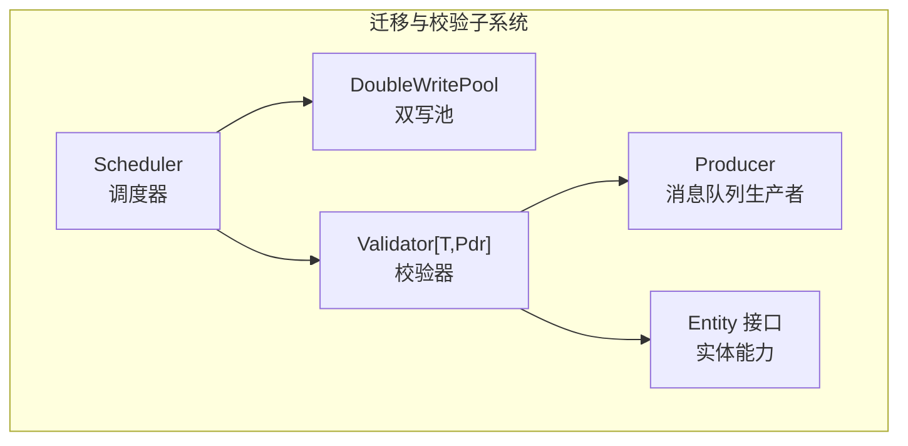
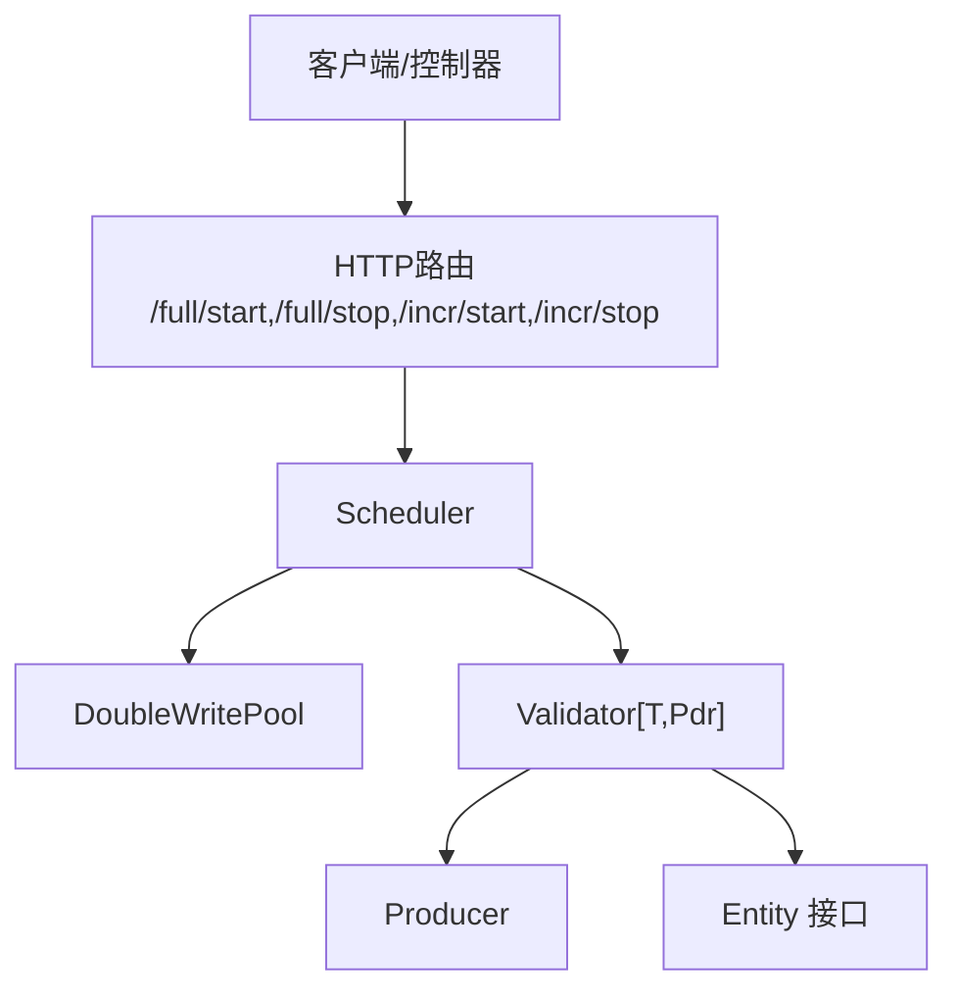
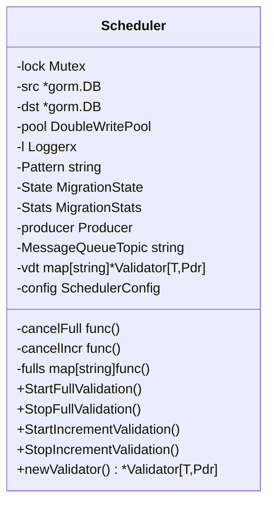
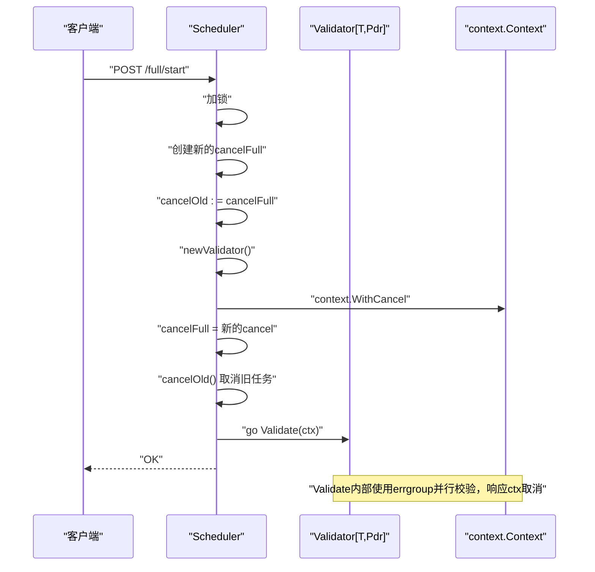
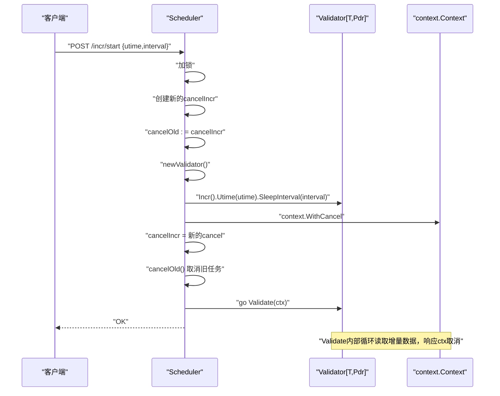
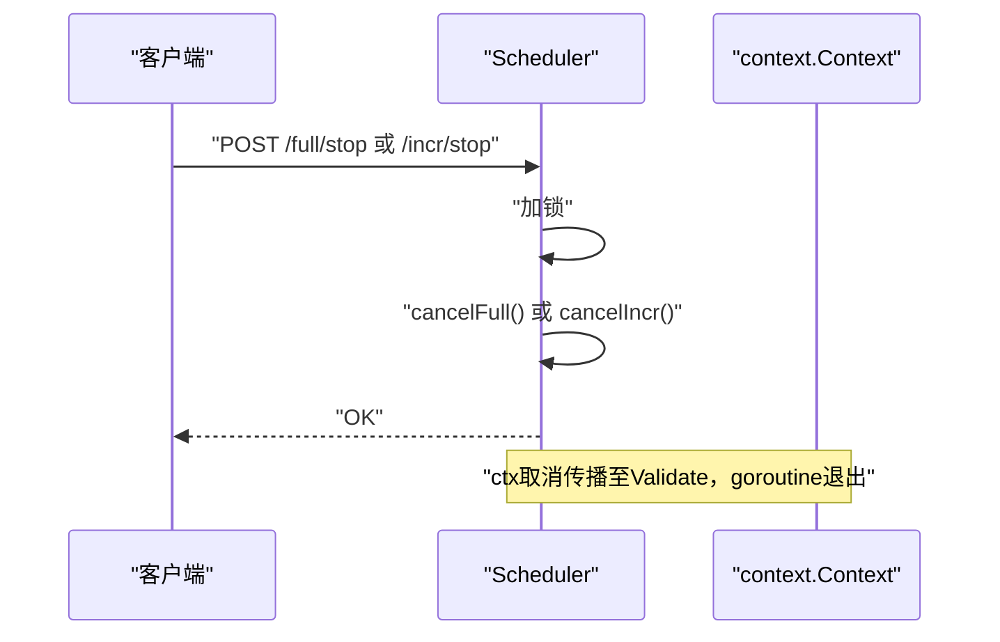
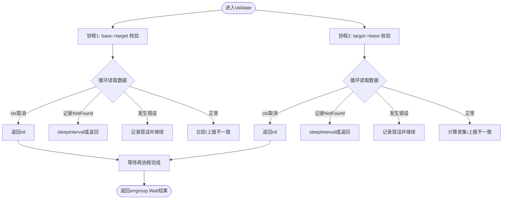
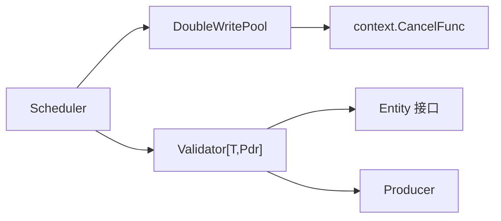
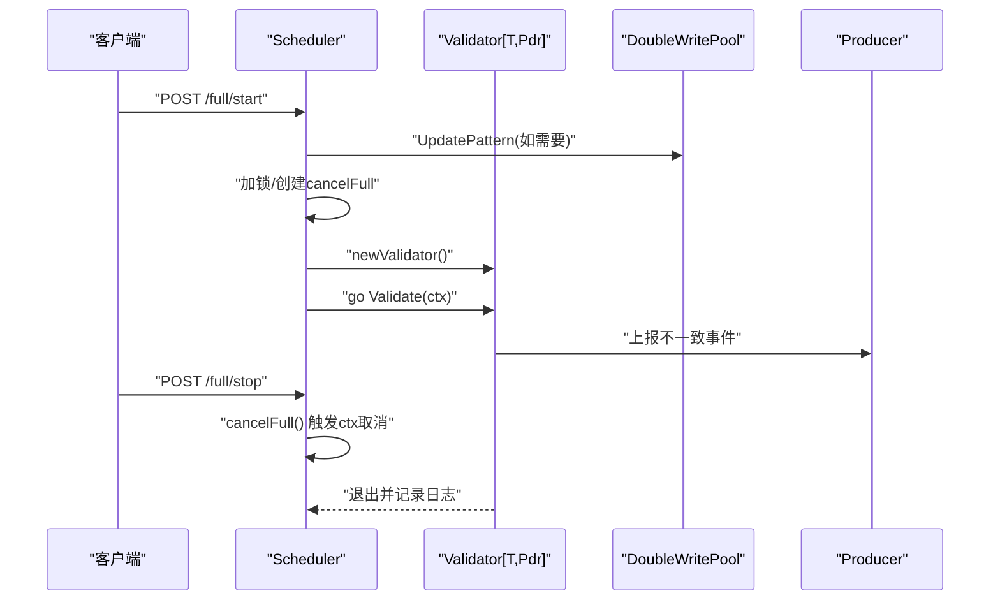

# 校验任务生命周期管理

<cite>
**本文引用的文件列表**
- [scheduler.go](file://DBx/mysqlX/gormx/dbMovex/myMovex/scheduler/scheduler.go)
- [validator.go](file://DBx/mysqlX/gormx/dbMovex/myMovex/validator/validator.go)
- [double_write_pool.go](file://DBx/mysqlX/gormx/dbMovex/myMovex/doubleWritePoolx/double_write_pool.go)
- [types.go](file://DBx/mysqlX/gormx/dbMovex/myMovex/migrator.go)
- [inconsistent.go](file://DBx/mysqlX/gormx/dbMovex/myMovex/events/inconsistent.go)
- [scheduler_test.go](file://DBx/mysqlX/gormx/dbMovex/myMovex/scheduler/scheduler_test.go)
- [types.go](file://channelx/mqX/types.go)
</cite>

## 目录
1. [引言](#引言)
2. [项目结构](#项目结构)
3. [核心组件](#核心组件)
4. [架构总览](#架构总览)
5. [详细组件分析](#详细组件分析)
6. [依赖关系分析](#依赖关系分析)
7. [性能考量](#性能考量)
8. [故障排查指南](#故障排查指南)
9. [结论](#结论)
10. [附录](#附录)

## 引言
本文件围绕“校验任务生命周期管理”展开，系统性解释Scheduler结构体中cancelFull与cancelIncr字段如何存储context.CancelFunc以实现任务的动态启停；StartFullValidation与StartIncrementValidation在加锁后如何安全地取消前一个运行中的任务并启动新任务；StopFullValidation与StopIncrementValidationAPI如何触发取消信号，使后台校验goroutine能及时响应并退出；迁移统计信息（MigrationStats）如何反映任务执行次数与错误状态，LastError字段在故障诊断中的作用；并提供任务调度时序图、并发控制机制说明及避免goroutine泄漏的最佳实践。

## 项目结构
本次分析聚焦于以下模块：
- 调度器：负责模式切换、全量/增量校验启停、状态与统计信息维护
- 校验器：负责具体的数据一致性校验与不一致事件上报
- 双写池：负责在不同模式下对源/目标库进行双写或单写
- 消息队列：用于上报不一致事件
- 实体接口：定义数据实体的最小能力（ID、比较、类型）

图表来源
- [scheduler.go](file://DBx/mysqlX/gormx/dbMovex/myMovex/scheduler/scheduler.go#L46-L101)
- [validator.go](file://DBx/mysqlX/gormx/dbMovex/myMovex/validator/validator.go#L29-L60)
- [double_write_pool.go](file://DBx/mysqlX/gormx/dbMovex/myMovex/doubleWritePoolx/double_write_pool.go#L36-L88)
- [types.go](file://DBx/mysqlX/gormx/dbMovex/myMovex/migrator.go#L1-L12)
- [types.go](file://channelx/mqX/types.go#L20-L34)

章节来源
- [scheduler.go](file://DBx/mysqlX/gormx/dbMovex/myMovex/scheduler/scheduler.go#L1-L123)
- [validator.go](file://DBx/mysqlX/gormx/dbMovex/myMovex/validator/validator.go#L1-L60)
- [double_write_pool.go](file://DBx/mysqlX/gormx/dbMovex/myMovex/doubleWritePoolx/double_write_pool.go#L1-L88)
- [types.go](file://DBx/mysqlX/gormx/dbMovex/myMovex/migrator.go#L1-L12)
- [types.go](file://channelx/mqX/types.go#L20-L34)

## 核心组件
- Scheduler：统一管理迁移过程，持有cancelFull/cancelIncr两个context.CancelFunc，分别用于全量/增量校验的动态启停；通过lock互斥保护状态与取消函数；提供路由注册、模式切换、启停校验、状态/统计查询等接口。
- Validator[T,Pdr]：封装校验逻辑，支持全量与增量两种模式，内部使用errgroup并行校验双向一致性，并通过消息队列上报不一致事件。
- DoubleWritePool：根据当前模式在源/目标库之间进行双写或单写，提供健康检查与指标采集。
- MigrationStats：记录任务执行次数、当前状态、最后错误等统计信息，LastError用于故障诊断。
- Entity接口：约束实体具备ID、比较与类型能力，便于校验器按ID进行比对。

章节来源
- [scheduler.go](file://DBx/mysqlX/gormx/dbMovex/myMovex/scheduler/scheduler.go#L36-L68)
- [validator.go](file://DBx/mysqlX/gormx/dbMovex/myMovex/validator/validator.go#L29-L60)
- [double_write_pool.go](file://DBx/mysqlX/gormx/dbMovex/myMovex/doubleWritePoolx/double_write_pool.go#L109-L146)
- [types.go](file://DBx/mysqlX/gormx/dbMovex/myMovex/migrator.go#L1-L12)

## 架构总览
调度器作为入口，协调双写池与校验器；校验器在后台goroutine中执行，通过context取消信号优雅退出；消息队列用于上报不一致事件，便于后续修复。

图表来源
- [scheduler.go](file://DBx/mysqlX/gormx/dbMovex/myMovex/scheduler/scheduler.go#L103-L123)
- [validator.go](file://DBx/mysqlX/gormx/dbMovex/myMovex/validator/validator.go#L62-L78)
- [double_write_pool.go](file://DBx/mysqlX/gormx/dbMovex/myMovex/doubleWritePoolx/double_write_pool.go#L109-L146)
- [types.go](file://channelx/mqX/types.go#L20-L34)

## 详细组件分析

### Scheduler结构体与生命周期控制
- cancelFull/cancelIncr：两个字段保存context.CancelFunc，用于在启动新任务前取消旧任务。初始化时设置为空函数，确保首次调用Stop不会panic。
- lock：互斥锁，保证Start/Stop与状态变更的原子性。
- Stats：迁移统计信息，包括任务执行次数、当前状态、最后错误等。
- newValidator：根据当前模式选择源/目标库方向，构造校验器实例。

图表来源
- [scheduler.go](file://DBx/mysqlX/gormx/dbMovex/myMovex/scheduler/scheduler.go#L46-L101)

章节来源
- [scheduler.go](file://DBx/mysqlX/gormx/dbMovex/myMovex/scheduler/scheduler.go#L46-L101)

### 全量校验生命周期（StartFullValidation）
- 加锁后，先创建新的context.WithCancel，得到新的cancelIncr/取消函数；随后调用旧的cancelIncr以取消上一次运行中的任务；再启动新的goroutine执行v.Validate(ctx)。
- 统计信息：FullValidationRuns自增。
- 退出路径：当ctx被取消或Validate返回错误时，日志记录退出原因。

图表来源
- [scheduler.go](file://DBx/mysqlX/gormx/dbMovex/myMovex/scheduler/scheduler.go#L259-L287)
- [validator.go](file://DBx/mysqlX/gormx/dbMovex/myMovex/validator/validator.go#L62-L78)

章节来源
- [scheduler.go](file://DBx/mysqlX/gormx/dbMovex/myMovex/scheduler/scheduler.go#L259-L287)

### 增量校验生命周期（StartIncrementValidation）
- 加锁后，先创建新的context.WithCancel，得到新的cancelIncr；随后调用旧的cancelIncr取消上一次运行中的任务；再启动新的goroutine执行v.Validate(ctx)，并在请求参数中设置utime与sleepInterval。
- 统计信息：IncrValidationRuns自增。
- 退出路径：当ctx被取消或Validate返回错误时，日志记录退出原因。

图表来源
- [scheduler.go](file://DBx/mysqlX/gormx/dbMovex/myMovex/scheduler/scheduler.go#L218-L247)
- [validator.go](file://DBx/mysqlX/gormx/dbMovex/myMovex/validator/validator.go#L134-L152)
- [validator.go](file://DBx/mysqlX/gormx/dbMovex/myMovex/validator/validator.go#L163-L171)

章节来源
- [scheduler.go](file://DBx/mysqlX/gormx/dbMovex/myMovex/scheduler/scheduler.go#L218-L247)

### 停止校验API（StopFullValidation/StopIncrementValidation）
- 加锁后直接调用cancelFull/cancelIncr，触发对应校验goroutine的ctx取消，使其尽快退出。
- 该方法不阻塞，适合快速停止。

图表来源
- [scheduler.go](file://DBx/mysqlX/gormx/dbMovex/myMovex/scheduler/scheduler.go#L208-L216)
- [scheduler.go](file://DBx/mysqlX/gormx/dbMovex/myMovex/scheduler/scheduler.go#L249-L257)

章节来源
- [scheduler.go](file://DBx/mysqlX/gormx/dbMovex/myMovex/scheduler/scheduler.go#L208-L216)
- [scheduler.go](file://DBx/mysqlX/gormx/dbMovex/myMovex/scheduler/scheduler.go#L249-L257)

### 校验器执行逻辑与取消传播
- Validate内部使用errgroup并行执行双向校验（base->target与target->base），在循环中对ctx进行检查，遇到Canceled/DeadlineExceeded即优雅退出。
- 增量模式下，从base按utime过滤并按sleepInterval轮询；目标库侧按batch读取并计算差集，同时上报不一致事件。

图表来源
- [validator.go](file://DBx/mysqlX/gormx/dbMovex/myMovex/validator/validator.go#L62-L78)
- [validator.go](file://DBx/mysqlX/gormx/dbMovex/myMovex/validator/validator.go#L80-L132)
- [validator.go](file://DBx/mysqlX/gormx/dbMovex/myMovex/validator/validator.go#L174-L232)

章节来源
- [validator.go](file://DBx/mysqlX/gormx/dbMovex/myMovex/validator/validator.go#L62-L78)
- [validator.go](file://DBx/mysqlX/gormx/dbMovex/myMovex/validator/validator.go#L80-L132)
- [validator.go](file://DBx/mysqlX/gormx/dbMovex/myMovex/validator/validator.go#L174-L232)

### 迁移统计信息与LastError
- MigrationStats包含：开始时间、当前状态、全量/增量校验次数、数据不一致数量、最后一次错误信息。
- LastError用于记录最近一次校验失败的原因，便于故障诊断与告警。
- 测试中验证了全量/增量校验次数的正确递增。

章节来源
- [scheduler.go](file://DBx/mysqlX/gormx/dbMovex/myMovex/scheduler/scheduler.go#L36-L44)
- [scheduler_test.go](file://DBx/mysqlX/gormx/dbMovex/myMovex/scheduler/scheduler_test.go#L126-L151)
- [scheduler_test.go](file://DBx/mysqlX/gormx/dbMovex/myMovex/scheduler/scheduler_test.go#L152-L185)

### 模式切换与自动升级
- 模式切换通过双写池UpdatePattern实现，Scheduler仅更新内部状态与统计。
- autoPromoteIfReady在满足条件时自动升级模式，减少人工干预。

章节来源
- [scheduler.go](file://DBx/mysqlX/gormx/dbMovex/myMovex/scheduler/scheduler.go#L127-L205)
- [scheduler.go](file://DBx/mysqlX/gormx/dbMovex/myMovex/scheduler/scheduler.go#L405-L435)
- [double_write_pool.go](file://DBx/mysqlX/gormx/dbMovex/myMovex/doubleWritePoolx/double_write_pool.go#L109-L119)

## 依赖关系分析
- Scheduler依赖DoubleWritePool进行模式切换与健康检查；依赖Validator执行校验；依赖Producer上报不一致事件。
- Validator依赖Entity接口进行ID与比较判断；依赖消息队列Producer发送事件。
- 双写池内部使用context.CancelFunc控制指标收集goroutine的生命周期。

图表来源
- [scheduler.go](file://DBx/mysqlX/gormx/dbMovex/myMovex/scheduler/scheduler.go#L290-L300)
- [validator.go](file://DBx/mysqlX/gormx/dbMovex/myMovex/validator/validator.go#L29-L60)
- [double_write_pool.go](file://DBx/mysqlX/gormx/dbMovex/myMovex/doubleWritePoolx/double_write_pool.go#L41-L50)

章节来源
- [scheduler.go](file://DBx/mysqlX/gormx/dbMovex/myMovex/scheduler/scheduler.go#L290-L300)
- [validator.go](file://DBx/mysqlX/gormx/dbMovex/myMovex/validator/validator.go#L29-L60)
- [double_write_pool.go](file://DBx/mysqlX/gormx/dbMovex/myMovex/doubleWritePoolx/double_write_pool.go#L41-L50)

## 性能考量
- 并发控制：Scheduler通过互斥锁保护关键路径，避免竞态；Validator使用errgroup并行校验，提升吞吐。
- 取消传播：context.WithCancel确保取消信号快速传播到数据库查询与消息发送等阻塞点。
- 轮询与批处理：增量校验支持sleepInterval与批量读取，降低CPU占用与数据库压力。
- 指标与健康检查：双写池提供健康检查与指标采集，便于运维观察。

[本节为通用指导，无需特定文件来源]

## 故障排查指南
- LastError定位：查看MigrationStats.LastError获取最近一次错误信息，结合日志定位问题。
- 停止无效：若Stop接口无效，确认是否在正确的模式下调用（全量/增量对应不同的cancel函数）。
- goroutine泄漏：确保每次Start都会覆盖旧的cancel函数，并在Stop中调用；Validator内部对ctx取消有处理，避免死循环。
- 不一致事件：检查Producer是否可用，消息是否成功发送；关注日志中的错误提示。

章节来源
- [scheduler.go](file://DBx/mysqlX/gormx/dbMovex/myMovex/scheduler/scheduler.go#L36-L44)
- [validator.go](file://DBx/mysqlX/gormx/dbMovex/myMovex/validator/validator.go#L241-L255)

## 结论
通过Scheduler的cancelFull/cancelIncr字段与context.WithCancel机制，系统实现了对全量/增量校验任务的动态启停与优雅退出；配合Scheduler的加锁与统计信息，能够可靠地追踪任务执行状态与错误；Validator的并行校验与取消传播保障了高吞吐与低延迟；消息队列用于故障事件的可观测性。整体设计清晰、解耦良好，具备良好的可维护性与扩展性。

[本节为总结，无需特定文件来源]

## 附录

### 任务调度时序图（综合）

图表来源
- [scheduler.go](file://DBx/mysqlX/gormx/dbMovex/myMovex/scheduler/scheduler.go#L127-L205)
- [scheduler.go](file://DBx/mysqlX/gormx/dbMovex/myMovex/scheduler/scheduler.go#L259-L287)
- [validator.go](file://DBx/mysqlX/gormx/dbMovex/myMovex/validator/validator.go#L241-L255)

### 并发控制与最佳实践
- 使用互斥锁保护状态与取消函数的更新，避免竞态。
- 每次启动新任务前，先保存旧的cancel函数并立即调用它，确保旧任务尽快退出。
- 在Stop接口中直接调用cancel函数，保证快速响应。
- Validator内部对ctx取消进行处理，避免死循环与资源泄漏。
- 使用errgroup并行校验，提高吞吐并保持一致性。

章节来源
- [scheduler.go](file://DBx/mysqlX/gormx/dbMovex/myMovex/scheduler/scheduler.go#L218-L287)
- [validator.go](file://DBx/mysqlX/gormx/dbMovex/myMovex/validator/validator.go#L62-L78)