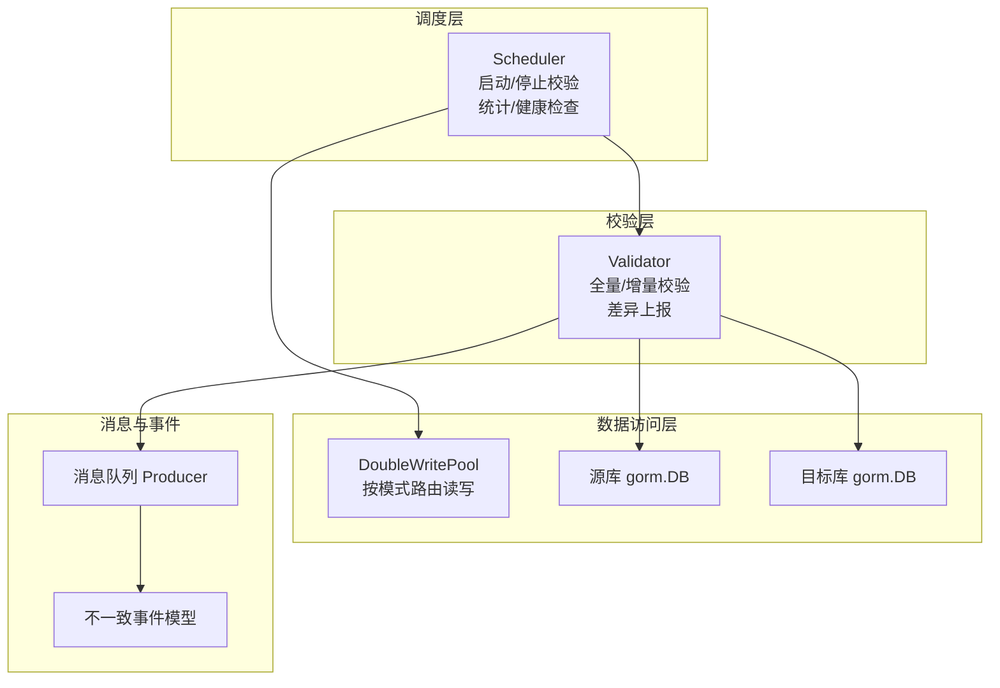
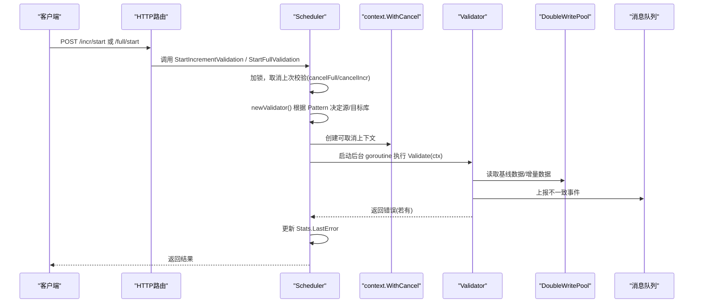
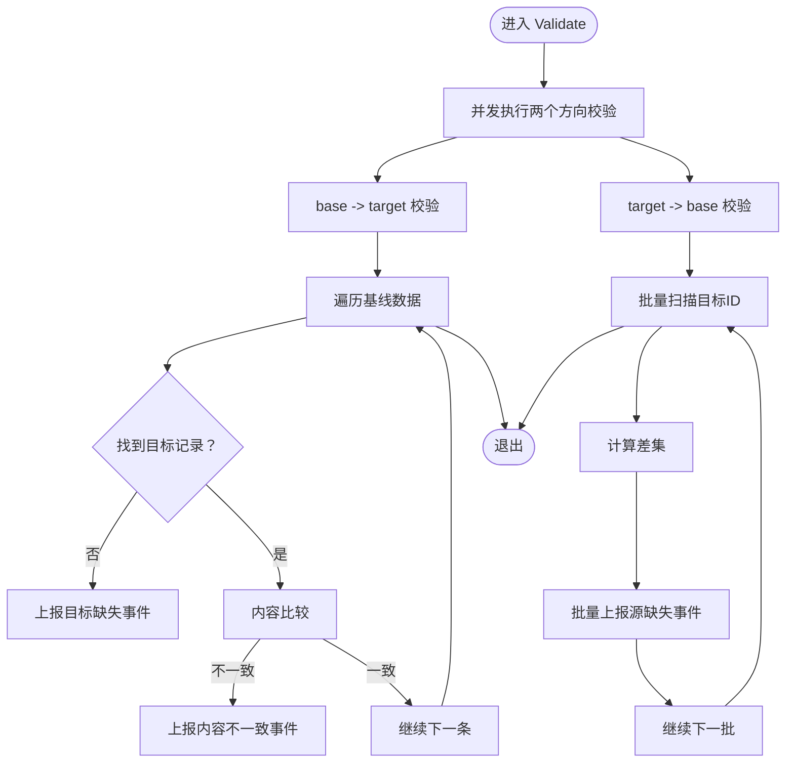
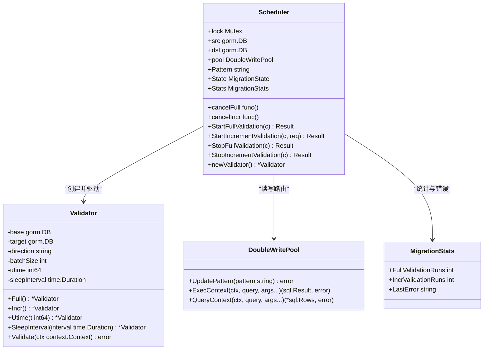
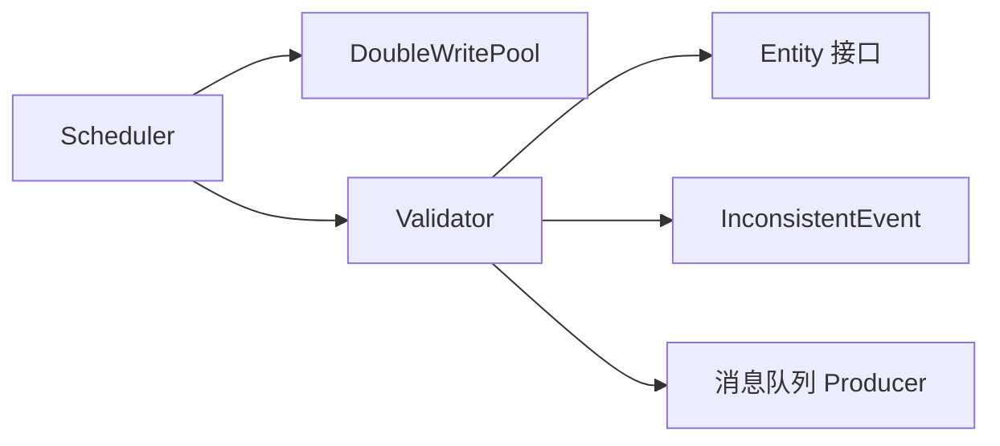

# 校验任务调度机制

<cite>
**本文引用的文件列表**
- [scheduler.go](file://DBx/mysqlX/gormx/dbMovex/myMovex/scheduler/scheduler.go)
- [validator.go](file://DBx/mysqlX/gormx/dbMovex/myMovex/validator/validator.go)
- [double_write_pool.go](file://DBx/mysqlX/gormx/dbMovex/myMovex/doubleWritePoolx/double_write_pool.go)
- [inconsistent.go](file://DBx/mysqlX/gormx/dbMovex/myMovex/events/inconsistent.go)
- [migrator.go](file://DBx/mysqlX/gormx/dbMovex/myMovex/migrator.go)
- [scheduler_test.go](file://DBx/mysqlX/gormx/dbMovex/myMovex/scheduler/scheduler_test.go)
</cite>

## 目录
1. [引言](#引言)
2. [项目结构](#项目结构)
3. [核心组件](#核心组件)
4. [架构总览](#架构总览)
5. [详细组件分析](#详细组件分析)
6. [依赖关系分析](#依赖关系分析)
7. [性能与并发特性](#性能与并发特性)
8. [故障排查指南](#故障排查指南)
9. [结论](#结论)

## 引言
本文件围绕“校验任务调度机制”展开，重点解析调度器如何通过 StartFullValidation 和 StartIncrementValidation 启动全量与增量校验，并在后台 goroutine 中运行；解释 newValidator 如何依据当前双写模式（Pattern）动态选择正确的源库与目标库；说明 cancelFull 与 cancelIncr 的作用及优雅停止策略；阐述 MigrationStats 中计数器 FullValidationRuns 与 IncrValidationRuns 的递增逻辑，以及校验过程中错误如何被记录到 LastError 字段。

## 项目结构
本次分析聚焦于以下模块：
- 调度器：负责模式切换、启动/停止校验、统计与健康检查等
- 校验器：负责双向一致性校验、差异上报与错误处理
- 双写池：提供按模式路由的读写能力
- 事件模型：用于上报不一致事件
- 实体接口：约束实体具备 ID、比较与类型信息

图表来源
- [scheduler.go](file://DBx/mysqlX/gormx/dbMovex/myMovex/scheduler/scheduler.go#L1-L120)
- [validator.go](file://DBx/mysqlX/gormx/dbMovex/myMovex/validator/validator.go#L1-L120)
- [double_write_pool.go](file://DBx/mysqlX/gormx/dbMovex/myMovex/doubleWritePoolx/double_write_pool.go#L1-L120)
- [inconsistent.go](file://DBx/mysqlX/gormx/dbMovex/myMovex/events/inconsistent.go#L1-L21)

章节来源
- [scheduler.go](file://DBx/mysqlX/gormx/dbMovex/myMovex/scheduler/scheduler.go#L1-L120)
- [validator.go](file://DBx/mysqlX/gormx/dbMovex/myMovex/validator/validator.go#L1-L120)
- [double_write_pool.go](file://DBx/mysqlX/gormx/dbMovex/myMovex/doubleWritePoolx/double_write_pool.go#L1-L120)
- [inconsistent.go](file://DBx/mysqlX/gormx/dbMovex/myMovex/events/inconsistent.go#L1-L21)

## 核心组件
- 调度器 Scheduler：提供 HTTP 接口注册、模式切换、全量/增量校验启停、统计与健康检查。
- 校验器 Validator：支持全量与增量两种模式，双向校验（base->target 与 target->base），并将不一致事件上报消息队列。
- 双写池 DoubleWritePool：根据当前 Pattern 将读写路由到源库或目标库，支持严格模式与重试。
- 事件模型 InconsistentEvent：描述不一致事件的类型与方向。

章节来源
- [scheduler.go](file://DBx/mysqlX/gormx/dbMovex/myMovex/scheduler/scheduler.go#L46-L120)
- [validator.go](file://DBx/mysqlX/gormx/dbMovex/myMovex/validator/validator.go#L23-L80)
- [double_write_pool.go](file://DBx/mysqlX/gormx/dbMovex/myMovex/doubleWritePoolx/double_write_pool.go#L109-L156)
- [inconsistent.go](file://DBx/mysqlX/gormx/dbMovex/myMovex/events/inconsistent.go#L1-L21)

## 架构总览
调度器通过 HTTP 路由对外暴露启停校验接口；启动时创建可取消的上下文并派发到后台 goroutine；校验器根据调度器的 Pattern 动态决定源库与目标库；校验完成后将错误信息写入统计结构体的 LastError 字段。

图表来源
- [scheduler.go](file://DBx/mysqlX/gormx/dbMovex/myMovex/scheduler/scheduler.go#L217-L287)
- [validator.go](file://DBx/mysqlX/gormx/dbMovex/myMovex/validator/validator.go#L62-L120)
- [double_write_pool.go](file://DBx/mysqlX/gormx/dbMovex/myMovex/doubleWritePoolx/double_write_pool.go#L352-L407)
- [inconsistent.go](file://DBx/mysqlX/gormx/dbMovex/myMovex/events/inconsistent.go#L1-L21)

## 详细组件分析

### StartFullValidation 与 StartIncrementValidation 的实现要点
- 并发安全：两方法均使用互斥锁保护对调度器内部状态的修改。
- 取消旧任务：在启动新任务前，先调用上次的 cancel 函数，确保同一时刻只有一个活跃的校验任务。
- 可取消上下文：使用 context.WithCancel 创建新的上下文，并将新的 cancel 函数保存到调度器字段，供后续 Stop* 接口使用。
- 校验器创建：调用 newValidator() 基于当前 Pattern 动态构造校验器。
- 统计递增：分别增加 FullValidationRuns 与 IncrValidationRuns 计数器。
- 后台执行：在 goroutine 中调用 v.Validate(ctx)，并在退出时记录日志。

章节来源
- [scheduler.go](file://DBx/mysqlX/gormx/dbMovex/myMovex/scheduler/scheduler.go#L249-L287)
- [scheduler.go](file://DBx/mysqlX/gormx/dbMovex/myMovex/scheduler/scheduler.go#L217-L247)

### newValidator 如何根据 Pattern 动态创建校验器
- 源/目标映射：
  - PatternSrcOnly、PatternSrcFirst：校验器的 base 指向源库，target 指向目标库。
  - PatternDstFirst、PatternDstOnly：校验器的 base 指向目标库，target 指向源库。
- 错误处理：未知 Pattern 时返回错误，避免错误的源/目标映射导致数据不一致。
- 方向标记：校验器构造时传入 Direction（如 "SRC"/"DST"），用于上报事件的方向标识。

章节来源
- [scheduler.go](file://DBx/mysqlX/gormx/dbMovex/myMovex/scheduler/scheduler.go#L289-L300)
- [validator.go](file://DBx/mysqlX/gormx/dbMovex/myMovex/validator/validator.go#L49-L60)

### cancelFull 与 cancelIncr 的作用与优雅停止
- 初始化：NewScheduler 在创建调度器时，为 cancelFull 与 cancelIncr 分别设置为空操作函数，保证初始状态下不会触发取消。
- 启动时：StartFullValidation/StartIncrementValidation 在 goroutine 启动前，先保存上次 cancel 函数，再用 context.WithCancel 生成新的 cancel 并覆盖旧值。
- 停止时：StopFullValidation/StopIncrementValidation 直接调用对应的 cancel 函数，使 Validate(ctx) 内部的循环检测到 ctx.Done() 并优雅退出。
- 退出行为：校验器在检测到 context 已取消或超时时返回 nil，避免错误传播到上层。

章节来源
- [scheduler.go](file://DBx/mysqlX/gormx/dbMovex/myMovex/scheduler/scheduler.go#L85-L101)
- [scheduler.go](file://DBx/mysqlX/gormx/dbMovex/myMovex/scheduler/scheduler.go#L249-L287)
- [validator.go](file://DBx/mysqlX/gormx/dbMovex/myMovex/validator/validator.go#L80-L120)

### MigrationStats 中计数器与错误记录
- FullValidationRuns：在 StartFullValidation 中每次成功创建校验器后递增。
- IncrValidationRuns：在 StartIncrementValidation 中每次成功创建校验器后递增。
- LastError：当校验退出时，若存在非 nil 错误，调度器会将其写入 Stats.LastError 字段，便于外部查询与告警。

章节来源
- [scheduler.go](file://DBx/mysqlX/gormx/dbMovex/myMovex/scheduler/scheduler.go#L273-L287)
- [scheduler.go](file://DBx/mysqlX/gormx/dbMovex/myMovex/scheduler/scheduler.go#L234-L247)

### 校验器 Validate 的执行流程与差异上报
- 双向校验：Validate 内部通过 errgroup 并发执行两个方向的校验：
  - base -> target：逐条对比，若目标缺失或内容不一致，则上报事件。
  - target -> base：批量查询目标库 ID，与源库比对，上报缺失事件。
- 增量模式：Incr() 设置 utime 与 sleepInterval，循环扫描新增/变更数据。
- 上报机制：notify 将事件序列化并通过消息队列发送，事件包含 ID、Type、Direction。

图表来源
- [validator.go](file://DBx/mysqlX/gormx/dbMovex/myMovex/validator/validator.go#L62-L120)
- [validator.go](file://DBx/mysqlX/gormx/dbMovex/myMovex/validator/validator.go#L134-L232)
- [inconsistent.go](file://DBx/mysqlX/gormx/dbMovex/myMovex/events/inconsistent.go#L1-L21)

章节来源
- [validator.go](file://DBx/mysqlX/gormx/dbMovex/myMovex/validator/validator.go#L62-L120)
- [validator.go](file://DBx/mysqlX/gormx/dbMovex/myMovex/validator/validator.go#L134-L232)
- [inconsistent.go](file://DBx/mysqlX/gormx/dbMovex/myMovex/events/inconsistent.go#L1-L21)

### 类关系图（代码级）

图表来源
- [scheduler.go](file://DBx/mysqlX/gormx/dbMovex/myMovex/scheduler/scheduler.go#L46-L120)
- [validator.go](file://DBx/mysqlX/gormx/dbMovex/myMovex/validator/validator.go#L23-L80)
- [double_write_pool.go](file://DBx/mysqlX/gormx/dbMovex/myMovex/doubleWritePoolx/double_write_pool.go#L109-L156)

## 依赖关系分析
- 调度器依赖双写池以实现按模式读写；依赖校验器执行一致性校验；依赖消息队列上报不一致事件。
- 校验器依赖实体接口以进行 ID 与内容比较；依赖事件模型描述不一致类型。
- 测试用例验证了不同模式下 newValidator 的正确性与统计计数的递增行为。

图表来源
- [scheduler.go](file://DBx/mysqlX/gormx/dbMovex/myMovex/scheduler/scheduler.go#L1-L120)
- [validator.go](file://DBx/mysqlX/gormx/dbMovex/myMovex/validator/validator.go#L1-L120)
- [migrator.go](file://DBx/mysqlX/gormx/dbMovex/myMovex/migrator.go#L1-L12)
- [inconsistent.go](file://DBx/mysqlX/gormx/dbMovex/myMovex/events/inconsistent.go#L1-L21)

章节来源
- [scheduler_test.go](file://DBx/mysqlX/gormx/dbMovex/myMovex/scheduler/scheduler_test.go#L138-L181)
- [scheduler_test.go](file://DBx/mysqlX/gormx/dbMovex/myMovex/scheduler/scheduler_test.go#L292-L311)

## 性能与并发特性
- 并发校验：Validate 内部使用 errgroup 并发执行两个方向的校验，提升吞吐。
- 增量模式：通过 sleepInterval 控制轮询频率，避免过载；utime 限定扫描范围。
- 取消与优雅退出：context.WithCancel 提供即时取消能力，Validate 在检测到取消或超时后立即返回，减少资源占用。
- 统计与健康：调度器提供 GetStats 与 HealthCheck 接口，便于运维观察与告警。

章节来源
- [validator.go](file://DBx/mysqlX/gormx/dbMovex/myMovex/validator/validator.go#L62-L120)
- [scheduler.go](file://DBx/mysqlX/gormx/dbMovex/myMovex/scheduler/scheduler.go#L302-L348)

## 故障排查指南
- 启动失败：检查 newValidator 返回的错误（未知 Pattern 或初始化失败），确认当前 Pattern 是否合法。
- 校验未停止：确认 Stop* 接口是否被调用，cancelIncr/cancelFull 是否被正确覆盖。
- 统计异常：核对 FullValidationRuns 与 IncrValidationRuns 是否按预期递增；LastError 是否被更新。
- 上报缺失：检查消息队列 Producer 配置与 Topic，确认 notify 是否成功发送事件。
- 健康检查：通过 HealthCheck 接口查看双写池健康状态，定位源/目标库连接问题。

章节来源
- [scheduler.go](file://DBx/mysqlX/gormx/dbMovex/myMovex/scheduler/scheduler.go#L302-L348)
- [validator.go](file://DBx/mysqlX/gormx/dbMovex/myMovex/validator/validator.go#L241-L256)
- [double_write_pool.go](file://DBx/mysqlX/gormx/dbMovex/myMovex/doubleWritePoolx/double_write_pool.go#L121-L146)

## 结论
本文系统梳理了调度器如何通过 StartFullValidation 与 StartIncrementValidation 启动并管理校验任务，强调了 context.WithCancel 的关键作用与优雅停止策略；解释了 newValidator 如何依据 Pattern 动态选择源/目标库；明确了统计计数器与错误记录的实现路径；并结合校验器 Validate 的双向校验与事件上报机制，给出了整体架构视图与故障排查建议。该机制在保证数据一致性的同时，提供了可观测性与可运维性。