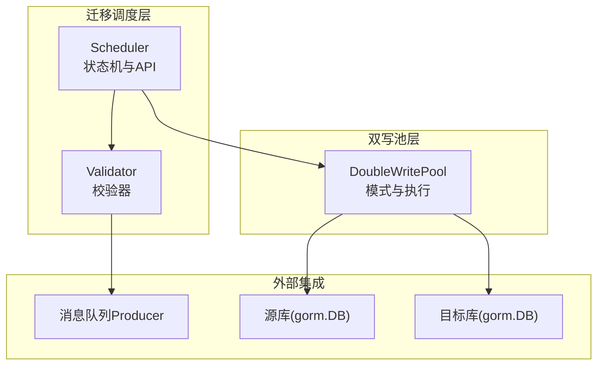
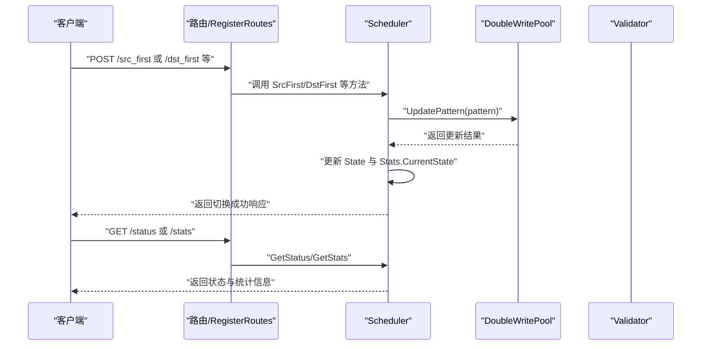
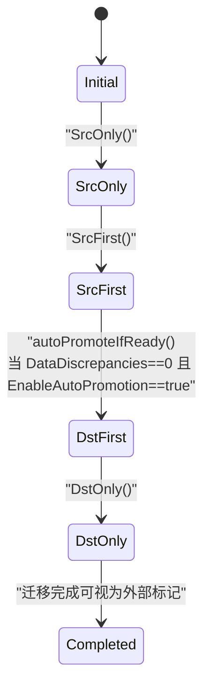
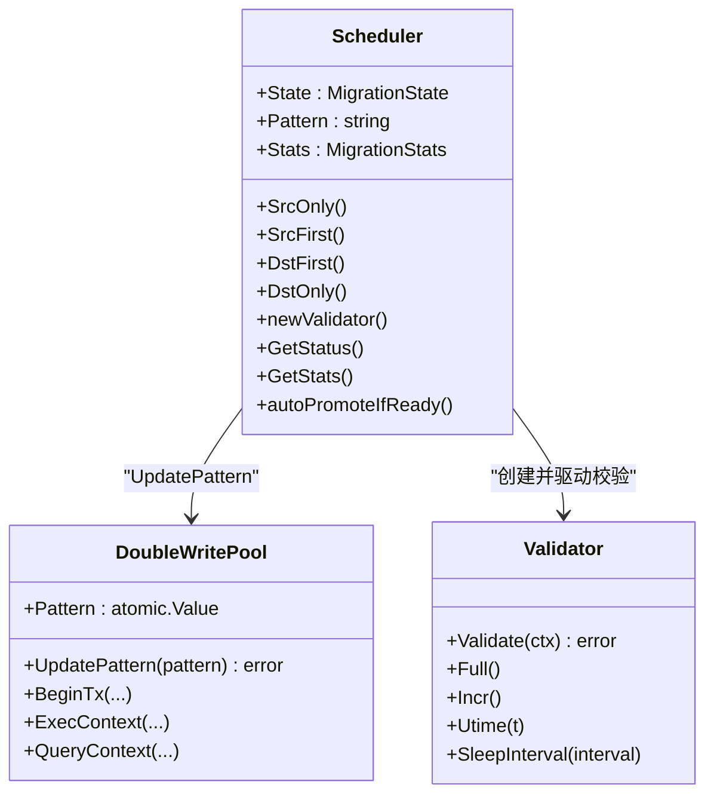

# 状态机与状态管理

<cite>
**本文引用的文件列表**
- [scheduler.go](file://DBx/mysqlX/gormx/dbMovex/myMovex/scheduler/scheduler.go)
- [double_write_pool.go](file://DBx/mysqlX/gormx/dbMovex/myMovex/doubleWritePoolx/double_write_pool.go)
- [validator.go](file://DBx/mysqlX/gormx/dbMovex/myMovex/validator/validator.go)
- [scheduler_test.go](file://DBx/mysqlX/gormx/dbMovex/myMovex/scheduler/scheduler_test.go)
- [myMove_test.go](file://DBx/mysqlX/gormx/dbMovex/myMovex/test/myMove_test.go)
</cite>

## 目录
1. [引言](#引言)
2. [项目结构](#项目结构)
3. [核心组件](#核心组件)
4. [架构总览](#架构总览)
5. [详细组件分析](#详细组件分析)
6. [依赖关系分析](#依赖关系分析)
7. [性能考量](#性能考量)
8. [故障排查指南](#故障排查指南)
9. [结论](#结论)

## 引言
本文围绕迁移调度器内部的状态机进行深入解析，重点阐述如何通过 MigrationState 枚举（StateInitial、StateSrcOnly、StateSrcFirst、StateDstFirst、StateDstOnly、StateCompleted）驱动整个迁移流程；详细说明各状态的含义、进入与退出条件、状态转换的业务逻辑；解释 State 字段与双写池 Pattern 的同步机制及其对校验器行为的影响；并说明 Stats 中 CurrentState 的更新策略及在 GetStatus 和 GetStats API 中的作用。最后给出状态转换图，并结合 SrcOnly、SrcFirst 等方法的实现展示状态变迁过程。

## 项目结构
本次文档聚焦于以下关键文件：
- scheduler.go：定义状态枚举、调度器结构体、状态切换方法、校验器创建、状态查询与统计接口、自动迁移与自动升级逻辑
- double_write_pool.go：双写池的模式常量与 UpdatePattern 实现，决定实际的读写路径
- validator.go：校验器的创建与校验流程，依据调度器当前 Pattern 决定校验方向
- scheduler_test.go 与 myMove_test.go：测试用例覆盖状态切换、并发安全、自动升级、HTTP 接口返回值等

图表来源
- [scheduler.go](file://DBx/mysqlX/gormx/dbMovex/myMovex/scheduler/scheduler.go#L46-L123)
- [double_write_pool.go](file://DBx/mysqlX/gormx/dbMovex/myMovex/doubleWritePoolx/double_write_pool.go#L109-L119)
- [validator.go](file://DBx/mysqlX/gormx/dbMovex/myMovex/validator/validator.go#L49-L60)

章节来源
- [scheduler.go](file://DBx/mysqlX/gormx/dbMovex/myMovex/scheduler/scheduler.go#L1-L123)
- [double_write_pool.go](file://DBx/mysqlX/gormx/dbMovex/myMovex/doubleWritePoolx/double_write_pool.go#L1-L120)
- [validator.go](file://DBx/mysqlX/gormx/dbMovex/myMovex/validator/validator.go#L1-L60)

## 核心组件
- 状态枚举 MigrationState：用于表达迁移过程中的阶段状态
- 调度器 Scheduler：持有 State、Pattern、Stats 等字段，负责状态切换、校验器创建、统计与健康检查
- 双写池 DoubleWritePool：维护 Pattern 并根据模式执行读写操作
- 校验器 Validator：基于当前 Pattern 决定校验方向（源→目标或目标→源），并将不一致事件上报消息队列

章节来源
- [scheduler.go](file://DBx/mysqlX/gormx/dbMovex/myMovex/scheduler/scheduler.go#L24-L68)
- [double_write_pool.go](file://DBx/mysqlX/gormx/dbMovex/myMovex/doubleWritePoolx/double_write_pool.go#L711-L717)
- [validator.go](file://DBx/mysqlX/gormx/dbMovex/myMovex/validator/validator.go#L29-L48)

## 架构总览
调度器通过 HTTP 路由暴露状态切换与校验控制接口；每次切换都会更新 Scheduler 的 State 与 Pattern，并通过双写池 Apply 模式；校验器在创建时依据 Pattern 决定校验方向；Stats.CurrentState 作为对外查询的“当前状态”快照，与 State 保持一致。

图表来源
- [scheduler.go](file://DBx/mysqlX/gormx/dbMovex/myMovex/scheduler/scheduler.go#L103-L123)
- [scheduler.go](file://DBx/mysqlX/gormx/dbMovex/myMovex/scheduler/scheduler.go#L147-L205)
- [scheduler.go](file://DBx/mysqlX/gormx/dbMovex/myMovex/scheduler/scheduler.go#L302-L348)
- [double_write_pool.go](file://DBx/mysqlX/gormx/dbMovex/myMovex/doubleWritePoolx/double_write_pool.go#L109-L119)

## 详细组件分析

### 状态枚举与初始状态
- StateInitial：初始化状态，调度器刚创建时 State 为 initial，Pattern 默认为 src_only
- 其他状态：src_only、src_first、dst_first、dst_only、completed（completed 在当前代码中未显式触发）

章节来源
- [scheduler.go](file://DBx/mysqlX/gormx/dbMovex/myMovex/scheduler/scheduler.go#L24-L34)
- [scheduler.go](file://DBx/mysqlX/gormx/dbMovex/myMovex/scheduler/scheduler.go#L88-L91)

### 状态切换方法与双写池同步
- SrcOnly：将 Pattern 设为 src_only，并通过双写池 UpdatePattern 生效；随后更新 State 与 Stats.CurrentState
- SrcFirst：将 Pattern 设为 src_first，并通过双写池 UpdatePattern 生效；随后更新 State 与 Stats.CurrentState
- DstFirst：将 Pattern 设为 dst_first，并通过双写池 UpdatePattern 生效；随后更新 State 与 Stats.CurrentState
- DstOnly：将 Pattern 设为 dst_only，并通过双写池 UpdatePattern 生效；随后更新 State 与 Stats.CurrentState

上述方法均使用互斥锁保护，确保并发安全；双写池仅接受已知模式常量，否则返回错误。

章节来源
- [scheduler.go](file://DBx/mysqlX/gormx/dbMovex/myMovex/scheduler/scheduler.go#L127-L205)
- [double_write_pool.go](file://DBx/mysqlX/gormx/dbMovex/myMovex/doubleWritePoolx/double_write_pool.go#L109-L119)

### 状态转换图

图表来源
- [scheduler.go](file://DBx/mysqlX/gormx/dbMovex/myMovex/scheduler/scheduler.go#L24-L34)
- [scheduler.go](file://DBx/mysqlX/gormx/dbMovex/myMovex/scheduler/scheduler.go#L405-L435)

### 自动升级逻辑
- autoPromoteIfReady：当 EnableAutoPromotion 为真时，若当前处于 src_first 且 DataDiscrepancies 为 0，则自动切换到 dst_first，并更新 State、Stats.CurrentState 与 Pattern
- 若当前处于 dst_first 且 DataDiscrepancies 为 0，则自动切换到 dst_only，并更新 State、Stats.CurrentState 与 Pattern

章节来源
- [scheduler.go](file://DBx/mysqlX/gormx/dbMovex/myMovex/scheduler/scheduler.go#L405-L435)

### 自动迁移流程
- executeMigrationPlan：按阶段顺序自动执行迁移计划，依次切换到 src_only、src_first（期间启动全量校验）、dst_first、dst_only，并在每一步更新 State

章节来源
- [scheduler.go](file://DBx/mysqlX/gormx/dbMovex/myMovex/scheduler/scheduler.go#L358-L403)

### 校验器与状态的关系
- newValidator：根据当前 Pattern 决定校验方向
  - 当 Pattern 为 src_only 或 src_first 时，校验方向为“源→目标”
  - 当 Pattern 为 dst_first 或 dst_only 时，校验方向为“目标→源”
- 校验器 Validate：同时进行双向校验（源→目标与目标→源），并在发现不一致时通过消息队列上报事件

章节来源
- [scheduler.go](file://DBx/mysqlX/gormx/dbMovex/myMovex/scheduler/scheduler.go#L289-L300)
- [validator.go](file://DBx/mysqlX/gormx/dbMovex/myMovex/validator/validator.go#L62-L78)
- [validator.go](file://DBx/mysqlX/gormx/dbMovex/myMovex/validator/validator.go#L80-L132)
- [validator.go](file://DBx/mysqlX/gormx/dbMovex/myMovex/validator/validator.go#L174-L232)

### Stats.CurrentState 的更新与查询
- 更新时机：
  - 状态切换方法中：切换后立即更新 Stats.CurrentState
  - 自动升级中：满足条件时更新 Stats.CurrentState
- 查询接口：
  - GetStatus：返回包含 current_state、current_pattern、migration_stats、pool_health、pool_metrics、uptime
  - GetStats：返回 migration_stats（含 FullValidationRuns、IncrValidationRuns、DataDiscrepancies、LastError 等）

章节来源
- [scheduler.go](file://DBx/mysqlX/gormx/dbMovex/myMovex/scheduler/scheduler.go#L138-L141)
- [scheduler.go](file://DBx/mysqlX/gormx/dbMovex/myMovex/scheduler/scheduler.go#L158-L161)
- [scheduler.go](file://DBx/mysqlX/gormx/dbMovex/myMovex/scheduler/scheduler.go#L178-L181)
- [scheduler.go](file://DBx/mysqlX/gormx/dbMovex/myMovex/scheduler/scheduler.go#L198-L201)
- [scheduler.go](file://DBx/mysqlX/gormx/dbMovex/myMovex/scheduler/scheduler.go#L411-L433)
- [scheduler.go](file://DBx/mysqlX/gormx/dbMovex/myMovex/scheduler/scheduler.go#L302-L348)

### API 行为与测试验证
- 注册路由 RegisterRoutes：提供 /src_only、/src_first、/dst_first、/dst_only、/full/start、/full/stop、/incr/start、/incr/stop、/status、/auto-migrate、/health、/stats
- 测试覆盖：
  - 模式切换一致性：切换后 State 与 Pattern 保持一致
  - 并发安全性：多 goroutine 并发切换不会导致状态错乱
  - 自动升级：满足条件时自动从 src_first 升级到 dst_first，再从 dst_first 升级到 dst_only
  - HTTP 接口返回值：/status 中 current_state 与 /stats 中 CurrentState 与预期一致

章节来源
- [scheduler.go](file://DBx/mysqlX/gormx/dbMovex/myMovex/scheduler/scheduler.go#L103-L123)
- [scheduler_test.go](file://DBx/mysqlX/gormx/dbMovex/myMovex/scheduler/scheduler_test.go#L91-L124)
- [scheduler_test.go](file://DBx/mysqlX/gormx/dbMovex/myMovex/scheduler/scheduler_test.go#L187-L223)
- [scheduler_test.go](file://DBx/mysqlX/gormx/dbMovex/myMovex/scheduler/scheduler_test.go#L225-L257)
- [myMove_test.go](file://DBx/mysqlX/gormx/dbMovex/myMovex/test/myMove_test.go#L357-L393)

## 依赖关系分析
- Scheduler 依赖 DoubleWritePool 的 UpdatePattern 来应用新的写入模式
- Scheduler 通过 newValidator 动态选择校验方向，从而影响校验器的行为
- 校验器 Validate 会向消息队列上报不一致事件，供下游修复器消费

图表来源
- [scheduler.go](file://DBx/mysqlX/gormx/dbMovex/myMovex/scheduler/scheduler.go#L46-L123)
- [double_write_pool.go](file://DBx/mysqlX/gormx/dbMovex/myMovex/doubleWritePoolx/double_write_pool.go#L109-L119)
- [validator.go](file://DBx/mysqlX/gormx/dbMovex/myMovex/validator/validator.go#L62-L78)

章节来源
- [scheduler.go](file://DBx/mysqlX/gormx/dbMovex/myMovex/scheduler/scheduler.go#L46-L123)
- [double_write_pool.go](file://DBx/mysqlX/gormx/dbMovex/myMovex/doubleWritePoolx/double_write_pool.go#L109-L119)
- [validator.go](file://DBx/mysqlX/gormx/dbMovex/myMovex/validator/validator.go#L62-L78)

## 性能考量
- 并发安全：所有状态切换方法均使用互斥锁保护，避免竞态条件
- 校验器并发：Validate 内部采用并发分组执行双向校验，提升吞吐
- 指标采集：双写池支持可选的指标收集与定期清理，避免内存膨胀
- 自动迁移：自动迁移流程中包含固定等待时间，确保数据稳定后再推进

章节来源
- [scheduler.go](file://DBx/mysqlX/gormx/dbMovex/myMovex/scheduler/scheduler.go#L127-L205)
- [validator.go](file://DBx/mysqlX/gormx/dbMovex/myMovex/validator/validator.go#L62-L78)
- [double_write_pool.go](file://DBx/mysqlX/gormx/dbMovex/myMovex/doubleWritePoolx/double_write_pool.go#L450-L469)

## 故障排查指南
- 切换失败：若 UpdatePattern 返回错误，检查双写池是否正确初始化、是否传入未知模式
- 校验异常：查看 Stats.LastError 与校验器日志；确认 utime 与 sleepInterval 参数是否合理
- 自动升级未生效：确认 EnableAutoPromotion 已开启，且 DataDiscrepancies 为 0
- 健康检查：通过 HealthCheck 接口快速定位源库或目标库连接问题

章节来源
- [double_write_pool.go](file://DBx/mysqlX/gormx/dbMovex/myMovex/doubleWritePoolx/double_write_pool.go#L121-L146)
- [scheduler.go](file://DBx/mysqlX/gormx/dbMovex/myMovex/scheduler/scheduler.go#L324-L348)
- [scheduler.go](file://DBx/mysqlX/gormx/dbMovex/myMovex/scheduler/scheduler.go#L405-L435)

## 结论
该状态机以 MigrationState 为核心，通过调度器在状态切换时同步更新 Pattern 与 Stats.CurrentState，使外部查询接口能够准确反映当前迁移阶段。双写池承担了具体的读写决策，校验器依据当前模式决定校验方向，形成“状态驱动行为”的闭环。自动升级与自动迁移进一步提升了运维效率，配合完善的统计与健康检查，使得迁移过程可控、可观测、可恢复。