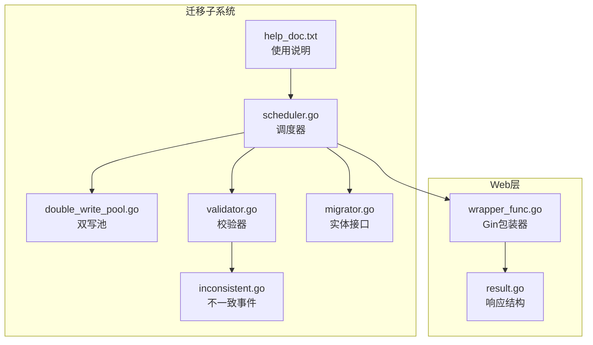
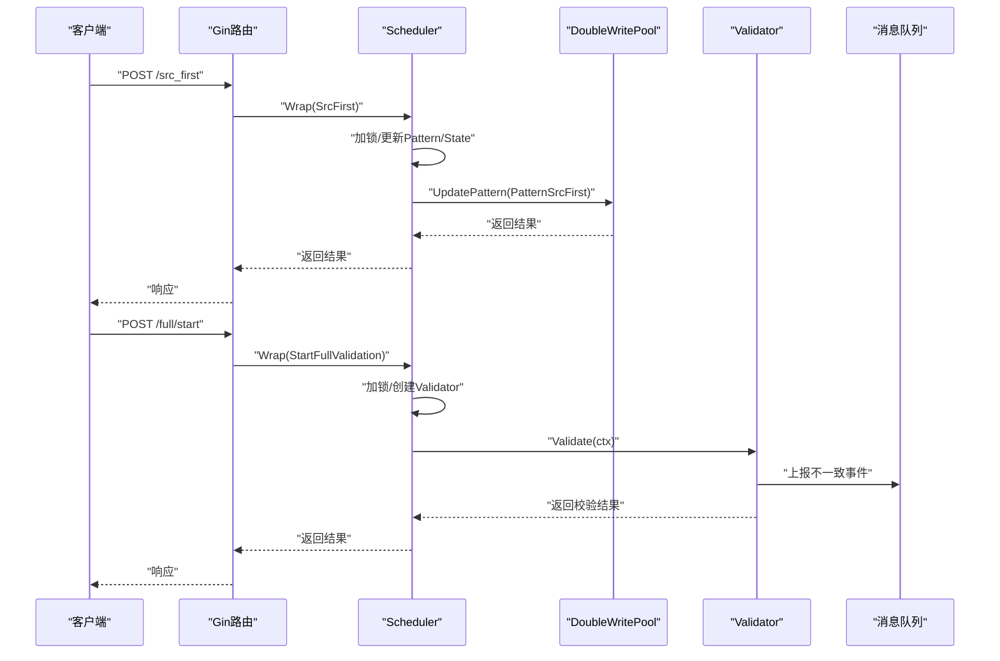
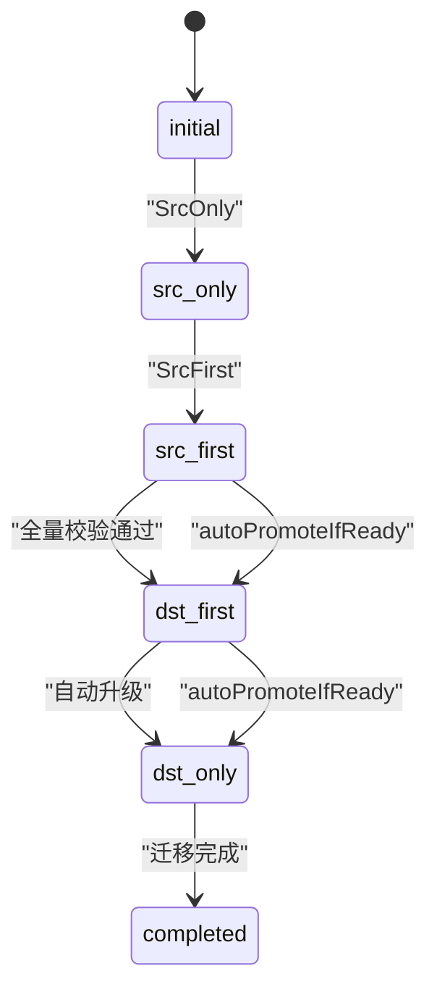
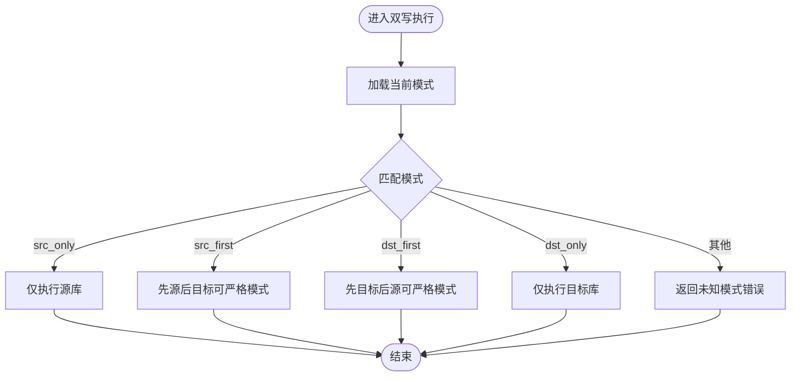
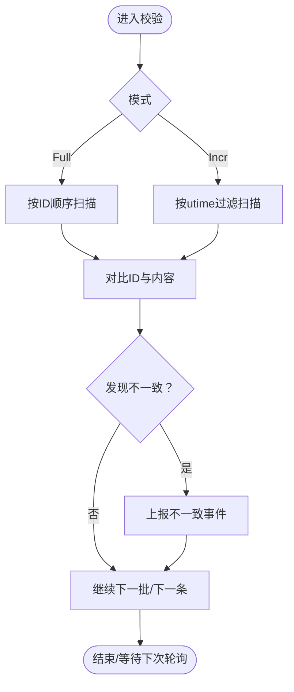
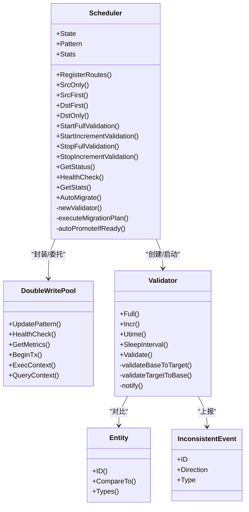

# 迁移调度器

<cite>
**本文引用的文件列表**
- [scheduler.go](file://DBx/mysqlX/gormx/dbMovex/myMovex/scheduler/scheduler.go)
- [scheduler_test.go](file://DBx/mysqlX/gormx/dbMovex/myMovex/scheduler/scheduler_test.go)
- [double_write_pool.go](file://DBx/mysqlX/gormx/dbMovex/myMovex/doubleWritePoolx/double_write_pool.go)
- [validator.go](file://DBx/mysqlX/gormx/dbMovex/myMovex/validator/validator.go)
- [migrator.go](file://DBx/mysqlX/gormx/dbMovex/myMovex/migrator.go)
- [inconsistent.go](file://DBx/mysqlX/gormx/dbMovex/myMovex/events/inconsistent.go)
- [help_doc.txt](file://DBx/mysqlX/gormx/dbMovex/myMovex/help_doc.txt)
- [wrapper_func.go](file://webx/ginx/wrapper_func.go)
- [result.go](file://webx/ginx/result.go)
</cite>

## 目录
1. [简介](#简介)
2. [项目结构](#项目结构)
3. [核心组件](#核心组件)
4. [架构总览](#架构总览)
5. [详细组件分析](#详细组件分析)
6. [依赖关系分析](#依赖关系分析)
7. [性能与可靠性](#性能与可靠性)
8. [故障排查指南](#故障排查指南)
9. [结论](#结论)
10. [附录](#附录)

## 简介
本文件围绕“迁移调度器（Scheduler）”展开，系统性阐述其作为数据库迁移全过程协调者的角色定位。调度器通过封装“双写池（DoubleWritePool）”与“校验器（Validator）”，提供统一的API管理迁移状态（MigrationState）的演进，并通过Gin路由对外暴露控制端点，实现对双写模式切换与全量/增量校验的启动与停止。同时，调度器内置状态机驱动迁移流程，支持自动迁移计划与自动升级策略，并提供统计信息收集与暴露能力，便于运维观测与告警。

## 项目结构
迁移调度器位于数据库迁移子系统中，与双写池、校验器、事件与消息队列等模块协同工作。下图给出与调度器直接相关的文件组织与职责划分。

图表来源
- [scheduler.go](file://DBx/mysqlX/gormx/dbMovex/myMovex/scheduler/scheduler.go#L1-L123)
- [double_write_pool.go](file://DBx/mysqlX/gormx/dbMovex/myMovex/doubleWritePoolx/double_write_pool.go#L1-L120)
- [validator.go](file://DBx/mysqlX/gormx/dbMovex/myMovex/validator/validator.go#L1-L60)
- [inconsistent.go](file://DBx/mysqlX/gormx/dbMovex/myMovex/events/inconsistent.go#L1-L21)
- [migrator.go](file://DBx/mysqlX/gormx/dbMovex/myMovex/migrator.go#L1-L12)
- [help_doc.txt](file://DBx/mysqlX/gormx/dbMovex/myMovex/help_doc.txt#L1-L18)
- [wrapper_func.go](file://webx/ginx/wrapper_func.go#L1-L131)
- [result.go](file://webx/ginx/result.go#L1-L8)

章节来源
- [scheduler.go](file://DBx/mysqlX/gormx/dbMovex/myMovex/scheduler/scheduler.go#L1-L123)
- [help_doc.txt](file://DBx/mysqlX/gormx/dbMovex/myMovex/help_doc.txt#L1-L18)

## 核心组件
- 调度器（Scheduler[T,Pdr]）
  - 职责：封装双写池与校验器，统一管理迁移状态与统计信息；提供Gin路由注册；驱动自动迁移流程与自动升级策略。
  - 关键字段：锁、源/目标数据库、双写池、日志、模式、状态、统计、消息队列生产者与主题、活跃校验器集合、配置。
- 双写池（DoubleWritePool）
  - 职责：在事务或非事务场景下按模式（src_only/src_first/dst_first/dst_only）执行双写/单写；提供健康检查与指标采集。
- 校验器（Validator[T,Pdr]）
  - 职责：在全量/增量模式下对比源与目标数据一致性，发现不一致后通过消息队列上报事件。
- 实体接口（Entity）
  - 职责：约束实体具备ID、比较与类型标识，支撑校验器的对比与上报。
- 不一致事件（InconsistentEvent）
  - 职责：标准化不一致事件的结构，用于消息队列上报。
- Web包装器（ginx）
  - 职责：提供Wrap/WrapBody等包装器，统一Gin处理器的入参绑定、鉴权、日志与指标上报。

章节来源
- [scheduler.go](file://DBx/mysqlX/gormx/dbMovex/myMovex/scheduler/scheduler.go#L46-L101)
- [double_write_pool.go](file://DBx/mysqlX/gormx/dbMovex/myMovex/doubleWritePoolx/double_write_pool.go#L36-L88)
- [validator.go](file://DBx/mysqlX/gormx/dbMovex/myMovex/validator/validator.go#L29-L60)
- [migrator.go](file://DBx/mysqlX/gormx/dbMovex/myMovex/migrator.go#L1-L12)
- [inconsistent.go](file://DBx/mysqlX/gormx/dbMovex/myMovex/events/inconsistent.go#L1-L21)
- [wrapper_func.go](file://webx/ginx/wrapper_func.go#L65-L131)

## 架构总览
调度器作为迁移过程的中枢，向上提供HTTP控制端点，向下协调双写池与校验器，形成“状态机驱动 + 异步校验”的闭环。

图表来源
- [scheduler.go](file://DBx/mysqlX/gormx/dbMovex/myMovex/scheduler/scheduler.go#L103-L123)
- [double_write_pool.go](file://DBx/mysqlX/gormx/dbMovex/myMovex/doubleWritePoolx/double_write_pool.go#L109-L119)
- [validator.go](file://DBx/mysqlX/gormx/dbMovex/myMovex/validator/validator.go#L62-L78)
- [wrapper_func.go](file://webx/ginx/wrapper_func.go#L65-L131)

## 详细组件分析

### 调度器类与状态机
- 类型与字段
  - 泛型参数T满足Entity接口，Pdr为消息队列生产者承载的数据类型。
  - 字段包括：锁、源/目标数据库、双写池、日志、模式（Pattern）、状态（State）、统计（Stats）、取消函数、消息队列生产者与主题、活跃校验器集合、配置。
- 状态常量
  - initial、src_only、src_first、dst_first、dst_only、completed。
- 状态机驱动
  - 模式切换：SrcOnly/SrcFirst/DstFirst/DstOnly分别更新双写池模式并同步状态。
  - 自动迁移：executeMigrationPlan按阶段推进，从只写源库到双写源优先、全量校验、双写目标优先、只写目标库。
  - 自动升级：autoPromoteIfReady在满足条件时自动提升模式，减少人工干预。
- 统计信息
  - MigrationStats包含开始时间、当前状态、全量/增量校验次数、不一致数量、最后一次错误等。
  - GetStats提供只读统计查询。

图表来源
- [scheduler.go](file://DBx/mysqlX/gormx/dbMovex/myMovex/scheduler/scheduler.go#L24-L34)
- [scheduler.go](file://DBx/mysqlX/gormx/dbMovex/myMovex/scheduler/scheduler.go#L358-L403)
- [scheduler.go](file://DBx/mysqlX/gormx/dbMovex/myMovex/scheduler/scheduler.go#L405-L435)

章节来源
- [scheduler.go](file://DBx/mysqlX/gormx/dbMovex/myMovex/scheduler/scheduler.go#L24-L101)
- [scheduler.go](file://DBx/mysqlX/gormx/dbMovex/myMovex/scheduler/scheduler.go#L125-L205)
- [scheduler.go](file://DBx/mysqlX/gormx/dbMovex/myMovex/scheduler/scheduler.go#L207-L287)
- [scheduler.go](file://DBx/mysqlX/gormx/dbMovex/myMovex/scheduler/scheduler.go#L350-L403)
- [scheduler.go](file://DBx/mysqlX/gormx/dbMovex/myMovex/scheduler/scheduler.go#L405-L435)

### 双写池（DoubleWritePool）
- 模式与行为
  - 支持四种模式：src_only、src_first、dst_first、dst_only。
  - 在BeginTx/ExecContext/QueryContext等路径按模式选择源/目标库执行，必要时进行回滚与严格模式控制。
- 健康检查与指标
  - HealthCheck检查源/目标库连接池可用性。
  - 可选指标收集，记录双写成功/失败与查询耗时分布。
- 错误处理
  - 对未知模式、空连接池等情况返回明确错误，便于上层感知。

图表来源
- [double_write_pool.go](file://DBx/mysqlX/gormx/dbMovex/myMovex/doubleWritePoolx/double_write_pool.go#L109-L119)
- [double_write_pool.go](file://DBx/mysqlX/gormx/dbMovex/myMovex/doubleWritePoolx/double_write_pool.go#L256-L350)
- [double_write_pool.go](file://DBx/mysqlX/gormx/dbMovex/myMovex/doubleWritePoolx/double_write_pool.go#L352-L407)

章节来源
- [double_write_pool.go](file://DBx/mysqlX/gormx/dbMovex/myMovex/doubleWritePoolx/double_write_pool.go#L36-L88)
- [double_write_pool.go](file://DBx/mysqlX/gormx/dbMovex/myMovex/doubleWritePoolx/double_write_pool.go#L109-L119)
- [double_write_pool.go](file://DBx/mysqlX/gormx/dbMovex/myMovex/doubleWritePoolx/double_write_pool.go#L121-L146)
- [double_write_pool.go](file://DBx/mysqlX/gormx/dbMovex/myMovex/doubleWritePoolx/double_write_pool.go#L256-L407)

### 校验器（Validator）
- 功能
  - 全量/增量两种模式：Full()/Incr()，支持设置utime与sleepInterval。
  - 双向校验：从base到target与从target到base，发现缺失或不一致时通过消息队列上报事件。
  - 批量处理：target->base侧采用批量查询与差集计算，降低网络与数据库压力。
- 上报机制
  - 通过MessageQueueStr配置生产者与主题，上报不一致事件（缺失、不相等等）。

图表来源
- [validator.go](file://DBx/mysqlX/gormx/dbMovex/myMovex/validator/validator.go#L62-L78)
- [validator.go](file://DBx/mysqlX/gormx/dbMovex/myMovex/validator/validator.go#L80-L132)
- [validator.go](file://DBx/mysqlX/gormx/dbMovex/myMovex/validator/validator.go#L134-L172)
- [validator.go](file://DBx/mysqlX/gormx/dbMovex/myMovex/validator/validator.go#L175-L232)
- [validator.go](file://DBx/mysqlX/gormx/dbMovex/myMovex/validator/validator.go#L241-L256)

章节来源
- [validator.go](file://DBx/mysqlX/gormx/dbMovex/myMovex/validator/validator.go#L29-L60)
- [validator.go](file://DBx/mysqlX/gormx/dbMovex/myMovex/validator/validator.go#L62-L78)
- [validator.go](file://DBx/mysqlX/gormx/dbMovex/myMovex/validator/validator.go#L134-L172)
- [validator.go](file://DBx/mysqlX/gormx/dbMovex/myMovex/validator/validator.go#L175-L232)
- [validator.go](file://DBx/mysqlX/gormx/dbMovex/myMovex/validator/validator.go#L241-L256)

### 实体接口与事件模型
- 实体接口（Entity）
  - 要求实体具备ID()、CompareTo()、Types()，确保校验器能够按ID对比与区分表类型。
- 不一致事件（InconsistentEvent）
  - 结构包含ID、方向（Direction）、类型（Type），用于消息队列上报与后续修复。

章节来源
- [migrator.go](file://DBx/mysqlX/gormx/dbMovex/myMovex/migrator.go#L1-L12)
- [inconsistent.go](file://DBx/mysqlX/gormx/dbMovex/myMovex/events/inconsistent.go#L1-L21)

### Gin路由与Web包装器
- 路由注册（RegisterRoutes）
  - 模式切换：/src_only、/src_first、/dst_first、/dst_only。
  - 校验控制：/full/start、/full/stop、/incr/start、/incr/stop。
  - 辅助接口：/status、/auto-migrate、/health、/stats。
- Web包装器（ginx）
  - Wrap/WrapBody/WrapClaims等，统一处理参数绑定、鉴权、日志与指标上报，返回统一Result结构。

章节来源
- [scheduler.go](file://DBx/mysqlX/gormx/dbMovex/myMovex/scheduler/scheduler.go#L103-L123)
- [wrapper_func.go](file://webx/ginx/wrapper_func.go#L65-L131)
- [result.go](file://webx/ginx/result.go#L1-L8)

## 依赖关系分析
- 调度器依赖
  - 双写池：用于更新写入模式与健康检查。
  - 校验器：用于全量/增量校验，生成不一致事件并通过消息队列上报。
  - Web包装器：用于将调度器方法包装为Gin处理器。
- 双写池依赖
  - GORM连接池（ConnPool）与事务接口（TxBeginner）。
  - 可选指标收集协程。
- 校验器依赖
  - GORM数据库访问、实体接口、消息队列生产者、事件模型。
- 实体接口与事件模型
  - 为校验器提供对比与上报的基础能力。

图表来源
- [scheduler.go](file://DBx/mysqlX/gormx/dbMovex/myMovex/scheduler/scheduler.go#L46-L101)
- [double_write_pool.go](file://DBx/mysqlX/gormx/dbMovex/myMovex/doubleWritePoolx/double_write_pool.go#L36-L88)
- [validator.go](file://DBx/mysqlX/gormx/dbMovex/myMovex/validator/validator.go#L29-L60)
- [migrator.go](file://DBx/mysqlX/gormx/dbMovex/myMovex/migrator.go#L1-L12)
- [inconsistent.go](file://DBx/mysqlX/gormx/dbMovex/myMovex/events/inconsistent.go#L1-L21)

章节来源
- [scheduler.go](file://DBx/mysqlX/gormx/dbMovex/myMovex/scheduler/scheduler.go#L46-L101)
- [double_write_pool.go](file://DBx/mysqlX/gormx/dbMovex/myMovex/doubleWritePoolx/double_write_pool.go#L36-L88)
- [validator.go](file://DBx/mysqlX/gormx/dbMovex/myMovex/validator/validator.go#L29-L60)
- [migrator.go](file://DBx/mysqlX/gormx/dbMovex/myMovex/migrator.go#L1-L12)
- [inconsistent.go](file://DBx/mysqlX/gormx/dbMovex/myMovex/events/inconsistent.go#L1-L21)

## 性能与可靠性
- 并发安全
  - 调度器内部使用互斥锁保护状态变更与统计更新，避免竞态。
- 异步校验
  - 全量/增量校验通过goroutine异步执行，支持取消函数（context.WithCancel）终止。
- 模式切换与严格模式
  - 双写池支持严格模式，可在源/目标库写入失败时快速失败并回滚，保障一致性。
- 指标与健康检查
  - 双写池可选指标收集，定期清理历史指标；健康检查返回具体错误，便于快速定位问题。
- 自动迁移与自动升级
  - 自动迁移按阶段推进，自动升级在无差异时自动提升模式，减少人工干预。

章节来源
- [scheduler.go](file://DBx/mysqlX/gormx/dbMovex/myMovex/scheduler/scheduler.go#L125-L205)
- [scheduler.go](file://DBx/mysqlX/gormx/dbMovex/myMovex/scheduler/scheduler.go#L207-L287)
- [scheduler.go](file://DBx/mysqlX/gormx/dbMovex/myMovex/scheduler/scheduler.go#L358-L403)
- [scheduler.go](file://DBx/mysqlX/gormx/dbMovex/myMovex/scheduler/scheduler.go#L405-L435)
- [double_write_pool.go](file://DBx/mysqlX/gormx/dbMovex/myMovex/doubleWritePoolx/double_write_pool.go#L109-L119)
- [double_write_pool.go](file://DBx/mysqlX/gormx/dbMovex/myMovex/doubleWritePoolx/double_write_pool.go#L121-L146)
- [double_write_pool.go](file://DBx/mysqlX/gormx/dbMovex/myMovex/doubleWritePoolx/double_write_pool.go#L431-L469)

## 故障排查指南
- 健康检查失败
  - 通过/health接口查看双写池健康检查结果，关注源/目标库连接池状态。
- 模式切换失败
  - 检查双写池UpdatePattern返回的错误，确认传入模式是否合法。
- 校验异常
  - 查看/health与/status返回的pool_health/pool_metrics，结合日志定位问题。
- 统计信息
  - 通过/stats与/status查看全量/增量校验次数、不一致数量与最后错误，辅助定位问题根因。
- 自动迁移失败
  - 观察自动迁移流程各阶段的日志输出，确认每一步的模式更新与错误信息。

章节来源
- [scheduler.go](file://DBx/mysqlX/gormx/dbMovex/myMovex/scheduler/scheduler.go#L324-L348)
- [scheduler.go](file://DBx/mysqlX/gormx/dbMovex/myMovex/scheduler/scheduler.go#L302-L322)
- [double_write_pool.go](file://DBx/mysqlX/gormx/dbMovex/myMovex/doubleWritePoolx/double_write_pool.go#L121-L146)

## 结论
迁移调度器通过封装双写池与校验器，实现了对数据库迁移全过程的统一协调与可观测。其状态机驱动的迁移流程、灵活的模式切换、完善的统计与健康检查，以及异步校验与自动升级能力，共同构成了高可靠、易运维的迁移体系。配合Gin路由与Web包装器，调度器既可嵌入业务系统，也可作为独立控制面供运维使用。

## 附录

### 使用示例与最佳实践
- 初始化与集成
  - 使用NewScheduler创建调度器实例，传入日志、源/目标数据库、双写池与消息队列生产者。
  - 通过RegisterRoutes将控制端点注册到Gin路由组，即可通过HTTP控制双写模式与校验任务。
  - 参考帮助文档了解如何替换默认gorm.db并集成双写池与调度器。
- 控制端点
  - 模式切换：/src_only、/src_first、/dst_first、/dst_only。
  - 校验控制：/full/start、/full/stop、/incr/start、/incr/stop。
  - 辅助接口：/status、/auto-migrate、/health、/stats。
- 自动迁移
  - 调用/AutoMigrate触发自动迁移流程，按阶段推进并自动升级。
- 统计与监控
  - 通过/stats与/status获取统计与健康信息，结合日志与指标进行监控。

章节来源
- [scheduler.go](file://DBx/mysqlX/gormx/dbMovex/myMovex/scheduler/scheduler.go#L78-L101)
- [scheduler.go](file://DBx/mysqlX/gormx/dbMovex/myMovex/scheduler/scheduler.go#L103-L123)
- [help_doc.txt](file://DBx/mysqlX/gormx/dbMovex/myMovex/help_doc.txt#L1-L18)