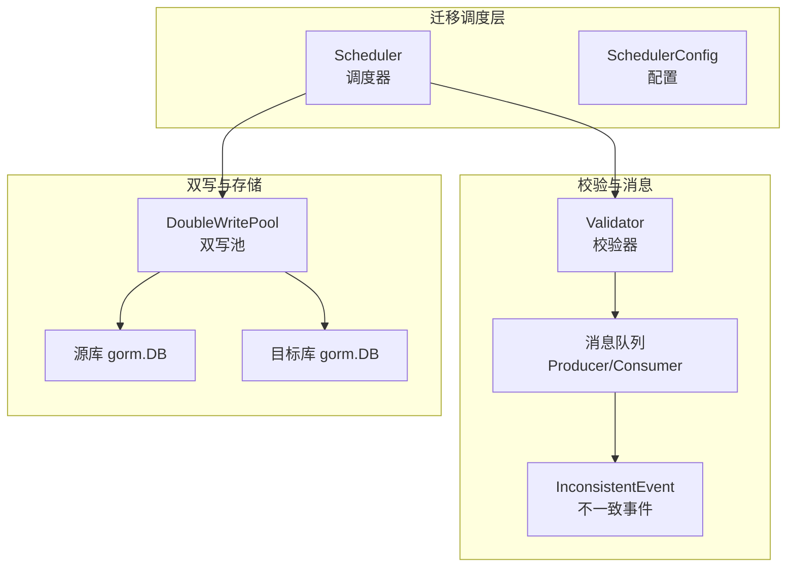
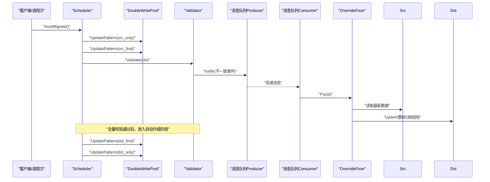
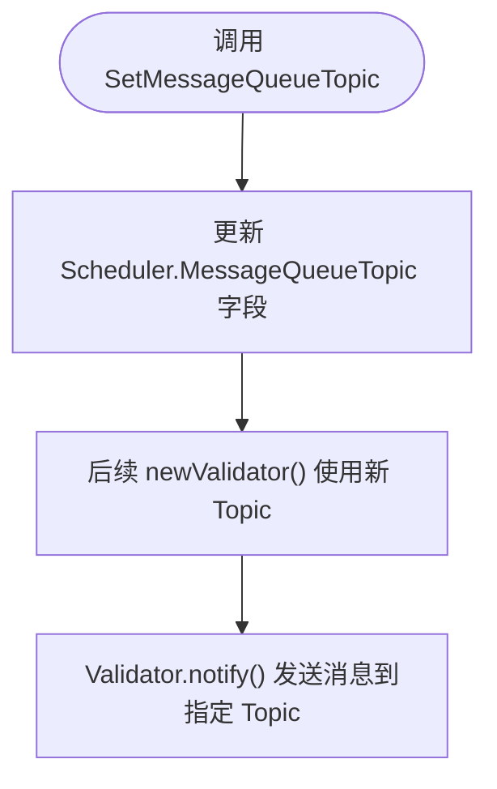
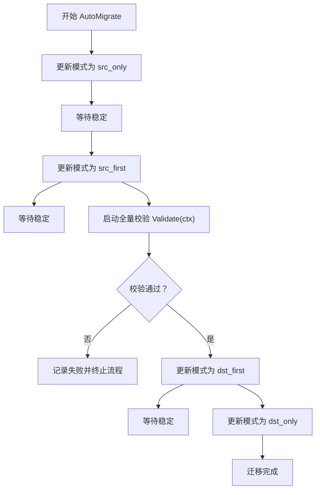
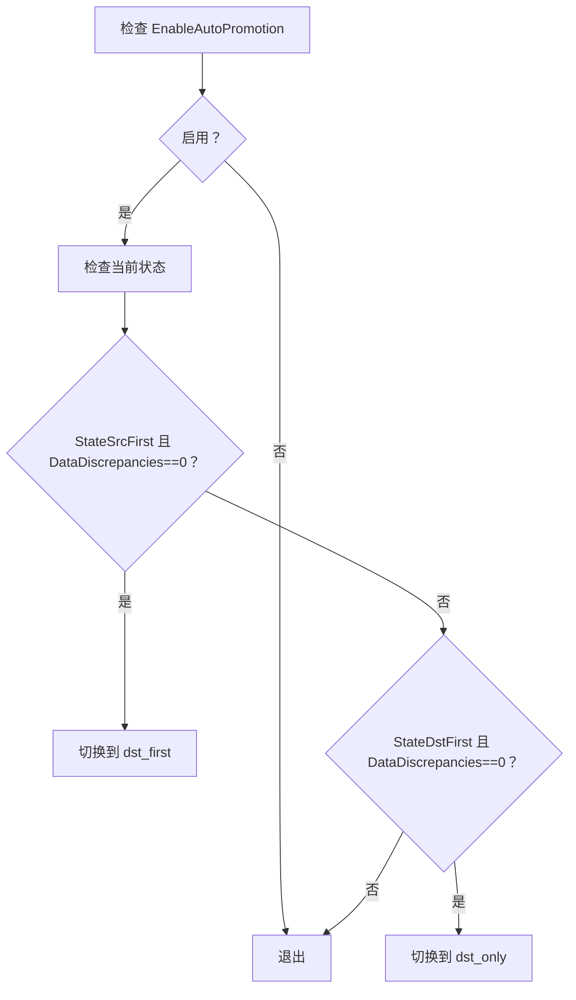
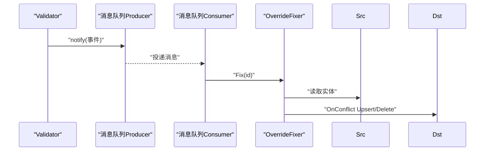
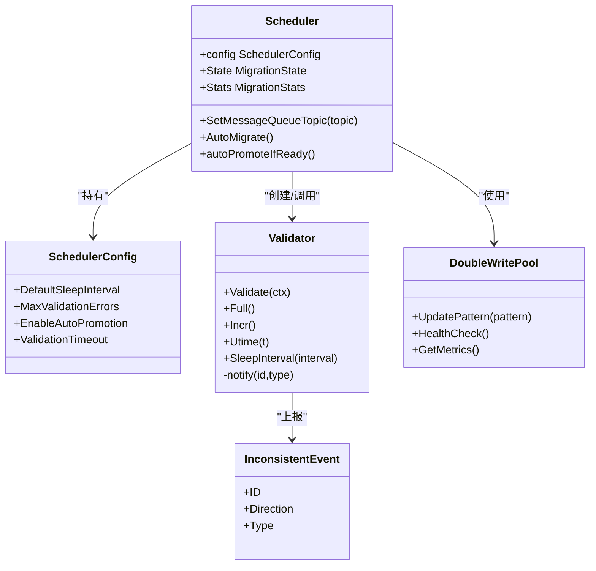

# 配置与高级功能

<cite>
**本文引用的文件列表**
- [scheduler.go](file://DBx/mysqlX/gormx/dbMovex/myMovex/scheduler/scheduler.go)
- [validator.go](file://DBx/mysqlX/gormx/dbMovex/myMovex/validator/validator.go)
- [double_write_pool.go](file://DBx/mysqlX/gormx/dbMovex/myMovex/doubleWritePoolx/double_write_pool.go)
- [inconsistent.go](file://DBx/mysqlX/gormx/dbMovex/myMovex/events/inconsistent.go)
- [consumer.go](file://DBx/mysqlX/gormx/dbMovex/myMovex/messageQueue/consumerx/consumer.go)
- [fixer.go](file://DBx/mysqlX/gormx/dbMovex/myMovex/messageQueue/consumerx/fixer.go)
- [migrator.go](file://DBx/mysqlX/gormx/dbMovex/myMovex/migrator.go)
- [help_doc.txt](file://DBx/mysqlX/gormx/dbMovex/myMovex/help_doc.txt)
- [scheduler_test.go](file://DBx/mysqlX/gormx/dbMovex/myMovex/scheduler/scheduler_test.go)
</cite>

## 目录
1. [简介](#简介)
2. [项目结构](#项目结构)
3. [核心组件](#核心组件)
4. [架构总览](#架构总览)
5. [详细组件分析](#详细组件分析)
6. [依赖关系分析](#依赖关系分析)
7. [性能考量](#性能考量)
8. [故障排查指南](#故障排查指南)
9. [结论](#结论)

## 简介
本文件聚焦于迁移调度器的配置选项与高级功能，围绕 SchedulerConfig 结构体的四个关键字段展开：DefaultSleepInterval（默认睡眠间隔）、MaxValidationErrors（最大校验错误数）、EnableAutoPromotion（自动升级开关）、ValidationTimeout（校验超时），并深入解析 SetMessageQueueTopic 方法如何允许用户自定义消息队列主题；同时，系统性阐述 AutoMigrate 方法实现的自动化迁移流程，以及 autoPromoteIfReady 方法如何依据数据一致性（DataDiscrepancies 为 0）与 EnableAutoPromotion 配置自动推进迁移状态，从而实现无人值守的迁移。

## 项目结构
围绕“迁移调度器”主题，相关代码主要分布在以下模块：
- 调度器与配置：DBx/mysqlX/gormx/dbMovex/myMovex/scheduler
- 校验器与消息队列：DBx/mysqlX/gormx/dbMovex/myMovex/validator、messageQueue/consumerx
- 双写池：DBx/mysqlX/gormx/dbMovex/myMovex/doubleWritePoolx
- 事件模型：DBx/mysqlX/gormx/dbMovex/myMovex/events
- 实体接口：DBx/mysqlX/gormx/dbMovex/myMovex/migrator.go
- 使用说明与测试：help_doc.txt、scheduler_test.go

图表来源
- [scheduler.go](file://DBx/mysqlX/gormx/dbMovex/myMovex/scheduler/scheduler.go#L46-L101)
- [validator.go](file://DBx/mysqlX/gormx/dbMovex/myMovex/validator/validator.go#L23-L60)
- [double_write_pool.go](file://DBx/mysqlX/gormx/dbMovex/myMovex/doubleWritePoolx/double_write_pool.go#L36-L119)
- [inconsistent.go](file://DBx/mysqlX/gormx/dbMovex/myMovex/events/inconsistent.go#L1-L21)

章节来源
- [scheduler.go](file://DBx/mysqlX/gormx/dbMovex/myMovex/scheduler/scheduler.go#L46-L101)
- [validator.go](file://DBx/mysqlX/gormx/dbMovex/myMovex/validator/validator.go#L23-L60)
- [double_write_pool.go](file://DBx/mysqlX/gormx/dbMovex/myMovex/doubleWritePoolx/double_write_pool.go#L36-L119)
- [inconsistent.go](file://DBx/mysqlX/gormx/dbMovex/myMovex/events/inconsistent.go#L1-L21)
- [help_doc.txt](file://DBx/mysqlX/gormx/dbMovex/myMovex/help_doc.txt#L1-L18)

## 核心组件
- SchedulerConfig：调度器配置对象，包含 DefaultSleepInterval、MaxValidationErrors、EnableAutoPromotion、ValidationTimeout 四个字段，用于控制校验行为与自动升级策略。
- Scheduler：迁移调度器，负责状态机推进、模式切换、校验启停、消息队列主题设置、自动化迁移流程与自动升级。
- Validator：数据校验器，负责双向校验（源→目标、目标→源），在发现不一致时通过消息队列上报事件。
- DoubleWritePool：双写连接池，抽象不同写入模式（仅源、源优先、目标优先、仅目标），并提供健康检查与指标采集。
- InconsistentEvent：不一致事件载体，携带 ID、方向（Direction）与类型（Type）等信息，供消息队列消费端修复使用。

章节来源
- [scheduler.go](file://DBx/mysqlX/gormx/dbMovex/myMovex/scheduler/scheduler.go#L70-L76)
- [scheduler.go](file://DBx/mysqlX/gormx/dbMovex/myMovex/scheduler/scheduler.go#L46-L68)
- [validator.go](file://DBx/mysqlX/gormx/dbMovex/myMovex/validator/validator.go#L23-L60)
- [double_write_pool.go](file://DBx/mysqlX/gormx/dbMovex/myMovex/doubleWritePoolx/double_write_pool.go#L36-L119)
- [inconsistent.go](file://DBx/mysqlX/gormx/dbMovex/myMovex/events/inconsistent.go#L1-L21)

## 架构总览
下图展示从调度器到双写池、校验器与消息队列的整体交互：

图表来源
- [scheduler.go](file://DBx/mysqlX/gormx/dbMovex/myMovex/scheduler/scheduler.go#L350-L403)
- [validator.go](file://DBx/mysqlX/gormx/dbMovex/myMovex/validator/validator.go#L241-L256)
- [consumer.go](file://DBx/mysqlX/gormx/dbMovex/myMovex/messageQueue/consumerx/consumer.go#L78-L95)
- [fixer.go](file://DBx/mysqlX/gormx/dbMovex/myMovex/messageQueue/consumerx/fixer.go#L25-L41)
- [double_write_pool.go](file://DBx/mysqlX/gormx/dbMovex/myMovex/doubleWritePoolx/double_write_pool.go#L109-L119)

## 详细组件分析

### 配置项详解：SchedulerConfig
- DefaultSleepInterval（默认睡眠间隔）
  - 作用：在增量校验循环中，当无新数据或达到轮询边界时，校验器会按该间隔休眠，避免空转占用 CPU。
  - 设置位置：通过 StartIncrementValidation 请求参数 Interval 传入，Validator 的 SleepInterval 接口生效。
  - 影响范围：影响增量校验的扫描节奏与资源消耗。
  
  章节来源
  - [scheduler.go](file://DBx/mysqlX/gormx/dbMovex/myMovex/scheduler/scheduler.go#L218-L247)
  - [validator.go](file://DBx/mysqlX/gormx/dbMovex/myMovex/validator/validator.go#L149-L151)

- MaxValidationErrors（最大校验错误数）
  - 作用：用于限制校验过程中允许出现的错误数量阈值，超过阈值可触发告警或中止流程（具体策略取决于上层业务与监控体系）。
  - 设置位置：SchedulerConfig 中定义，当前代码未直接使用该字段，建议结合外部监控与策略引擎实现。
  
  章节来源
  - [scheduler.go](file://DBx/mysqlX/gormx/dbMovex/myMovex/scheduler/scheduler.go#L70-L76)

- EnableAutoPromotion（自动升级开关）
  - 作用：启用后，当处于特定状态且 DataDiscrepancies 为 0 时，调度器将自动推进到下一阶段（如从 src_first 切换到 dst_first，再从 dst_first 切换到 dst_only）。
  - 触发条件：仅在 EnableAutoPromotion 为真时生效；且当前状态为 StateSrcFirst 或 StateDstFirst。
  - 行为细节：切换前会记录日志，切换失败会记录错误并终止自动升级。
  
  章节来源
  - [scheduler.go](file://DBx/mysqlX/gormx/dbMovex/myMovex/scheduler/scheduler.go#L406-L435)

- ValidationTimeout（校验超时）
  - 作用：为全量校验设置超时时间，防止长时间阻塞导致资源占用。
  - 设置位置：在 AutoMigrate 的 executeMigrationPlan 中使用 context.WithTimeout 控制全量校验的生命周期。
  - 影响范围：超时将导致全量校验提前结束，可能影响自动迁移流程的推进。
  
  章节来源
  - [scheduler.go](file://DBx/mysqlX/gormx/dbMovex/myMovex/scheduler/scheduler.go#L376-L403)

### SetMessageQueueTopic 方法：自定义消息队列主题
- 功能：允许用户在运行时动态设置消息队列主题 Topic，从而灵活适配不同的环境或业务线。
- 使用场景：当需要将不一致事件路由到不同 Topic 时，可通过该方法进行覆盖。
- 注意事项：设置后，后续创建的 Validator 将使用新的 Topic，确保消息队列消费者订阅正确 Topic。

图表来源
- [scheduler.go](file://DBx/mysqlX/gormx/dbMovex/myMovex/scheduler/scheduler.go#L443-L447)
- [validator.go](file://DBx/mysqlX/gormx/dbMovex/myMovex/validator/validator.go#L23-L27)
- [validator.go](file://DBx/mysqlX/gormx/dbMovex/myMovex/validator/validator.go#L241-L256)

章节来源
- [scheduler.go](file://DBx/mysqlX/gormx/dbMovex/myMovex/scheduler/scheduler.go#L443-L447)
- [validator.go](file://DBx/mysqlX/gormx/dbMovex/myMovex/validator/validator.go#L23-L27)
- [validator.go](file://DBx/mysqlX/gormx/dbMovex/myMovex/validator/validator.go#L241-L256)

### AutoMigrate 自动化迁移流程
- 流程阶段：
  1) 仅写源库（src_only）：稳定写入源库，准备迁移。
  2) 双写，源库优先（src_first）：开启双写，随后启动全量校验。
  3) 若全量校验通过：切换到双写，目标库优先（dst_first）。
  4) 最终切换到仅写目标库（dst_only），完成迁移。
- 关键点：
  - 使用 context.WithTimeout 控制全量校验超时。
  - 每个阶段均记录日志，并在切换失败时输出错误。
  - 阶段间存在短暂 sleep，确保系统稳定。

图表来源
- [scheduler.go](file://DBx/mysqlX/gormx/dbMovex/myMovex/scheduler/scheduler.go#L350-L403)

章节来源
- [scheduler.go](file://DBx/mysqlX/gormx/dbMovex/myMovex/scheduler/scheduler.go#L350-L403)

### autoPromoteIfReady 自动升级机制
- 触发条件：
  - EnableAutoPromotion 为真。
  - 当前状态为 StateSrcFirst 或 StateDstFirst。
  - Stats.DataDiscrepancies 为 0。
- 升级路径：
  - StateSrcFirst 且无差异 → 切换到 StateDstFirst（目标库优先）。
  - StateDstFirst 且无差异 → 切换到 StateDstOnly（仅写目标库）。
- 错误处理：切换失败会记录错误日志，不影响后续手动干预。

图表来源
- [scheduler.go](file://DBx/mysqlX/gormx/dbMovex/myMovex/scheduler/scheduler.go#L406-L435)

章节来源
- [scheduler.go](file://DBx/mysqlX/gormx/dbMovex/myMovex/scheduler/scheduler.go#L406-L435)
- [scheduler_test.go](file://DBx/mysqlX/gormx/dbMovex/myMovex/scheduler/scheduler_test.go#L225-L257)

### 校验器与消息队列联动
- 校验器 Validator：
  - 支持全量与增量两种模式，分别通过 fullFromBase 与 incrFromBase 迭代扫描。
  - 双向校验：从源到目标、从目标到源，发现缺失或不一致时，通过消息队列上报事件。
  - 通知机制：notify 方法将事件序列化后发送到指定 Topic。
- 消息队列消费者与修复器：
  - 消费者订阅指定 Topic，反序列化事件后调用 OverrideFixer 进行修复（Upsert 或 Delete）。
  - 修复器根据实体类型动态获取列名，保证冲突更新时仅更新实际存在的列。

图表来源
- [validator.go](file://DBx/mysqlX/gormx/dbMovex/myMovex/validator/validator.go#L134-L172)
- [validator.go](file://DBx/mysqlX/gormx/dbMovex/myMovex/validator/validator.go#L241-L256)
- [consumer.go](file://DBx/mysqlX/gormx/dbMovex/myMovex/messageQueue/consumerx/consumer.go#L78-L95)
- [fixer.go](file://DBx/mysqlX/gormx/dbMovex/myMovex/messageQueue/consumerx/fixer.go#L25-L41)
- [inconsistent.go](file://DBx/mysqlX/gormx/dbMovex/myMovex/events/inconsistent.go#L1-L21)

章节来源
- [validator.go](file://DBx/mysqlX/gormx/dbMovex/myMovex/validator/validator.go#L134-L172)
- [validator.go](file://DBx/mysqlX/gormx/dbMovex/myMovex/validator/validator.go#L241-L256)
- [consumer.go](file://DBx/mysqlX/gormx/dbMovex/myMovex/messageQueue/consumerx/consumer.go#L78-L95)
- [fixer.go](file://DBx/mysqlX/gormx/dbMovex/myMovex/messageQueue/consumerx/fixer.go#L25-L41)
- [inconsistent.go](file://DBx/mysqlX/gormx/dbMovex/myMovex/events/inconsistent.go#L1-L21)

## 依赖关系分析
- Scheduler 依赖：
  - 双写池 DoubleWritePool：用于模式切换与读写路由。
  - Validator：用于全量/增量校验与不一致事件上报。
  - 消息队列 Producer：用于上报不一致事件。
- Validator 依赖：
  - Entity 接口：要求实体具备 ID()、CompareTo()、Types() 能力。
  - 消息队列 Producer：用于事件上报。
- Consumer 与 Fixer：
  - 依赖 GORM 实体类型，通过 OnConflict 进行修复。

图表来源
- [scheduler.go](file://DBx/mysqlX/gormx/dbMovex/myMovex/scheduler/scheduler.go#L46-L76)
- [validator.go](file://DBx/mysqlX/gormx/dbMovex/myMovex/validator/validator.go#L23-L60)
- [double_write_pool.go](file://DBx/mysqlX/gormx/dbMovex/myMovex/doubleWritePoolx/double_write_pool.go#L109-L119)
- [inconsistent.go](file://DBx/mysqlX/gormx/dbMovex/myMovex/events/inconsistent.go#L1-L21)

章节来源
- [scheduler.go](file://DBx/mysqlX/gormx/dbMovex/myMovex/scheduler/scheduler.go#L46-L76)
- [validator.go](file://DBx/mysqlX/gormx/dbMovex/myMovex/validator/validator.go#L23-L60)
- [double_write_pool.go](file://DBx/mysqlX/gormx/dbMovex/myMovex/doubleWritePoolx/double_write_pool.go#L109-L119)
- [inconsistent.go](file://DBx/mysqlX/gormx/dbMovex/myMovex/events/inconsistent.go#L1-L21)

## 性能考量
- 增量校验的睡眠间隔（DefaultSleepInterval）直接影响扫描频率与 CPU 占用，建议根据业务流量与延迟容忍度调整。
- 全量校验的 ValidationTimeout 用于防止长时间阻塞，建议结合数据规模与硬件资源合理设置。
- MaxValidationErrors 当前未在代码中直接使用，建议结合监控系统实现阈值告警与自动中止策略。
- 双写池的 StrictMode 与 RetryAttempts 可影响写入成功率与延迟，应根据业务一致性需求权衡。

[本节为通用指导，无需列出章节来源]

## 故障排查指南
- 自动迁移失败
  - 检查双写模式切换是否成功（UpdatePattern 返回错误）。
  - 查看全量校验是否超时或提前结束。
  - 关注日志中的错误信息与状态变更。
  
  章节来源
  - [scheduler.go](file://DBx/mysqlX/gormx/dbMovex/myMovex/scheduler/scheduler.go#L360-L403)

- 自动升级未发生
  - 确认 EnableAutoPromotion 已启用。
  - 确认 Stats.DataDiscrepancies 为 0。
  - 检查当前状态是否为 StateSrcFirst 或 StateDstFirst。
  
  章节来源
  - [scheduler.go](file://DBx/mysqlX/gormx/dbMovex/myMovex/scheduler/scheduler.go#L406-L435)
  - [scheduler_test.go](file://DBx/mysqlX/gormx/dbMovex/myMovex/scheduler/scheduler_test.go#L225-L257)

- 消息队列不一致事件未被消费
  - 确认 SetMessageQueueTopic 已正确设置。
  - 检查消费者订阅 Topic 是否与生产者一致。
  - 核对消费者处理逻辑与实体类型匹配。
  
  章节来源
  - [scheduler.go](file://DBx/mysqlX/gormx/dbMovex/myMovex/scheduler/scheduler.go#L443-L447)
  - [validator.go](file://DBx/mysqlX/gormx/dbMovex/myMovex/validator/validator.go#L241-L256)
  - [consumer.go](file://DBx/mysqlX/gormx/dbMovex/myMovex/messageQueue/consumerx/consumer.go#L60-L95)

## 结论
通过 SchedulerConfig 的四维配置与 SetMessageQueueTopic 的动态主题能力，调度器实现了对校验节奏、错误阈值、自动升级与超时控制的精细化管理。配合 AutoMigrate 的自动化流程与 autoPromoteIfReady 的无人值守推进，系统能够在保障数据一致性的前提下，显著降低人工干预成本。建议在生产环境中结合监控与告警体系，将 MaxValidationErrors 等策略落地，并根据业务特性优化 DefaultSleepInterval 与 ValidationTimeout，以获得最佳的迁移体验与稳定性。