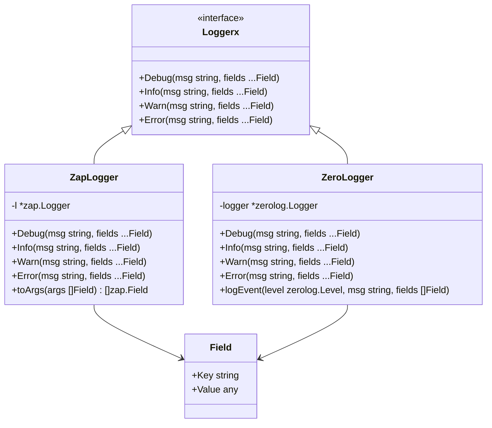
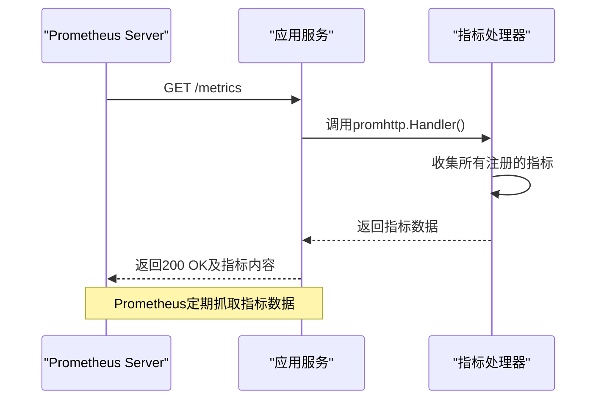
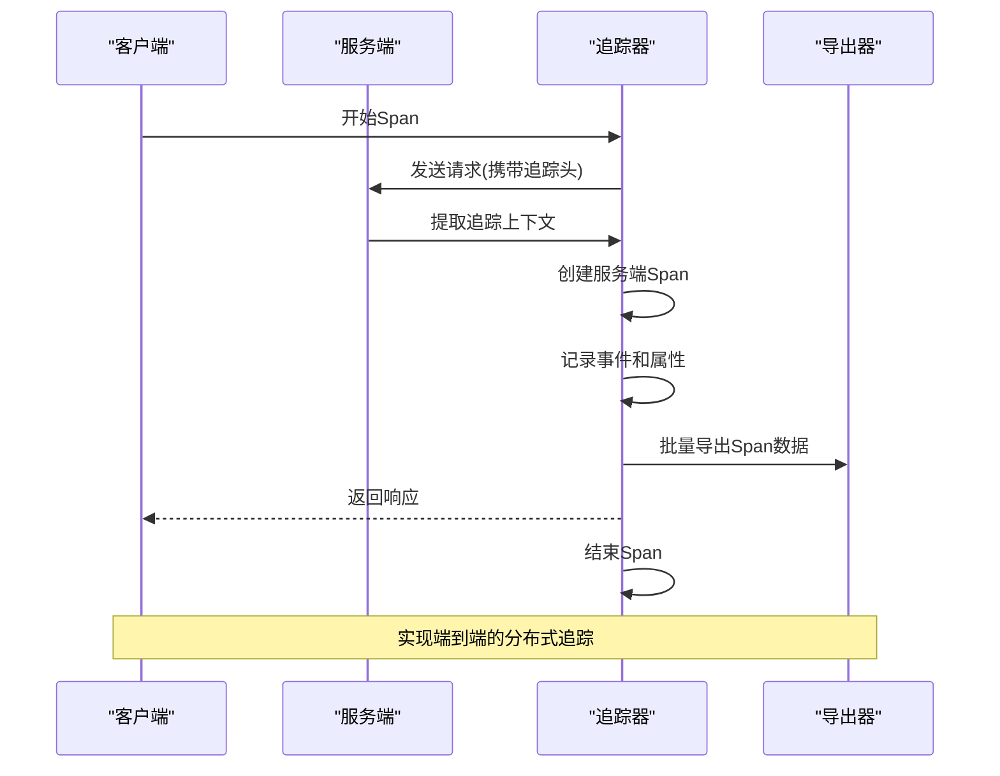
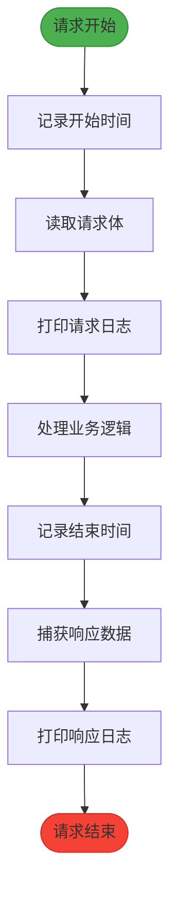
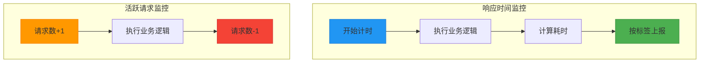
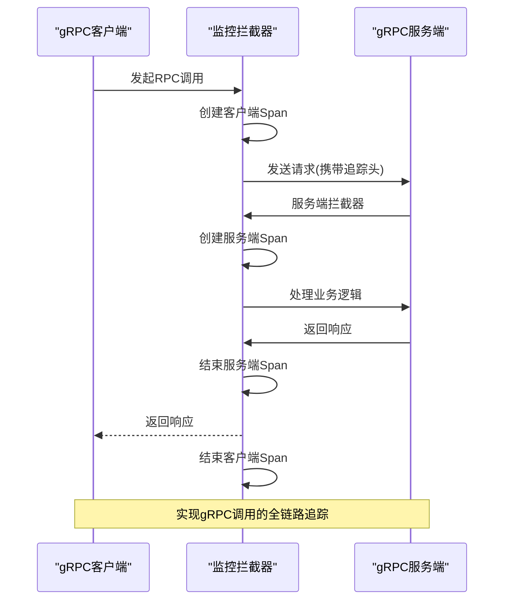
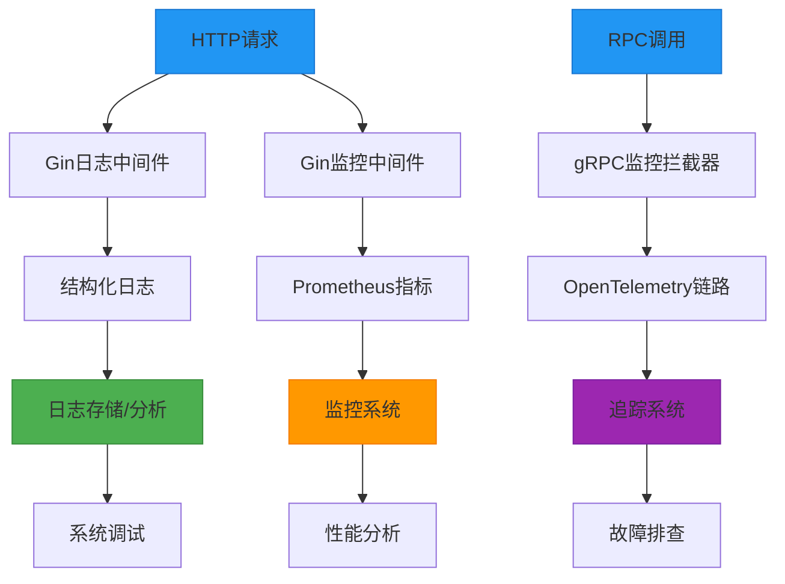

# 日志与监控

<cite>
**本文档引用的文件**
- [zapLogger.go](file://logx/zaplogx/zapLogger.go)
- [logx.go](file://logx/zerologx/logx.go)
- [types.go](file://logx/types.go)
- [fields.go](file://logx/fields.go)
- [prometheus.go](file://observationX/prometheusX/prometheus.go)
- [otel.go](file://observationX/opentelemetryX/otel.go)
- [otelTracer.go](file://observationX/opentelemetryX/otelTracer.go)
- [LogGinBuild.go](file://webx/ginx/middleware/logx/LogGinBuild.go)
- [prometheusGinBuild.go](file://webx/ginx/middleware/ginPrometheusx/prometheusGinBuild.go)
- [otle.go](file://rpc/grpcx/observationX/otleTraceX/otle.go)
</cite>

## 目录
1. [简介](#简介)
2. [日志组件](#日志组件)
3. [监控组件](#监控组件)
4. [Web中间件集成](#web中间件集成)
5. [RPC拦截器集成](#rpc拦截器集成)
6. [可观测性体系构建](#可观测性体系构建)
7. [系统调试与故障排查支持](#系统调试与故障排查支持)
8. [结论](#结论)

## 简介
本文档全面介绍日志与监控系统，涵盖高性能日志库封装、指标暴露、分布式链路追踪等核心功能。通过分析zaplogx和zerologx两种日志库的封装实现，以及PrometheusX和OpenTelemetryX监控组件的集成方式，展示如何构建完整的可观测性体系，为系统调试、性能分析和故障排查提供有力支持。

## 日志组件

### zaplogx与zerologx日志库封装对比
本项目封装了两种高性能日志库：zaplogx基于Uber的zap库，zerologx基于rs/zerolog库。两者都实现了统一的Loggerx接口，提供Debug、Info、Warn、Error等日志级别方法。

zaplogx通过ZapLogger结构体封装zap.Logger，将通用的Field结构转换为zap.Field进行日志记录。zerologx则通过ZeroLogger结构体封装zerolog.Logger，支持更细粒度的日志类型处理，如字符串、整数、浮点数、时间等不同类型的数据。

两种封装都遵循接口抽象原则，通过logx.Loggerx接口定义日志行为，实现解耦，便于在不同日志实现之间切换。

**Section sources**
- [zapLogger.go](file://logx/zaplogx/zapLogger.go#L8-L47)
- [logx.go](file://logx/zerologx/logx.go#L12-L144)
- [types.go](file://logx/types.go#L6-L11)

### 结构化日志记录器创建
创建结构化日志记录器时，首先定义统一的Loggerx接口，包含基本的日志级别方法。然后通过NewZapLogger或NewZeroLogger工厂函数创建具体的日志实例。

日志字段通过Field结构体表示，包含Key和Value两个属性。提供了丰富的辅助函数如String、Int、Bool等来创建不同类型的数据字段，支持结构化日志输出。

**Diagram sources**
- [types.go](file://logx/types.go#L6-L11)
- [zapLogger.go](file://logx/zaplogx/zapLogger.go#L8-L47)
- [logx.go](file://logx/zerologx/logx.go#L12-L144)

**Section sources**
- [types.go](file://logx/types.go#L6-L25)
- [fields.go](file://logx/fields.go#L7-L75)
- [zapLogger.go](file://logx/zaplogx/zapLogger.go#L8-L47)
- [logx.go](file://logx/zerologx/logx.go#L12-L144)

### 日志级别与输出格式设置
日志级别设置在日志实例创建时完成。对于zaplogx，可通过zap配置的Level字段设置；对于zerologx，通过zerolog.New函数的Level方法设置。

输出格式方面，zaplogx支持JSON和文本格式，可通过编码器配置；zerologx默认输出JSON格式，时间格式可通过zerolog.TimeFieldFormat设置。两者都支持添加时间戳、调用者信息等上下文数据。

在警告和错误级别日志中，zerologx会自动添加调用堆栈信息（默认跳过2层），便于定位问题。

**Section sources**
- [zapLogger.go](file://logx/zaplogx/zapLogger.go#L39-L46)
- [logx.go](file://logx/zerologx/logx.go#L34-L37)
- [zapLogger_test.go](file://logx/zaplogx/zapLogger_test.go#L11-L23)
- [logx_test.go](file://logx/zerologx/logx_test.go#L13-L17)

## 监控组件

### PrometheusX指标暴露
PrometheusX组件用于暴露系统指标，支持多种指标类型：计数器(Counter)、仪表(Gauge)、直方图(Histogram)和概要(Summary)。

通过InitPrometheus函数启动HTTP服务，在/metrics路径暴露指标。支持创建命名空间、子系统和实例ID等维度的指标，便于多服务、多实例的监控。

提供了向量(Vector)功能，可根据业务特征如请求方法、路径、状态码等维度统计指标，实现精细化监控。

**Diagram sources**
- [prometheus.go](file://observationX/prometheusX/prometheus.go#L9-L15)
- [prometheus.go](file://observationX/prometheusX/prometheus.go#L17-L107)

**Section sources**
- [prometheus.go](file://observationX/prometheusX/prometheus.go#L9-L107)

### OpenTelemetryX分布式链路追踪
OpenTelemetryX组件实现分布式链路追踪，通过otel.go中的NewOtelStr函数初始化全局追踪器。

支持创建Span，记录请求的开始和结束时间，添加事件和属性。通过传播器(Propagator)在服务间传递追踪上下文，实现跨服务的链路追踪。

提供了OTELInterceptorBuilder用于构建gRPC拦截器，自动为gRPC调用创建Span，记录调用详情、错误信息和状态码。

**Diagram sources**
- [otel.go](file://observationX/opentelemetryX/otel.go#L33-L63)
- [otle.go](file://rpc/grpcx/observationX/otleTraceX/otle.go#L24-L72)

**Section sources**
- [otel.go](file://observationX/opentelemetryX/otel.go#L1-L101)
- [otelTracer.go](file://observationX/opentelemetryX/otelTracer.go#L1-L18)
- [otle.go](file://rpc/grpcx/observationX/otleTraceX/otle.go#L1-L155)

## Web中间件集成

### Gin日志中间件
通过LogGinBuild.go实现Gin框架的日志中间件，记录HTTP请求的完整信息，包括客户端IP、请求方法、路径、查询参数、请求头、请求体、响应状态码、响应头、响应体、请求耗时等。

支持配置是否打印请求体和响应体，以及最大读取大小限制，防止大文件传输导致内存消耗过大。通过自定义responseWriter捕获响应数据。

**Diagram sources**
- [LogGinBuild.go](file://webx/ginx/middleware/logx/LogGinBuild.go#L53-L113)

**Section sources**
- [LogGinBuild.go](file://webx/ginx/middleware/logx/LogGinBuild.go#L1-L275)

### Gin监控中间件
通过prometheusGinBuild.go实现Gin框架的监控中间件，暴露HTTP请求相关指标。

BuildResponseTime中间件记录请求响应时间，按方法、路径、状态码维度统计；BuildActiveRequest中间件记录活跃请求数，实时反映系统负载。

**Diagram sources**
- [prometheusGinBuild.go](file://webx/ginx/middleware/ginPrometheusx/prometheusGinBuild.go#L32-L79)
- [prometheusGinBuild.go](file://webx/ginx/middleware/ginPrometheusx/prometheusGinBuild.go#L82-L110)

**Section sources**
- [prometheusGinBuild.go](file://webx/ginx/middleware/ginPrometheusx/prometheusGinBuild.go#L1-L111)
- [types.go](file://webx/ginx/middleware/ginPrometheusx/types.go#L6-L13)

## RPC拦截器集成

### gRPC日志拦截器
在gRPC服务中，通过拦截器模式集成日志功能。虽然具体实现文件未提供，但根据架构设计，应存在类似的日志拦截器，记录RPC调用的请求和响应信息。

### gRPC监控拦截器
通过otle.go实现gRPC的OpenTelemetry拦截器，自动为每个RPC调用创建Span。支持一元调用的服务器和客户端拦截器，记录调用详情、错误信息和状态码。

拦截器通过GrpcHeaderCarrier在请求头中传递追踪上下文，实现跨服务的链路追踪。

**Diagram sources**
- [otle.go](file://rpc/grpcx/observationX/otleTraceX/otle.go#L32-L72)
- [otle.go](file://rpc/grpcx/observationX/otleTraceX/otle.go#L74-L110)

**Section sources**
- [otle.go](file://rpc/grpcx/observationX/otleTraceX/otle.go#L1-L155)

## 可观测性体系构建

### 组件集成策略
通过统一的接口抽象和中间件/拦截器模式，将日志和监控组件无缝集成到Web和RPC框架中。

日志系统通过Loggerx接口实现多后端支持，监控系统通过Prometheus和OpenTelemetry标准实现指标收集和链路追踪。

### 完整可观测性流程
构建了从请求入口到业务处理再到响应出口的完整可观测性流程：

1. Web请求通过Gin中间件记录日志和监控指标
2. RPC调用通过gRPC拦截器记录链路追踪信息
3. 业务逻辑使用统一日志接口输出结构化日志
4. 所有指标通过Prometheus端点暴露
5. 链路追踪数据通过OpenTelemetry导出器发送

**Diagram sources**
- [LogGinBuild.go](file://webx/ginx/middleware/logx/LogGinBuild.go#L53-L113)
- [prometheusGinBuild.go](file://webx/ginx/middleware/ginPrometheusx/prometheusGinBuild.go#L32-L79)
- [otle.go](file://rpc/grpcx/observationX/otleTraceX/otle.go#L32-L72)

## 系统调试与故障排查支持

### 日志支持
结构化日志为系统调试提供详细上下文信息，包括：

- 完整的HTTP请求/响应信息
- 业务处理过程中的关键状态
- 错误发生时的堆栈信息
- 请求唯一标识，便于日志关联

通过日志级别控制，可灵活调整输出详细程度，平衡性能和调试需求。

### 监控支持
监控组件为性能分析提供量化数据：

- HTTP请求延迟分布
- 系统活跃请求数
- RPC调用成功率
- 服务端性能瓶颈定位

通过Prometheus查询语言，可进行复杂的数据分析和告警设置。

### 链路追踪支持
分布式链路追踪为故障排查提供端到端视图：

- 请求在各服务间的流转路径
- 各环节的耗时分布
- 错误发生的具体位置
- 跨服务的上下文传递

通过追踪ID，可关联分散在各服务的日志，快速定位问题根源。

**Section sources**
- [LogGinBuild.go](file://webx/ginx/middleware/logx/LogGinBuild.go#L205-L274)
- [prometheus.go](file://observationX/prometheusX/prometheus.go#L17-L107)
- [otel.go](file://observationX/opentelemetryX/otel.go#L1-L101)

## 结论
本文档详细介绍了日志与监控系统的架构和实现。通过封装zaplogx和zerologx两种高性能日志库，实现了灵活的日志记录能力；通过PrometheusX和OpenTelemetryX组件，构建了全面的监控和链路追踪体系。

这些组件通过中间件和拦截器模式与Web和RPC框架集成，为系统提供了强大的可观测性支持，有效提升了系统调试、性能分析和故障排查的效率。