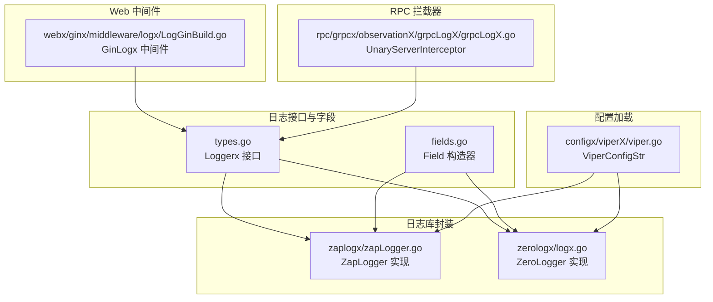
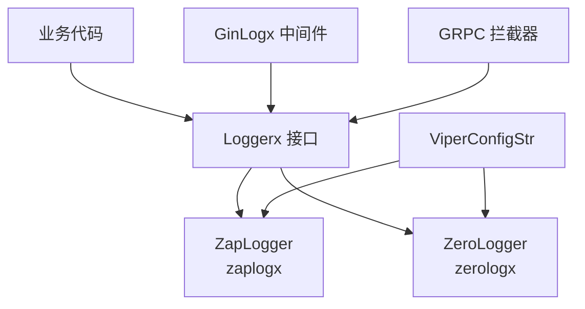
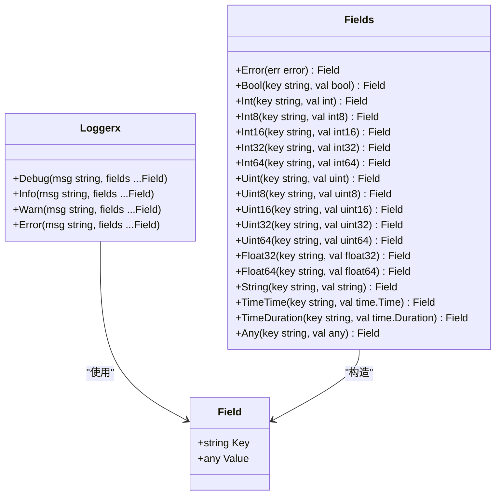
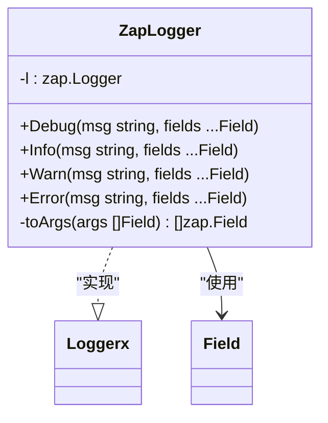
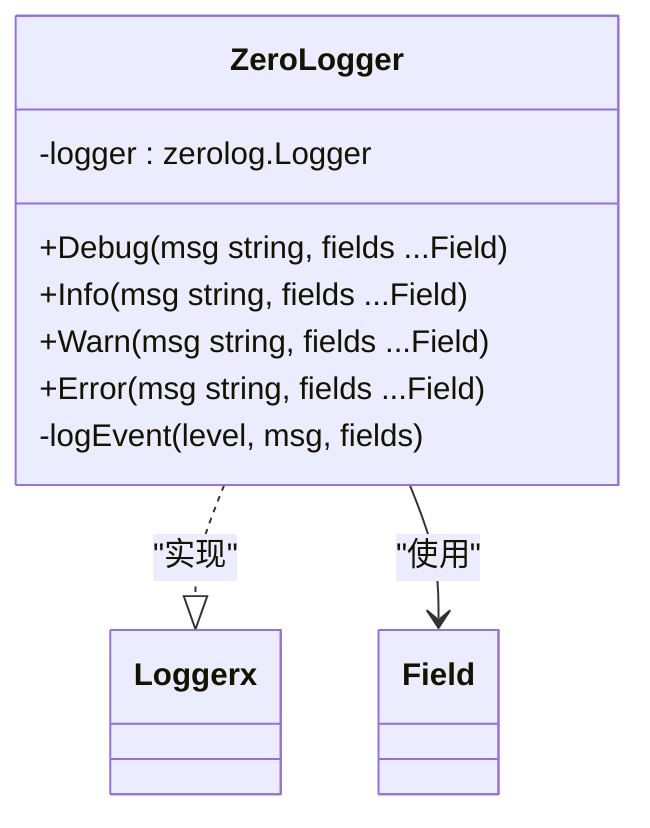
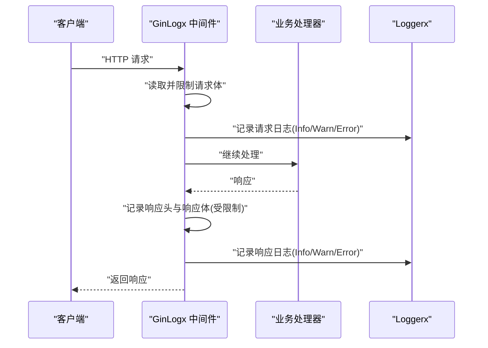
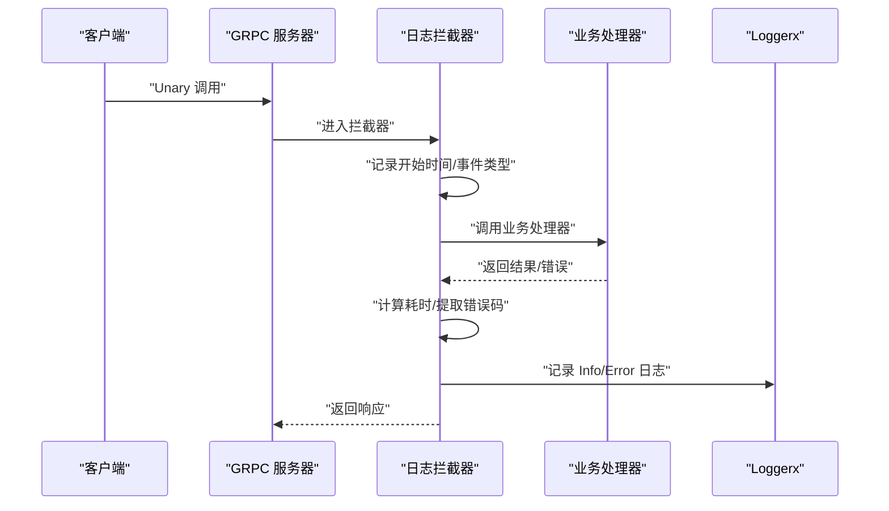
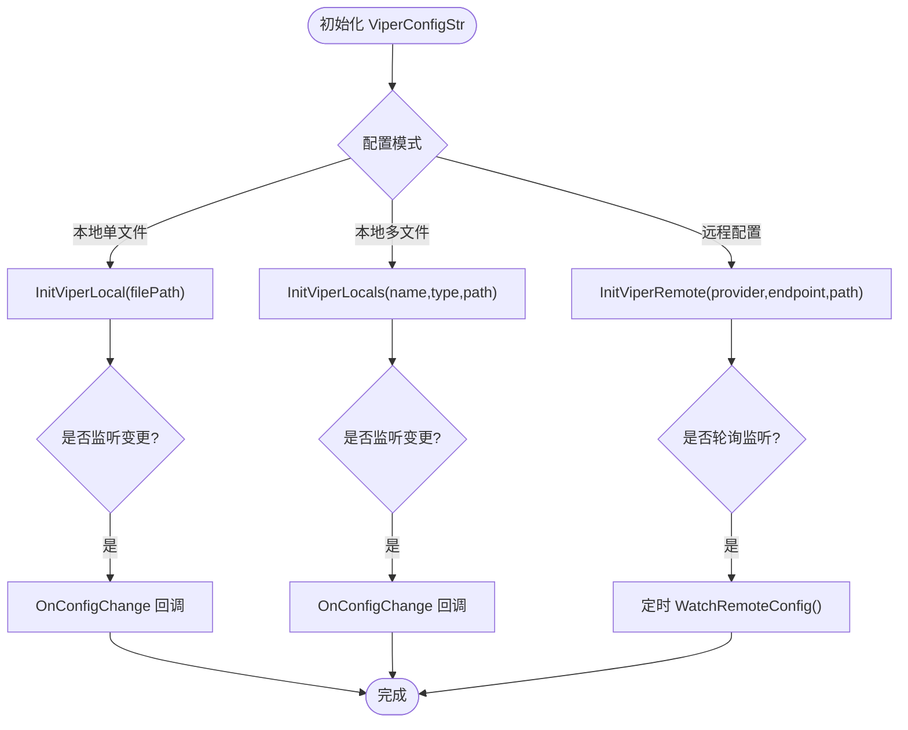
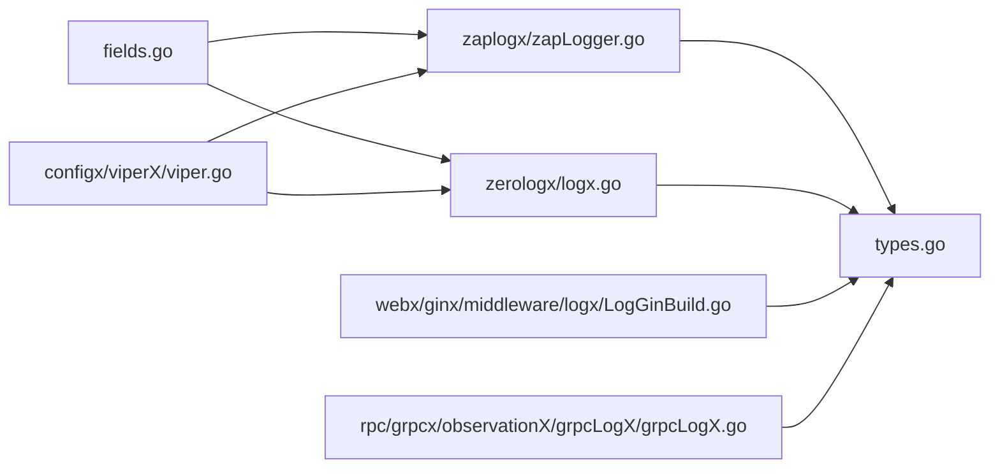

# 日志系统

<cite>
**本文引用的文件列表**
- [zapLogger.go](file://logx/zaplogx/zapLogger.go)
- [logx.go](file://logx/zerologx/logx.go)
- [fields.go](file://logx/fields.go)
- [types.go](file://logx/types.go)
- [zapLogger_test.go](file://logx/zaplogx/zapLogger_test.go)
- [logx_test.go](file://logx/zerologx/logx_test.go)
- [LogGinBuild.go](file://webx/ginx/middleware/logx/LogGinBuild.go)
- [grpcLogX.go](file://rpc/grpcx/observationX/grpcLogX/grpcLogX.go)
- [viper.go](file://configx/viperX/viper.go)
- [viper_test.go](file://configx/viperX/viper_test.go)
</cite>

## 目录
1. [简介](#简介)
2. [项目结构](#项目结构)
3. [核心组件](#核心组件)
4. [架构总览](#架构总览)
5. [组件详解](#组件详解)
6. [依赖关系分析](#依赖关系分析)
7. [性能与特性](#性能与特性)
8. [故障排查指南](#故障排查指南)
9. [结论](#结论)
10. [附录](#附录)

## 简介
本文件系统性解析仓库中的日志子系统，重点对比并讲解 zaplogx 与 zerologx 两种高性能结构化日志库的封装设计，说明如何通过统一接口 Loggerx 和 Field 字段体系实现跨库一致的日志体验；同时覆盖初始化、输出目标选择（标准输出/文件）、动态调整日志级别、上下文字段注入等使用场景，并给出在 Web 中间件（ginx）与 RPC（grpc）服务中的最佳实践，最后结合 viperX 动态配置加载与测试用例，完整呈现关键功能验证路径。

## 项目结构
日志相关代码集中在 logx 目录，按“库封装 + 字段工具 + Web中间件 + RPC拦截器 + 配置加载”进行分层组织：
- 接口与字段：types.go 定义 Loggerx 接口与 Field 结构；fields.go 提供常用字段构造器，统一字段命名与类型。
- zaplogx：对 zap.Logger 的轻量封装，实现 Loggerx 接口。
- zerologx：对 zerolog.Logger 的轻量封装，实现 Loggerx 接口，并内置调用栈与类型化字段处理。
- Web中间件：ginx 中间件 LogGinBuild.go 提供 HTTP 请求/响应日志采集与打印。
- RPC拦截器：grpcLogX.go 提供 UnaryServerInterceptor，记录 RPC 调用耗时、错误码、客户端信息等。
- 配置加载：viperX/viper.go 提供本地/远程配置读取与监听能力，支持通过 viper.UnmarshalKey 动态加载日志配置。



图表来源
- [types.go](file://logx/types.go#L1-L25)
- [fields.go](file://logx/fields.go#L1-L75)
- [zapLogger.go](file://logx/zaplogx/zapLogger.go#L1-L47)
- [logx.go](file://logx/zerologx/logx.go#L1-L144)
- [LogGinBuild.go](file://webx/ginx/middleware/logx/LogGinBuild.go#L1-L275)
- [grpcLogX.go](file://rpc/grpcx/observationX/grpcLogX/grpcLogX.go#L1-L70)
- [viper.go](file://configx/viperX/viper.go#L1-L254)

章节来源
- [types.go](file://logx/types.go#L1-L25)
- [fields.go](file://logx/fields.go#L1-L75)
- [zapLogger.go](file://logx/zaplogx/zapLogger.go#L1-L47)
- [logx.go](file://logx/zerologx/logx.go#L1-L144)
- [LogGinBuild.go](file://webx/ginx/middleware/logx/LogGinBuild.go#L1-L275)
- [grpcLogX.go](file://rpc/grpcx/observationX/grpcLogX/grpcLogX.go#L1-L70)
- [viper.go](file://configx/viperX/viper.go#L1-L254)

## 核心组件
- Loggerx 接口：统一 Debug/Info/Warn/Error 四级日志方法签名，屏蔽底层实现差异。
- Field 字段体系：通过 fields.go 的构造器（如 String、Int、Any 等）生成键值对，确保字段命名一致性与类型安全。
- ZapLogger：将 zap.Logger 适配为 Loggerx，提供 toArgs 将 []Field 转换为 zap.Field 列表。
- ZeroLogger：将 zerolog.Logger 适配为 Loggerx，内置 logEvent 统一入口，按级别决定是否附加调用栈，类型化字段处理更丰富。
- GinLogx 中间件：在请求前后收集上下文、请求体/响应体（受大小限制），并按状态码选择不同级别日志。
- GRPC 拦截器：记录 unary 调用耗时、事件类型、方法名、对端信息、错误码与消息，异常时自动恢复并记录堆栈。
- ViperConfigStr：提供本地/远程配置读取与监听，支持通过 viper.UnmarshalKey 将配置反序列化到具体结构体（如 zap 配置）。

章节来源
- [types.go](file://logx/types.go#L1-L25)
- [fields.go](file://logx/fields.go#L1-L75)
- [zapLogger.go](file://logx/zaplogx/zapLogger.go#L1-L47)
- [logx.go](file://logx/zerologx/logx.go#L1-L144)
- [LogGinBuild.go](file://webx/ginx/middleware/logx/LogGinBuild.go#L1-L275)
- [grpcLogX.go](file://rpc/grpcx/observationX/grpcLogX/grpcLogX.go#L1-L70)
- [viper.go](file://configx/viperX/viper.go#L1-L254)

## 架构总览
下图展示日志系统在各层的职责与交互关系：应用通过 Loggerx 接口发起日志；ZapLogger/ZeroLogger 分别对接 zap/zerolog；Web/RPC 层通过中间件/拦截器注入上下文字段；配置层通过 viper 加载外部配置。



图表来源
- [types.go](file://logx/types.go#L1-L25)
- [zapLogger.go](file://logx/zaplogx/zapLogger.go#L1-L47)
- [logx.go](file://logx/zerologx/logx.go#L1-L144)
- [LogGinBuild.go](file://webx/ginx/middleware/logx/LogGinBuild.go#L1-L275)
- [grpcLogX.go](file://rpc/grpcx/observationX/grpcLogX/grpcLogX.go#L1-L70)
- [viper.go](file://configx/viperX/viper.go#L1-L254)

## 组件详解

### 接口与字段体系
- Loggerx 接口：定义四类日志方法，参数为可变字段切片，便于统一注入上下文字段。
- Field 结构：Key 为字符串，Value 为任意类型；fields.go 提供常用构造器，覆盖基础类型、时间、持续时间、错误、fmt.Stringer、encoding.TextMarshaler 等。



图表来源
- [types.go](file://logx/types.go#L1-L25)
- [fields.go](file://logx/fields.go#L1-L75)

章节来源
- [types.go](file://logx/types.go#L1-L25)
- [fields.go](file://logx/fields.go#L1-L75)

### zaplogx 封装设计
- 结构：ZapLogger 包装 zap.Logger，并实现 Loggerx 接口。
- 参数转换：toArgs 将 []Field 转为 []zap.Field，使用 zap.Any 保持类型信息。
- 初始化与配置：测试用例展示了通过 viper.UnmarshalKey 将配置反序列化到 zap.Config 并构建 zap.Logger，再包装为 Loggerx。



图表来源
- [zapLogger.go](file://logx/zaplogx/zapLogger.go#L1-L47)

章节来源
- [zapLogger.go](file://logx/zaplogx/zapLogger.go#L1-L47)
- [zapLogger_test.go](file://logx/zaplogx/zapLogger_test.go#L1-L77)

### zerologx 封装设计
- 结构：ZeroLogger 包装 zerolog.Logger，并实现 Loggerx 接口。
- 统一日志入口：logEvent 统一处理级别、调用栈（warn/error 自动附加 Caller）、字段类型化处理。
- 类型化字段：toIfType 对常见类型进行精确编码，支持 error、fmt.Stringer、encoding.TextMarshaler 等，提升 JSON 输出质量。
- 初始化示例：测试用例展示了通过 zerolog.New(os.Stderr).Level(...) 构建 logger 并包装为 Loggerx。



图表来源
- [logx.go](file://logx/zerologx/logx.go#L1-L144)

章节来源
- [logx.go](file://logx/zerologx/logx.go#L1-L144)
- [logx_test.go](file://logx/zerologx/logx_test.go#L1-L27)

### Web 中间件（ginx）集成
- GinLogx 收集请求/响应上下文，支持可选打印请求体/响应体（受 maxBodySize 限制），并在请求前后分别记录请求/响应日志。
- 日志级别依据 HTTP 状态码选择：4xx 使用 Warn，5xx 使用 Error，其他使用 Info。
- 上下文字段：包含 LogId、ClientIP、Method、Path、Headers、ReqBody、RespBody、Status、Start/End/Duration 等。



图表来源
- [LogGinBuild.go](file://webx/ginx/middleware/logx/LogGinBuild.go#L1-L275)

章节来源
- [LogGinBuild.go](file://webx/ginx/middleware/logx/LogGinBuild.go#L1-L275)

### RPC 服务集成（grpc）
- 拦截器记录 unary 调用耗时、事件类型、方法名、对端信息；异常时自动 recover 并记录堆栈，将错误映射为 gRPC 状态码与消息。
- 通过 ChainUnaryInterceptor 将日志拦截器与其他中间件（如限流、监控）组合使用。



图表来源
- [grpcLogX.go](file://rpc/grpcx/observationX/grpcLogX/grpcLogX.go#L1-L70)

章节来源
- [grpcLogX.go](file://rpc/grpcx/observationX/grpcLogX/grpcLogX.go#L1-L70)

### 配置动态加载（viperX）
- 支持本地单文件/多文件读取、远程配置中心（如 etcd）读取与轮询监听。
- 提供 Get/GetUnmarshalKey 等便捷方法；OnConfigChange 注册变更回调，结合 Loggerx 输出变更事件。
- 与日志库联动：通过 viper.UnmarshalKey 将配置反序列化到 zap.Config 或其他结构体，实现日志配置热更新。



图表来源
- [viper.go](file://configx/viperX/viper.go#L1-L254)

章节来源
- [viper.go](file://configx/viperX/viper.go#L1-L254)
- [viper_test.go](file://configx/viperX/viper_test.go#L1-L90)

## 依赖关系分析
- 耦合与内聚：Loggerx 作为抽象接口，zaplogx/zerologx 仅依赖该接口，保持良好内聚与低耦合。
- 字段统一：所有日志调用均通过 fields.go 的构造器生成 Field，避免硬编码键名，提升可维护性。
- 中间件/拦截器：Web/RPC 层通过 Loggerx 注入上下文字段，形成统一的可观测性入口。
- 配置解耦：viperX 与日志库解耦，通过 UnmarshalKey 将配置注入到具体库的配置对象。



图表来源
- [fields.go](file://logx/fields.go#L1-L75)
- [zapLogger.go](file://logx/zaplogx/zapLogger.go#L1-L47)
- [logx.go](file://logx/zerologx/logx.go#L1-L144)
- [types.go](file://logx/types.go#L1-L25)
- [LogGinBuild.go](file://webx/ginx/middleware/logx/LogGinBuild.go#L1-L275)
- [grpcLogX.go](file://rpc/grpcx/observationX/grpcLogX/grpcLogX.go#L1-L70)
- [viper.go](file://configx/viperX/viper.go#L1-L254)

## 性能与特性
- zaplogx：toArgs 预分配切片容量，减少扩容开销；zap.Field 保持类型信息，利于下游检索与可视化。
- zerologx：logEvent 统一入口，按级别决定是否附加 Caller，避免不必要的堆栈信息；toIfType 对多种类型进行精确编码，减少反射成本。
- Web/RPC 中间件：对请求体/响应体进行大小限制，防止大流量导致内存膨胀；按状态码选择日志级别，平衡可观测性与噪声。
- 配置监听：本地/远程配置变更时触发回调或轮询，实现日志级别与输出目标的动态调整。

[本节为通用性能讨论，无需列出具体文件来源]

## 故障排查指南
- 日志未输出或级别不生效
  - 检查 viper.UnmarshalKey 是否正确映射到日志库配置对象；确认配置文件路径与键名一致。
  - 在 viperX 中使用 OnConfigChange 观察配置变更事件，定位配置加载问题。
- 请求体/响应体过大被截断
  - 调整 GinLogx 的 maxBodySize；关注中间件注册顺序，确保能读取到原始请求体。
- RPC 异常未记录堆栈
  - 确认拦截器是否在链式拦截器中正确注册；检查 recover 逻辑与错误码提取。
- 字段类型不匹配
  - 使用 fields.go 的构造器统一生成 Field；避免直接传递原生类型导致的 JSON 编码异常。

章节来源
- [viper.go](file://configx/viperX/viper.go#L1-L254)
- [LogGinBuild.go](file://webx/ginx/middleware/logx/LogGinBuild.go#L1-L275)
- [grpcLogX.go](file://rpc/grpcx/observationX/grpcLogX/grpcLogX.go#L1-L70)

## 结论
本日志系统通过统一接口与字段体系，实现了对 zap 与 zerolog 的一致封装；配合 Web/RPC 中间件与拦截器，提供了完善的请求/响应与 RPC 调用可观测性；借助 viperX 的配置加载与监听能力，支持日志配置的动态调整。整体设计兼顾性能、可维护性与可扩展性。

[本节为总结性内容，无需列出具体文件来源]

## 附录

### 初始化与使用示例（路径指引）
- 初始化 zap 日志实例并记录日志
  - 参考：[zapLogger_test.go](file://logx/zaplogx/zapLogger_test.go#L1-L77)
- 初始化 zerolog 日志实例并记录日志
  - 参考：[logx_test.go](file://logx/zerologx/logx_test.go#L1-L27)
- 在 Gin 中启用请求/响应日志中间件
  - 参考：[LogGinBuild.go](file://webx/ginx/middleware/logx/LogGinBuild.go#L1-L275)
- 在 gRPC 服务中启用日志拦截器
  - 参考：[grpcLogX.go](file://rpc/grpcx/observationX/grpcLogX/grpcLogX.go#L1-L70)
- 通过 viper 动态加载日志配置
  - 参考：[viper.go](file://configx/viperX/viper.go#L1-L254)，[viper_test.go](file://configx/viperX/viper_test.go#L1-L90)

### 关键流程图（字段类型化处理）
```mermaid
flowchart TD
Start(["进入 logEvent/toIfType"]) --> LevelCheck{"级别为 Warn/Error?"}
LevelCheck --> |是| Caller["附加 Caller(2)"]
LevelCheck --> |否| SkipCaller["跳过 Caller"]
Caller --> Loop["遍历字段"]
SkipCaller --> Loop
Loop --> TypeSwitch{"字段值类型判断"}
TypeSwitch --> |string| Str["Str(key,val)"]
TypeSwitch --> |[]string| Strs["Strs(key,val)"]
TypeSwitch --> |int/uint/float| Prim["Int/Int64/Uint/Float 等"]
TypeSwitch --> |bool| Bool["Bool(key,val)"]
TypeSwitch --> |time.Time| Time["Time(key,val)"]
TypeSwitch --> |time.Duration| Dur["Dur(key,val)"]
TypeSwitch --> |error| Err["Str(key,val.Error()) 或 Interface(key,nil)"]
TypeSwitch --> |fmt.Stringer| S["Str(key,val.String()) 或 Interface"]
TypeSwitch --> |encoding.TextMarshaler| TM["尝试 MarshalText 或 Interface"]
TypeSwitch --> |nil| Nil["Interface(key,nil)"]
TypeSwitch --> |其他| Iface["Interface(key,val)"]
Str --> Next["下一个字段"]
Strs --> Next
Prim --> Next
Bool --> Next
Time --> Next
Dur --> Next
Err --> Next
S --> Next
TM --> Next
Nil --> Next
Iface --> Next
Next --> End(["输出 Msg"])
```

图表来源
- [logx.go](file://logx/zerologx/logx.go#L63-L126)