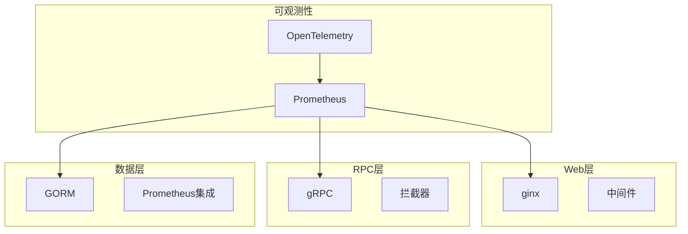
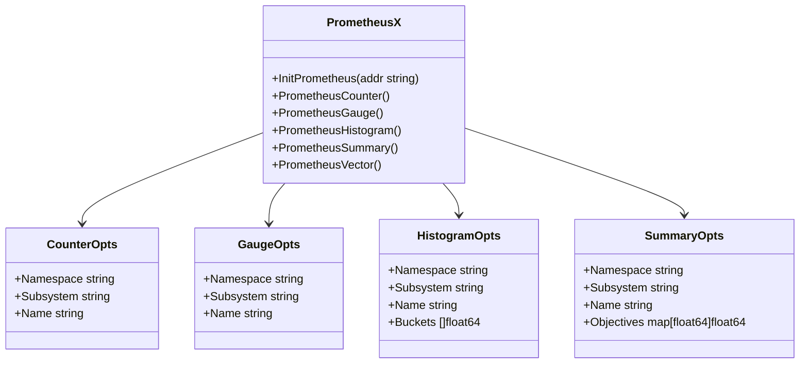
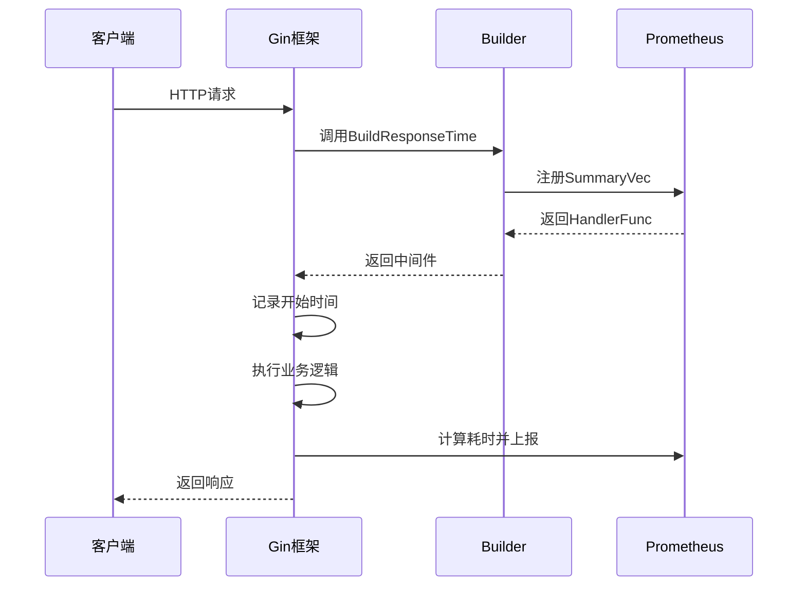
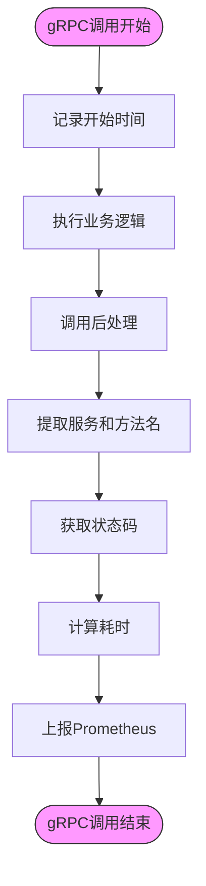
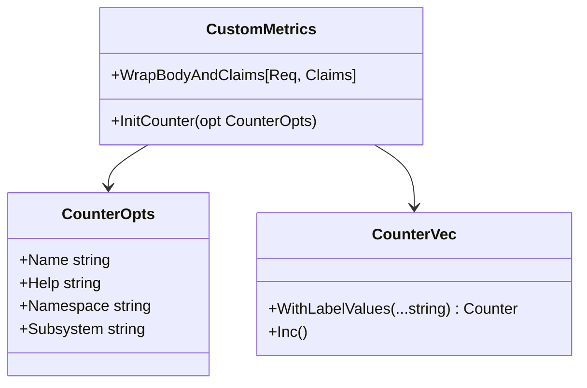
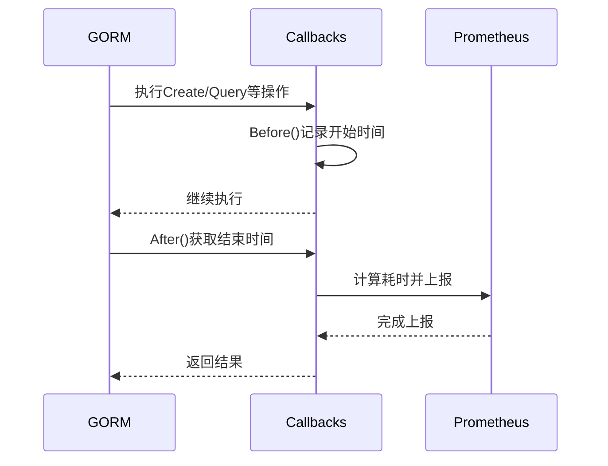
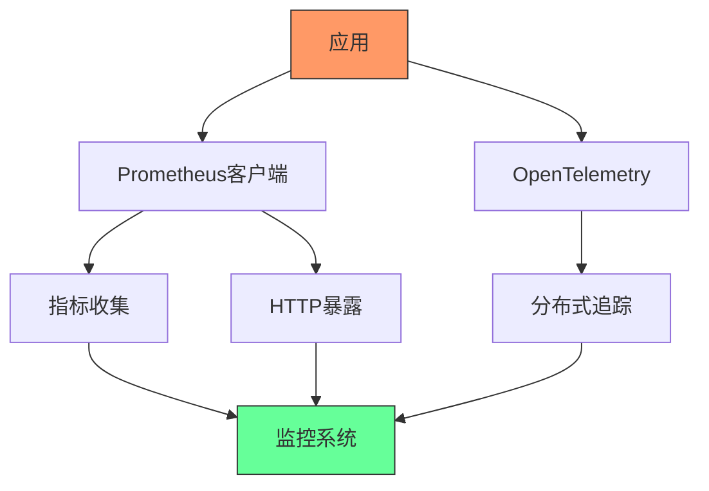

# 监控指标（Prometheus）

<cite>
**本文档引用文件**  
- [prometheus.go](file://observationX/prometheusX/prometheus.go)
- [prometheusGinBuild.go](file://webx/ginx/middleware/ginPrometheusx/prometheusGinBuild.go)
- [builder.go](file://rpc/grpcx/observationX/prometeusX/builder.go)
- [prometheusGormBuild.go](file://DBx/mysqlX/gormx/dbPrometheusx/prometheusGormBuild.go)
- [otel.go](file://observationX/opentelemetryX/otel.go)
- [types.go](file://webx/ginx/middleware/ginPrometheusx/types.go)
- [wrapper_func.go](file://webx/ginx/wrapper_func.go)
- [help_docx](file://webx/ginx/middleware/ginPrometheusx/help_docx)
</cite>

## 目录
1. [简介](#简介)
2. [项目结构](#项目结构)
3. [核心组件](#核心组件)
4. [架构概览](#架构概览)
5. [详细组件分析](#详细组件分析)
6. [依赖分析](#依赖分析)
7. [性能考量](#性能考量)
8. [故障排查指南](#故障排查指南)
9. [结论](#结论)

## 简介
本文档详细说明了Prometheus监控指标的暴露机制，涵盖指标初始化、HTTP与gRPC服务集成、自定义业务指标注册、安全访问控制及与OpenTelemetry的集成。通过分析`prometheus.go`、`prometheusGinBuild.go`和`builder.go`等核心文件，阐述了如何在Web框架（ginx）和gRPC服务中实现细粒度的性能监控。

## 项目结构
本项目采用模块化设计，将可观测性功能集中于`observationX`目录下，同时在`webx`和`rpc`模块中分别实现了HTTP和gRPC的监控集成。数据库层通过`DBx`模块提供了GORM的SQL执行时间监控。



**图示来源**  
- [prometheus.go](file://observationX/prometheusX/prometheus.go#L1-L107)
- [prometheusGinBuild.go](file://webx/ginx/middleware/ginPrometheusx/prometheusGinBuild.go#L1-L111)
- [builder.go](file://rpc/grpcx/observationX/prometeusX/builder.go#L1-L72)

## 核心组件
系统通过`prometheusX`包提供基础指标管理能力，包括计数器、仪表、直方图和摘要等核心指标类型。`ginPrometheusx`和`prometeusX`分别实现了HTTP和gRPC的监控中间件，而`dbPrometheusx`则专注于数据库性能监控。

**组件来源**  
- [prometheus.go](file://observationX/prometheusX/prometheus.go#L1-L107)
- [prometheusGinBuild.go](file://webx/ginx/middleware/ginPrometheusx/prometheusGinBuild.go#L1-L111)
- [builder.go](file://rpc/grpcx/observationX/prometeusX/builder.go#L1-L72)

## 架构概览
系统采用分层架构，将监控功能解耦为独立组件。Prometheus指标暴露通过专用HTTP服务实现，与业务端口分离。各服务通过中间件或拦截器采集指标，并统一注册到Prometheus收集器。

```mermaid
graph TB
subgraph "监控暴露"
A[/metrics端点]
B[HTTP服务器]
end
subgraph "指标采集"
C[HTTP中间件]
D[gRPC拦截器]
E[数据库回调]
end
subgraph "指标类型"
F[计数器]
G[仪表]
H[直方图]
I[摘要]
end
C --> A
D --> A
E --> A
F --> C
G --> D
H --> E
I --> C
B --> A
```

**图示来源**  
- [prometheus.go](file://observationX/prometheusX/prometheus.go#L9-L15)
- [prometheusGinBuild.go](file://webx/ginx/middleware/ginPrometheusx/prometheusGinBuild.go#L32-L78)
- [builder.go](file://rpc/grpcx/observationX/prometeusX/builder.go#L27-L62)

## 详细组件分析

### Prometheus初始化与指标注册
`prometheus.go`文件提供了指标收集器的初始化和各类指标的注册方法。通过`InitPrometheus`函数启动专用HTTP服务暴露`/metrics`端点。



**图示来源**  
- [prometheus.go](file://observationX/prometheusX/prometheus.go#L9-L107)

**组件来源**  
- [prometheus.go](file://observationX/prometheusX/prometheus.go#L1-L107)

### Web框架（ginx）集成
通过`ginPrometheusx`包实现Gin框架的Prometheus集成，提供响应时间和活跃请求监控。`Builder`结构体通过配置参数构建监控中间件。



**图示来源**  
- [prometheusGinBuild.go](file://webx/ginx/middleware/ginPrometheusx/prometheusGinBuild.go#L32-L78)
- [types.go](file://webx/ginx/middleware/ginPrometheusx/types.go#L6-L12)

**组件来源**  
- [prometheusGinBuild.go](file://webx/ginx/middleware/ginPrometheusx/prometheusGinBuild.go#L1-L111)
- [types.go](file://webx/ginx/middleware/ginPrometheusx/types.go#L1-L13)

### gRPC服务指标采集
gRPC服务通过`prometeusX`包的拦截器实现指标采集，监控服务调用的响应时间、调用类型、服务名、方法名和状态码等关键指标。



**图示来源**  
- [builder.go](file://rpc/grpcx/observationX/prometeusX/builder.go#L27-L62)

**组件来源**  
- [builder.go](file://rpc/grpcx/observationX/prometeusX/builder.go#L1-L72)

### 自定义业务指标示例
系统支持通过`wrapper_func.go`中的`InitCounter`函数注册自定义计数器指标，用于统计HTTP响应码分布等业务关键指标。



**图示来源**  
- [wrapper_func.go](file://webx/ginx/wrapper_func.go#L25-L28)

**组件来源**  
- [wrapper_func.go](file://webx/ginx/wrapper_func.go#L1-L63)

### 数据库性能监控
通过`dbPrometheusx`包实现GORM数据库操作的性能监控，利用GORM回调机制在SQL执行前后记录耗时，并按操作类型和表名进行分类统计。



**图示来源**  
- [prometheusGormBuild.go](file://DBx/mysqlX/gormx/dbPrometheusx/prometheusGormBuild.go#L24-L37)

**组件来源**  
- [prometheusGormBuild.go](file://DBx/mysqlX/gormx/dbPrometheusx/prometheusGormBuild.go#L1-L101)

## 依赖分析
系统依赖Prometheus客户端库实现指标收集和暴露，同时与OpenTelemetry集成实现分布式追踪。各监控组件通过接口抽象降低耦合度，便于扩展和维护。



**图示来源**  
- [prometheus.go](file://observationX/prometheusX/prometheus.go#L4-L5)
- [otel.go](file://observationX/opentelemetryX/otel.go#L5-L8)

**组件来源**  
- [prometheus.go](file://observationX/prometheusX/prometheus.go#L1-L107)
- [otel.go](file://observationX/opentelemetryX/otel.go#L1-L101)

## 性能考量
- 指标暴露使用专用端口，避免与业务流量竞争资源
- 采用SummaryVec而非Histogram，减少内存占用和计算开销
- 使用Register替代MustRegister，避免重复注册导致panic
- 在gRPC拦截器中使用defer确保耗时统计的准确性

## 故障排查指南
1. **指标未暴露**：检查`InitPrometheus`是否正确调用，确认端口未被占用
2. **重复注册错误**：使用Register并处理AlreadyRegisteredError异常
3. **标签值异常**：确保标签值不包含特殊字符，长度适中
4. **性能下降**：检查指标采集频率，避免过度监控
5. **gRPC拦截器失效**：确认拦截器已正确注册到gRPC服务器

**排查来源**  
- [prometheusGinBuild.go](file://webx/ginx/middleware/ginPrometheusx/prometheusGinBuild.go#L54-L61)
- [builder.go](file://rpc/grpcx/observationX/prometeusX/builder.go#L47)

## 结论
本系统通过模块化设计实现了全面的Prometheus监控集成，支持HTTP、gRPC和数据库层面的性能指标采集。通过合理的架构设计和性能优化，确保了监控系统的稳定性和高效性，为系统可观测性提供了坚实基础。