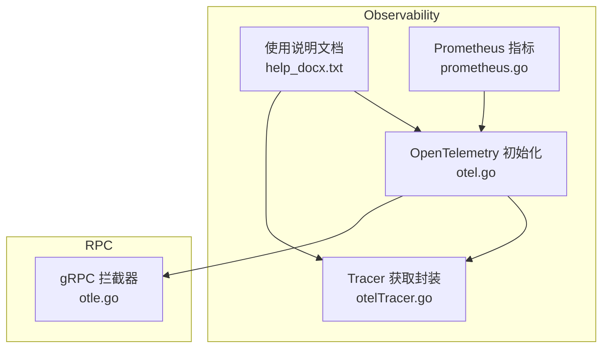
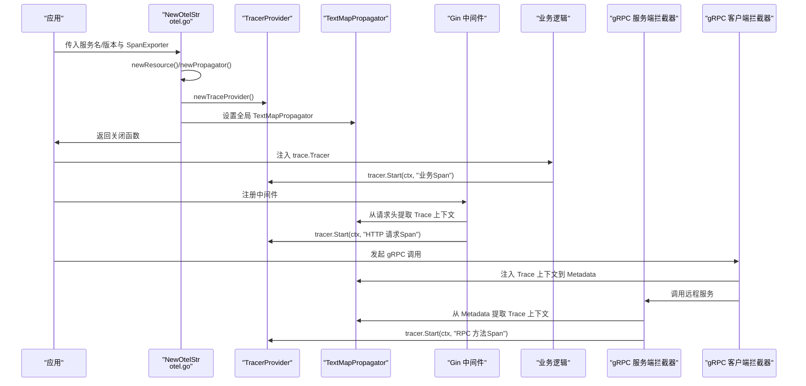
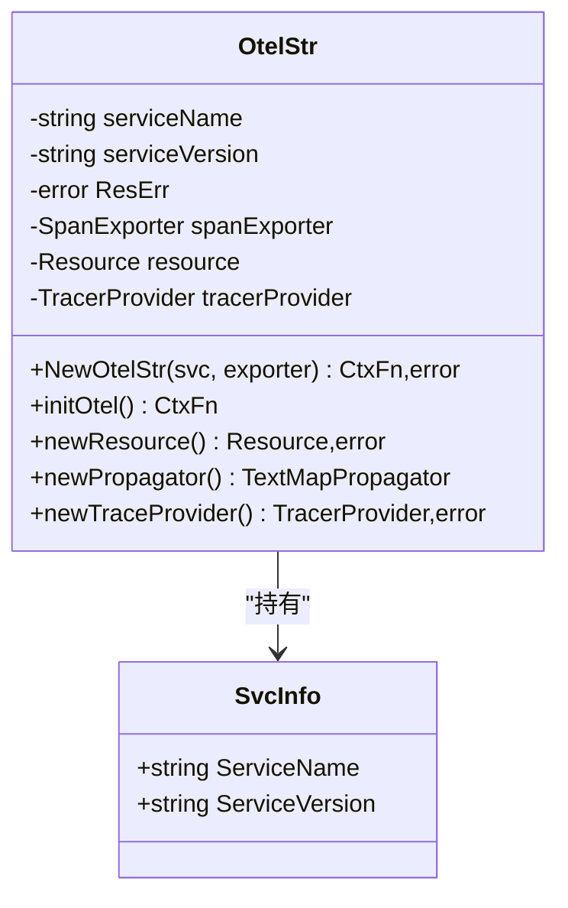
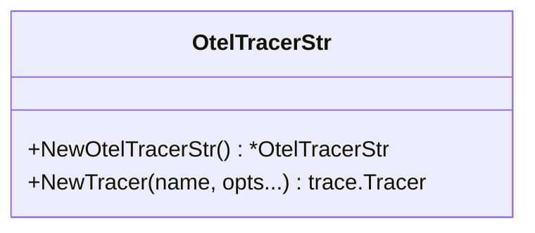
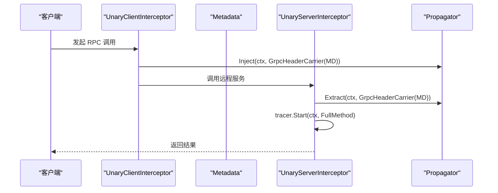
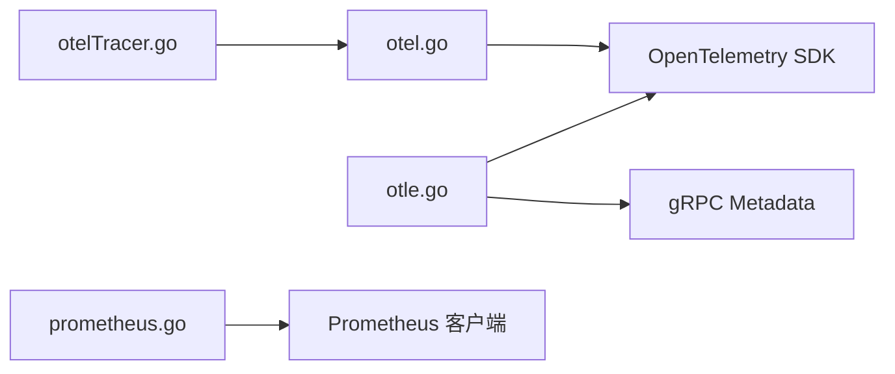

# 链路追踪（OpenTelemetry）

<cite>
**本文引用的文件列表**
- [otel.go](file://observationX/opentelemetryX/otel.go)
- [otelTracer.go](file://observationX/opentelemetryX/otelTracer.go)
- [otel_test.go](file://observationX/opentelemetryX/otel_test.go)
- [help_docx.txt](file://observationX/opentelemetryX/help_docx.txt)
- [otle.go](file://rpc/grpcx/observationX/otleTraceX/otle.go)
- [prometheus.go](file://observationX/prometheusX/prometheus.go)
</cite>

## 目录
1. [简介](#简介)
2. [项目结构](#项目结构)
3. [核心组件](#核心组件)
4. [架构总览](#架构总览)
5. [详细组件分析](#详细组件分析)
6. [依赖关系分析](#依赖关系分析)
7. [性能考量](#性能考量)
8. [故障排查指南](#故障排查指南)
9. [结论](#结论)
10. [附录](#附录)

## 简介
本文件围绕仓库中的 OpenTelemetry 分布式链路追踪实现进行系统化解析，重点覆盖以下方面：
- 如何初始化 Tracer Provider、配置 Span 导出器（Zipkin 示例）、设置资源信息与传播器
- 在 HTTP 请求（gin 中间件）与 gRPC 调用（grpcx 拦截器）中自动注入与传播 Trace 上下文
- 跨服务调用链的上下文透传示例，展示 TraceID、SpanID 的生成与传递过程
- 如何添加自定义 Span 属性、事件与注释以增强调试能力
- 结合 Prometheus 指标系统协同工作，实现全栈可观测性

## 项目结构
本项目的链路追踪相关代码主要集中在 observationX/opentelemetryX 与 rpc/grpcx/observationX/otleTraceX 两个模块：
- observationX/opentelemetryX：提供全局 Tracer Provider 初始化、资源与传播器配置、Tracer 获取封装
- rpc/grpcx/observationX/otleTraceX：提供 gRPC 一元拦截器的上下文提取/注入与 Span 生命周期管理
- observationX/prometheusX：提供 Prometheus 指标采集与暴露，便于与链路追踪联动分析



图表来源
- [otel.go](file://observationX/opentelemetryX/otel.go#L1-L101)
- [otelTracer.go](file://observationX/opentelemetryX/otelTracer.go#L1-L18)
- [help_docx.txt](file://observationX/opentelemetryX/help_docx.txt#L1-L91)
- [otle.go](file://rpc/grpcx/observationX/otleTraceX/otle.go#L1-L154)
- [prometheus.go](file://observationX/prometheusX/prometheus.go#L1-L107)

章节来源
- [otel.go](file://observationX/opentelemetryX/otel.go#L1-L101)
- [otelTracer.go](file://observationX/opentelemetryX/otelTracer.go#L1-L18)
- [help_docx.txt](file://observationX/opentelemetryX/help_docx.txt#L1-L91)
- [otle.go](file://rpc/grpcx/observationX/otleTraceX/otle.go#L1-L154)
- [prometheus.go](file://observationX/prometheusX/prometheus.go#L1-L107)

## 核心组件
- 全局初始化与 Provider 配置：通过 NewOtelStr 完成资源合并、传播器设置、TracerProvider 初始化与全局注册，并返回关闭函数
- Tracer 获取封装：通过 NewOtelTracerStr.NewTracer 获取 trace.Tracer，供业务侧按需创建 Span
- gRPC 拦截器：OTELInterceptorBuilder 提供一元客户端/服务端拦截器，负责提取/注入上下文、设置 RPC 语义属性、错误记录与状态设置
- 使用说明与示例：help_docx.txt 提供 IOC 初始化、main 中 defer 关闭、业务中使用、gin 接入、gorm 接入等参考

章节来源
- [otel.go](file://observationX/opentelemetryX/otel.go#L1-L101)
- [otelTracer.go](file://observationX/opentelemetryX/otelTracer.go#L1-L18)
- [help_docx.txt](file://observationX/opentelemetryX/help_docx.txt#L1-L91)
- [otle.go](file://rpc/grpcx/observationX/otleTraceX/otle.go#L1-L154)

## 架构总览
下图展示了从应用启动到业务 Span 创建、再到 gRPC 调用链上下文透传的整体流程。



图表来源
- [otel.go](file://observationX/opentelemetryX/otel.go#L33-L100)
- [otelTracer.go](file://observationX/opentelemetryX/otelTracer.go#L1-L18)
- [help_docx.txt](file://observationX/opentelemetryX/help_docx.txt#L70-L91)
- [otle.go](file://rpc/grpcx/observationX/otleTraceX/otle.go#L32-L111)

## 详细组件分析

### 组件A：全局初始化与 Provider 配置（otel.go）
- 资源合并：将默认资源与服务名/版本等属性合并，作为后续导出的资源维度
- 传播器：采用复合传播器，包含 TraceContext 与 Baggage，确保 TraceID/SpanID 与自定义键值在 HTTP/gRPC 头部中传递
- TracerProvider：使用批量导出器（WithBatcher），设置批处理超时与资源，便于控制导出频率与资源开销
- 全局注册：设置全局 TracerProvider 与 TextMapPropagator，供后续业务与中间件使用
- 关闭函数：返回的 CtxFn 用于优雅关闭 TracerProvider



图表来源
- [otel.go](file://observationX/opentelemetryX/otel.go#L15-L100)

章节来源
- [otel.go](file://observationX/opentelemetryX/otel.go#L33-L100)

### 组件B：Tracer 获取封装（otelTracer.go）
- 作用：提供统一的 Tracer 获取入口，业务侧通过注入 trace.Tracer 即可在任意层级创建 Span
- 设计：简单包装 otel.Tracer，便于集中管理与替换



图表来源
- [otelTracer.go](file://observationX/opentelemetryX/otelTracer.go#L1-L18)

章节来源
- [otelTracer.go](file://observationX/opentelemetryX/otelTracer.go#L1-L18)

### 组件C：gRPC 拦截器（rpc/grpcx/observationX/otleTraceX/otle.go）
- 服务端拦截器：从 Metadata 提取上下文，创建服务端 Span，设置 RPC 语义属性（方法、对端信息、组件类型），记录错误与状态
- 客户端拦截器：创建客户端 Span，设置 RPC 语义属性，将上下文注入到 Metadata，记录错误与状态
- 传播器：使用全局 TextMapPropagator 或显式传入的 propagator



图表来源
- [otle.go](file://rpc/grpcx/observationX/otleTraceX/otle.go#L32-L111)
- [otle.go](file://rpc/grpcx/observationX/otleTraceX/otle.go#L113-L154)

章节来源
- [otle.go](file://rpc/grpcx/observationX/otleTraceX/otle.go#L1-L154)

### 组件D：HTTP 请求（gin 中间件）与业务 Span（otel_test.go）
- 使用 Zipkin 导出器初始化全局 Provider
- 在 Gin 路由中，将 gin.Context 转换为 context.Context，创建顶层 Span
- 业务中可继续派生子 Span，并添加事件与属性
- 示例演示了事件与属性的使用方式

```mermaid
flowchart TD
Start(["进入 Gin 路由"]) --> Ctx["将 gin.Context 转为 context.Context"]
Ctx --> TopSpan["tracer.Start(ctx, \"top_span\")"]
TopSpan --> Sleep1["执行业务逻辑耗时"]
Sleep1 --> AddEvent["span.AddEvent(\"事件描述\")"]
AddEvent --> SubSpan["tracer.Start(ctx, \"sub_span\")"]
SubSpan --> Sleep2["执行子任务耗时"]
Sleep2 --> SetAttr["subSpan.SetAttributes(...)"]
SetAttr --> End(["结束子 Span 并返回"])
```

图表来源
- [otel_test.go](file://observationX/opentelemetryX/otel_test.go#L14-L61)

章节来源
- [otel_test.go](file://observationX/opentelemetryX/otel_test.go#L14-L61)

### 组件E：使用说明与最佳实践（help_docx.txt）
- IOC 初始化：在依赖注入层创建 SpanExporter（示例为 Zipkin），并通过 NewOtelStr 完成全局注册
- main 中 defer 关闭：使用返回的关闭函数优雅停止 TracerProvider
- 业务接入：通过 NewOtelTracerStr 获取 Tracer，注入到服务结构体中，按需创建 Span
- Gin 接入：文档建议使用 OpenTelemetry 提供的 gin 中间件（otelgin.Middleware）
- GORM 接入：文档建议使用 tracing.NewPlugin(tracing.WithoutMetrics()) 注册

章节来源
- [help_docx.txt](file://observationX/opentelemetryX/help_docx.txt#L1-L91)

## 依赖关系分析
- otel.go 依赖 OpenTelemetry SDK 的 trace、resource、propagation 模块，负责 Provider 与传播器的全局配置
- otelTracer.go 依赖 otel 全局 TracerProvider，提供便捷的 Tracer 获取
- otle.go 依赖 gRPC metadata 与 OpenTelemetry propagation，实现 Metadata 与上下文的双向注入/提取
- prometheus.go 与链路追踪解耦，但可与链路指标共同使用，形成全栈可观测性



图表来源
- [otel.go](file://observationX/opentelemetryX/otel.go#L1-L101)
- [otelTracer.go](file://observationX/opentelemetryX/otelTracer.go#L1-L18)
- [otle.go](file://rpc/grpcx/observationX/otleTraceX/otle.go#L1-L154)
- [prometheus.go](file://observationX/prometheusX/prometheus.go#L1-L107)

章节来源
- [otel.go](file://observationX/opentelemetryX/otel.go#L1-L101)
- [otelTracer.go](file://observationX/opentelemetryX/otelTracer.go#L1-L18)
- [otle.go](file://rpc/grpcx/observationX/otleTraceX/otle.go#L1-L154)
- [prometheus.go](file://observationX/prometheusX/prometheus.go#L1-L107)

## 性能考量
- 批量导出与超时：通过 WithBatcher 与 WithBatchTimeout 控制导出频率与延迟，平衡吞吐与实时性
- 传播器选择：TraceContext + Baggage 已满足大多数场景；如需更轻量，可评估仅使用 TraceContext
- Span 数量与层级：避免在高频路径创建过多子 Span；必要时使用事件与属性替代细粒度 Span
- 资源标签：合理设置服务名/版本等资源属性，避免过多无意义标签导致存储膨胀
- gRPC 拦截器：客户端/服务端拦截器会增加少量开销，建议在关键路径启用并监控

## 故障排查指南
- 导出器未生效：确认 NewOtelStr 返回的关闭函数在 main 中被正确 defer 调用
- 上下文未透传：检查是否在 gRPC 客户端拦截器中调用了注入，在服务端拦截器中调用了提取
- 事件与属性缺失：确认在业务中调用了 AddEvent 与 SetAttributes，并在导出器支持的后端可见
- 资源信息不完整：确认 newResource 合并了默认资源与服务名/版本等属性
- Prometheus 无法拉取：确认 prometheus.go 中的 /metrics 路由已正确注册并监听

章节来源
- [otel.go](file://observationX/opentelemetryX/otel.go#L33-L100)
- [otel_test.go](file://observationX/opentelemetryX/otel_test.go#L14-L61)
- [otle.go](file://rpc/grpcx/observationX/otleTraceX/otle.go#L32-L111)
- [prometheus.go](file://observationX/prometheusX/prometheus.go#L1-L107)

## 结论
本仓库提供了完整的 OpenTelemetry 链路追踪基础能力：全局 Provider 初始化、资源与传播器配置、Tracer 获取封装，以及 gRPC 拦截器的上下文透传。结合 help_docx.txt 的使用说明与 otel_test.go 的示例，开发者可以在 Gin 与 gRPC 场景中快速落地分布式链路追踪。同时，Prometheus 指标采集可与链路追踪协同，形成从端到端的全栈可观测性体系。

## 附录
- 采样策略：当前实现未显式配置采样策略，如需控制采样率，可在 TracerProvider 初始化时添加相应选项
- 导出器扩展：除 Zipkin 外，可替换为 Jaeger、OTLP 等导出器，只需在 NewOtelStr 中传入对应的 SpanExporter
- 跨服务调用：通过 gRPC 拦截器与 Gin 中间件的上下文注入/提取，TraceID 与 SpanID 将在服务边界保持一致