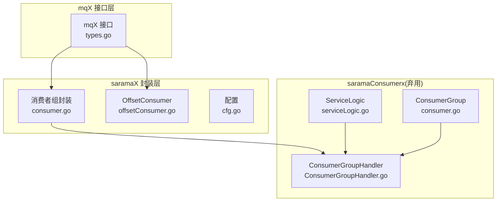
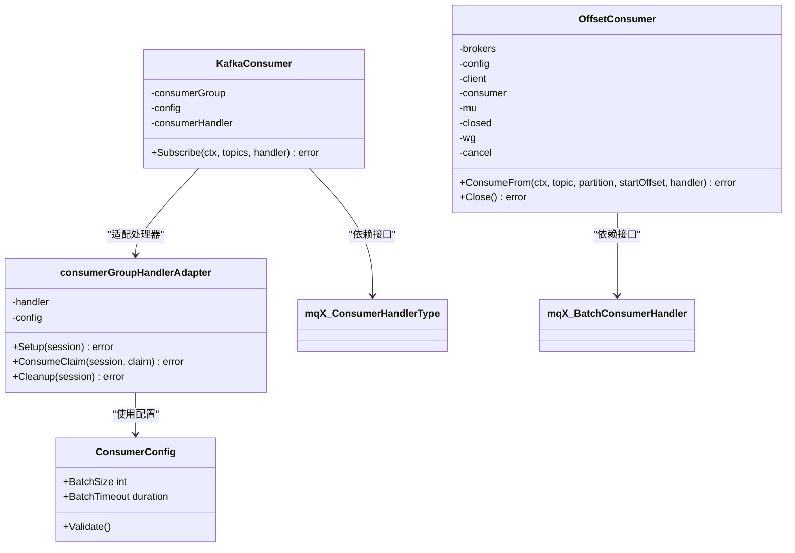
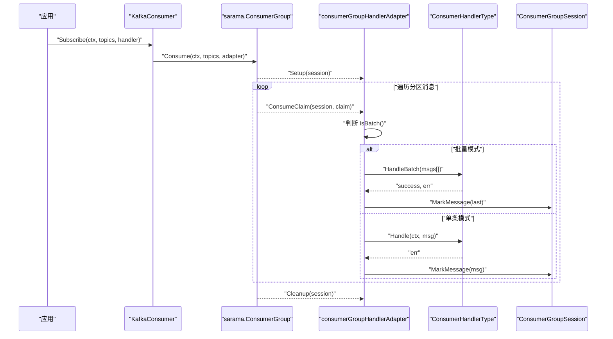
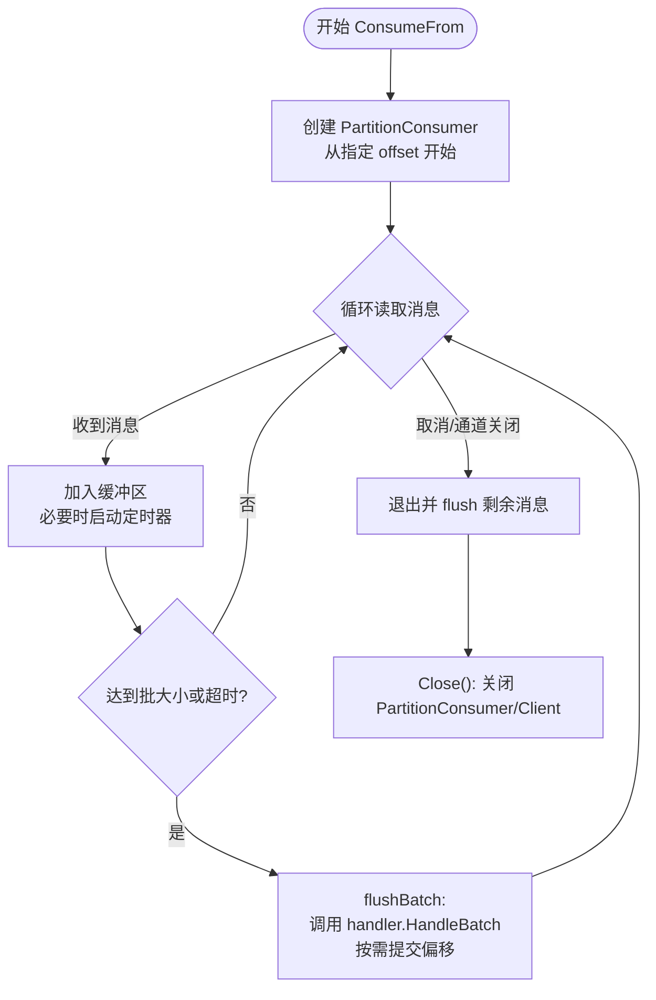
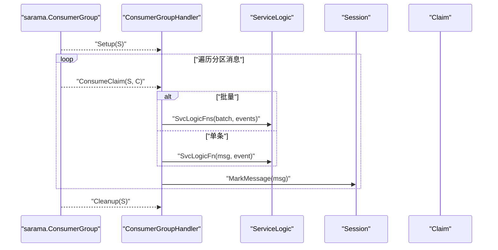
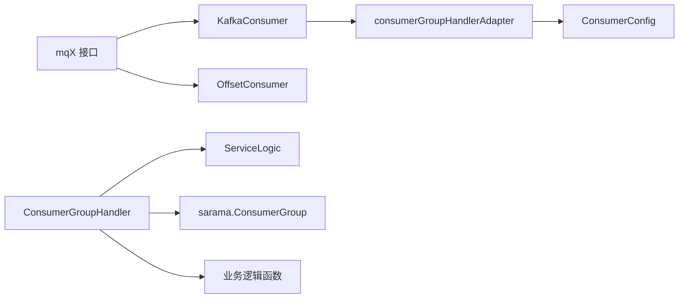

# Kafka消费者

<cite>
**本文引用的文件列表**
- [consumer.go](file://channelx/mqX/kafkaX/saramaX/consumerX/consumer.go)
- [offsetConsumer.go](file://channelx/mqX/kafkaX/saramaX/consumerX/offsetConsumer.go)
- [cfg.go](file://channelx/mqX/kafkaX/saramaX/consumerX/cfg.go)
- [types.go](file://channelx/mqX/types.go)
- [consumer.go](file://channelx/messageQueuex/saramax/saramaConsumerx/consumer.go)
- [ConsumerGroupHandler.go](file://channelx/messageQueuex/saramax/saramaConsumerx/ConsumerGroupHandlerx/ConsumerGroupHandler.go)
- [serviceLogic.go](file://channelx/messageQueuex/saramax/saramaConsumerx/serviceLogic/serviceLogic.go)
- [consumer_test.go](file://channelx/mqX/kafkaX/saramaX/consumerX/consumer_test.go)
- [offsetConsumer_test.go](file://channelx/mqX/kafkaX/saramaX/consumerX/offsetConsumer_test.go)
- [consumer_test.go](file://channelx/messageQueuex/saramax/saramaConsumerx/consumer_test.go)
- [README.md](file://README.md)
</cite>

## 目录
1. [简介](#简介)
2. [项目结构](#项目结构)
3. [核心组件](#核心组件)
4. [架构总览](#架构总览)
5. [详细组件分析](#详细组件分析)
6. [依赖关系分析](#依赖关系分析)
7. [性能考量](#性能考量)
8. [故障排查指南](#故障排查指南)
9. [结论](#结论)
10. [附录](#附录)

## 简介
本章节面向使用 IBM sarama 库构建 Kafka 消费者的开发者，聚焦于两类消费者实现：
- 基于消费者组的实现（saramaConsumerx），强调会话管理、再平衡与分区分配策略的使用与扩展点。
- 基于 PartitionConsumer 的 OffsetConsumer 实现（offsetConsumer），用于需要从指定偏移量开始精确消费的场景。

文档将系统讲解：
- 消费者组的会话生命周期与再平衡机制
- 分区分配策略（如 Range、RoundRobin）在 sarama 中的体现与自定义
- 消息拉取、处理逻辑注入与自动/手动偏移量提交
- OffsetConsumer 的特殊用途与使用方式
- 完整使用示例：定义处理器、启动消费者组、安全关闭
- 对比 saramaX/consumerX 与 saramax/saramaConsumerx 的 API 抽象与使用复杂度

## 项目结构
围绕 Kafka 消费者的关键目录与文件如下：
- channelx/mqX/kafkaX/saramaX/consumerX：通用封装的消费者组与 OffsetConsumer
- channelx/messageQueuex/saramax/saramaConsumerx：saramaConsumerx 包（已标注弃用，仍可参考其消费者组处理逻辑）
- channelx/mqX：统一的消息与消费者接口抽象（mqX）

图表来源
- [consumer.go](file://channelx/mqX/kafkaX/saramaX/consumerX/consumer.go#L1-L168)
- [offsetConsumer.go](file://channelx/mqX/kafkaX/saramaX/consumerX/offsetConsumer.go#L1-L207)
- [cfg.go](file://channelx/mqX/kafkaX/saramaX/consumerX/cfg.go#L1-L31)
- [consumer.go](file://channelx/messageQueuex/saramax/saramaConsumerx/consumer.go#L1-L36)
- [ConsumerGroupHandler.go](file://channelx/messageQueuex/saramax/saramaConsumerx/ConsumerGroupHandlerx/ConsumerGroupHandler.go#L1-L159)
- [serviceLogic.go](file://channelx/messageQueuex/saramax/saramaConsumerx/serviceLogic/serviceLogic.go#L1-L67)

章节来源
- [consumer.go](file://channelx/mqX/kafkaX/saramaX/consumerX/consumer.go#L1-L168)
- [offsetConsumer.go](file://channelx/mqX/kafkaX/saramaX/consumerX/offsetConsumer.go#L1-L207)
- [cfg.go](file://channelx/mqX/kafkaX/saramaX/consumerX/cfg.go#L1-L31)
- [consumer.go](file://channelx/messageQueuex/saramax/saramaConsumerx/consumer.go#L1-L36)
- [ConsumerGroupHandler.go](file://channelx/messageQueuex/saramax/saramaConsumerx/ConsumerGroupHandlerx/ConsumerGroupHandler.go#L1-L159)
- [serviceLogic.go](file://channelx/messageQueuex/saramax/saramaConsumerx/serviceLogic/serviceLogic.go#L1-L67)

## 核心组件
- 消费者组封装（saramaX/consumerX）
  - KafkaConsumer：对外暴露 Subscribe 方法，内部适配 sarama.ConsumerGroupHandler，支持单条与批量两种处理模式。
  - consumerGroupHandlerAdapter：桥接 mqX.ConsumerHandlerType 与 sarama.ConsumerGroupHandler，负责消息遍历、批次聚合与提交。
  - ConsumerConfig：批量大小与批量超时配置，含默认值与校验。
- OffsetConsumer（saramaX/consumerX）
  - 从指定 topic/partition/offset 开始消费，支持批量消费与超时触发，支持 AutoCommit 或由 handler 决定是否提交。
- saramaConsumerx（弃用包）
  - ConsumerGroup：封装 sarama.ConsumerGroup 与 sarama.ConsumerGroupHandler 的组合，提供 ReceiveMessage。
  - ConsumerGroupHandler：内置 Setup/Cleanup/ConsumeClaim，支持偏移量重置、单条/批量处理。
  - ServiceLogic：承载业务逻辑函数、批量配置与偏移量配置。

章节来源
- [consumer.go](file://channelx/mqX/kafkaX/saramaX/consumerX/consumer.go#L1-L168)
- [offsetConsumer.go](file://channelx/mqX/kafkaX/saramaX/consumerX/offsetConsumer.go#L1-L207)
- [cfg.go](file://channelx/mqX/kafkaX/saramaX/consumerX/cfg.go#L1-L31)
- [consumer.go](file://channelx/messageQueuex/saramax/saramaConsumerx/consumer.go#L1-L36)
- [ConsumerGroupHandler.go](file://channelx/messageQueuex/saramax/saramaConsumerx/ConsumerGroupHandlerx/ConsumerGroupHandler.go#L1-L159)
- [serviceLogic.go](file://channelx/messageQueuex/saramax/saramaConsumerx/serviceLogic/serviceLogic.go#L1-L67)

## 架构总览
下面的类图展示了消费者组封装与 OffsetConsumer 的关键类与关系，以及与 mqX 接口的对接。

图表来源
- [consumer.go](file://channelx/mqX/kafkaX/saramaX/consumerX/consumer.go#L1-L168)
- [offsetConsumer.go](file://channelx/mqX/kafkaX/saramaX/consumerX/offsetConsumer.go#L1-L207)
- [cfg.go](file://channelx/mqX/kafkaX/saramaX/consumerX/cfg.go#L1-L31)
- [types.go](file://channelx/mqX/types.go#L1-L71)

## 详细组件分析

### 组件A：消费者组封装（saramaX/consumerX）
- 设计要点
  - 通过 KafkaConsumer.Subscribe 将 mqX.ConsumerHandlerType 注入到 sarama.ConsumerGroup。
  - consumerGroupHandlerAdapter 在 ConsumeClaim 中根据 handler.IsBatch() 切换单条或批量处理。
  - 批量模式下，使用固定大小与超时双重触发条件，配合 session.MarkMessage 提交偏移。
- 处理流程（批量）
  - 初始化缓冲区与定时器；每条消息转换为通用 Message 并追加到缓冲区。
  - 达到 BatchSize 或超时触发 flushBatch：调用 handler.HandleBatch，成功则提交最后一条消息的偏移。
  - 退出时 flush 剩余消息并停止定时器。
- 处理流程（单条）
  - 逐条遍历消息，转换为通用 Message 后调用 handler.Handle，成功后提交该消息偏移。

图表来源
- [consumer.go](file://channelx/mqX/kafkaX/saramaX/consumerX/consumer.go#L1-L168)
- [types.go](file://channelx/mqX/types.go#L1-L71)

章节来源
- [consumer.go](file://channelx/mqX/kafkaX/saramaX/consumerX/consumer.go#L1-L168)
- [cfg.go](file://channelx/mqX/kafkaX/saramaX/consumerX/cfg.go#L1-L31)
- [types.go](file://channelx/mqX/types.go#L1-L71)

### 组件B：OffsetConsumer（从指定偏移量消费）
- 设计要点
  - 通过 NewOffsetConsumer 创建客户端与消费者，随后使用 ConsumePartition 从指定 offset 开始消费。
  - 支持批量消费与超时触发；是否提交由 handler 返回或配置决定。
  - Close 保证资源释放与上下文取消。
- 使用场景
  - 需要从历史偏移量重新消费、重放事件或修复数据时。
- 关键行为
  - ConsumeFrom 内部创建 PartitionConsumer，循环读取 Messages()，聚合到缓冲区，超时或满批触发 flush。
  - flush 时调用 handler.HandleBatch，若 commit 或 AutoCommit，则记录最后一条消息的偏移（注释提示可持久化到外部存储）。

图表来源
- [offsetConsumer.go](file://channelx/mqX/kafkaX/saramaX/consumerX/offsetConsumer.go#L1-L207)

章节来源
- [offsetConsumer.go](file://channelx/mqX/kafkaX/saramaX/consumerX/offsetConsumer.go#L1-L207)

### 组件C：saramaConsumerx（弃用包）——消费者组处理逻辑
- 设计要点
  - ConsumerGroupHandler 实现 Setup/Cleanup/ConsumeClaim，支持：
    - 偏移量重置：在 Setup 中根据配置对指定主题分区重置 offset。
    - 单条/批量处理：根据配置切换 oneMessageLogic/manyMessagesLogic。
    - 业务逻辑注入：通过 ServiceLogic 的 SvcLogicFn/SvcLogicFns 注入。
- 再平衡与会话
  - Setup/Cleanup 提供会话生命周期钩子，可在再平衡前后执行初始化/清理。
  - ConsumeClaim 遍历 claim.Messages()，按配置处理并标记消息。

图表来源
- [ConsumerGroupHandler.go](file://channelx/messageQueuex/saramax/saramaConsumerx/ConsumerGroupHandlerx/ConsumerGroupHandler.go#L1-L159)
- [serviceLogic.go](file://channelx/messageQueuex/saramax/saramaConsumerx/serviceLogic/serviceLogic.go#L1-L67)

章节来源
- [consumer.go](file://channelx/messageQueuex/saramax/saramaConsumerx/consumer.go#L1-L36)
- [ConsumerGroupHandler.go](file://channelx/messageQueuex/saramax/saramaConsumerx/ConsumerGroupHandlerx/ConsumerGroupHandler.go#L1-L159)
- [serviceLogic.go](file://channelx/messageQueuex/saramax/saramaConsumerx/serviceLogic/serviceLogic.go#L1-L67)

## 依赖关系分析
- 接口抽象
  - mqX.Message、ConsumerHandlerType、BatchConsumerHandler 为统一抽象，屏蔽具体实现差异。
- 组件耦合
  - saramaX/consumerX 的 KafkaConsumer 与 consumerGroupHandlerAdapter 依赖 mqX 接口，便于替换不同处理器。
  - saramaConsumerx 的 ConsumerGroupHandler 依赖 ServiceLogic，便于集中配置业务逻辑。
- 外部依赖
  - sarama.ConsumerGroup、sarama.Consumer、sarama.Client 等为核心依赖。
  - 通过配置对象（ConsumerConfig、OffsetConsumerConfig）控制行为。

图表来源
- [consumer.go](file://channelx/mqX/kafkaX/saramaX/consumerX/consumer.go#L1-L168)
- [offsetConsumer.go](file://channelx/mqX/kafkaX/saramaX/consumerX/offsetConsumer.go#L1-L207)
- [cfg.go](file://channelx/mqX/kafkaX/saramaX/consumerX/cfg.go#L1-L31)
- [ConsumerGroupHandler.go](file://channelx/messageQueuex/saramax/saramaConsumerx/ConsumerGroupHandlerx/ConsumerGroupHandler.go#L1-L159)
- [serviceLogic.go](file://channelx/messageQueuex/saramax/saramaConsumerx/serviceLogic/serviceLogic.go#L1-L67)

章节来源
- [types.go](file://channelx/mqX/types.go#L1-L71)
- [consumer.go](file://channelx/mqX/kafkaX/saramaX/consumerX/consumer.go#L1-L168)
- [offsetConsumer.go](file://channelx/mqX/kafkaX/saramaX/consumerX/offsetConsumer.go#L1-L207)
- [ConsumerGroupHandler.go](file://channelx/messageQueuex/saramax/saramaConsumerx/ConsumerGroupHandlerx/ConsumerGroupHandler.go#L1-L159)
- [serviceLogic.go](file://channelx/messageQueuex/saramax/saramaConsumerx/serviceLogic/serviceLogic.go#L1-L67)

## 性能考量
- 批量消费
  - 通过 ConsumerConfig.BatchSize 与 BatchTimeout 控制吞吐与延迟权衡；合理设置避免频繁提交与内存占用过高。
- 会话与再平衡
  - 避免在 Setup/Cleanup 中执行耗时操作；尽量将初始化移到应用启动阶段。
- 偏移量提交
  - 单条模式建议在业务处理成功后再提交；批量模式建议在批次全部成功后提交最后一条消息偏移。
- 资源管理
  - 使用 Close/defer 关闭 PartitionConsumer 与 Client；确保上下文取消后及时释放资源。

## 故障排查指南
- 连接 Kafka 失败
  - 检查地址与网络连通性；确认 sarama.NewConsumerGroup 的参数正确。
- 消费无响应
  - 确认已调用 Subscribe/Consume 并传入正确的 topics；检查处理器是否实现 IsBatch 与 Handle/HandleBatch。
- 偏移量未提交
  - 单条模式需确保业务处理成功后才会提交；批量模式需确保 handler.HandleBatch 返回成功。
- 重复消费或丢失
  - 检查消费者组配置与再平衡行为；确认业务处理幂等性。
- OffsetConsumer 无法提交
  - sarama 的 PartitionConsumer 不支持自动提交，需在业务侧持久化 offset 至外部存储。

章节来源
- [consumer_test.go](file://channelx/mqX/kafkaX/saramaX/consumerX/consumer_test.go#L1-L70)
- [offsetConsumer_test.go](file://channelx/mqX/kafkaX/saramaX/consumerX/offsetConsumer_test.go#L1-L51)
- [consumer_test.go](file://channelx/messageQueuex/saramax/saramaConsumerx/consumer_test.go#L1-L145)

## 结论
- saramaX/consumerX 提供了简洁易用的消费者组封装与 OffsetConsumer，适合大多数业务场景。
- saramaConsumerx（弃用包）展示了更完整的消费者组处理逻辑与偏移量重置能力，可作为参考实现。
- 在选择上：
  - 需要快速接入、统一接口抽象：优先使用 saramaX/consumerX。
  - 需要精细控制再平衡与偏移量策略：可参考 saramaConsumerx 的实现思路。

## 附录

### 使用示例与最佳实践
- 定义消费者处理器
  - 实现 mqX.ConsumerHandlerType 的 IsBatch/Handle/HandleBatch。
- 启动消费者组
  - 使用 sarama.NewConsumerGroup 创建消费者组，构造 KafkaConsumer 并调用 Subscribe。
- 安全关闭
  - 使用 context 控制生命周期；在 defer 中调用 Close（OffsetConsumer）或等待消费者组退出。
- 偏移量控制
  - 使用 OffsetConsumer 从指定 offset 开始消费；或在 saramaConsumerx 的 ConsumerGroupHandler.Setup 中重置偏移量。

章节来源
- [consumer_test.go](file://channelx/mqX/kafkaX/saramaX/consumerX/consumer_test.go#L1-L70)
- [offsetConsumer_test.go](file://channelx/mqX/kafkaX/saramaX/consumerX/offsetConsumer_test.go#L1-L51)
- [consumer_test.go](file://channelx/messageQueuex/saramax/saramaConsumerx/consumer_test.go#L1-L145)
- [README.md](file://README.md#L60-L66)

### API 抽象与使用复杂度对比
- saramaX/consumerX
  - 优点：接口统一、封装简单、易于集成；支持批量与超时控制。
  - 适用：常规消费者组场景，快速落地。
- saramax/saramaConsumerx（弃用）
  - 优点：内置偏移量重置、单条/批量处理、业务逻辑集中配置。
  - 适用：需要更细粒度控制再平衡与偏移量的场景。

章节来源
- [consumer.go](file://channelx/mqX/kafkaX/saramaX/consumerX/consumer.go#L1-L168)
- [ConsumerGroupHandler.go](file://channelx/messageQueuex/saramax/saramaConsumerx/ConsumerGroupHandlerx/ConsumerGroupHandler.go#L1-L159)
- [consumer.go](file://channelx/messageQueuex/saramax/saramaConsumerx/consumer.go#L1-L36)