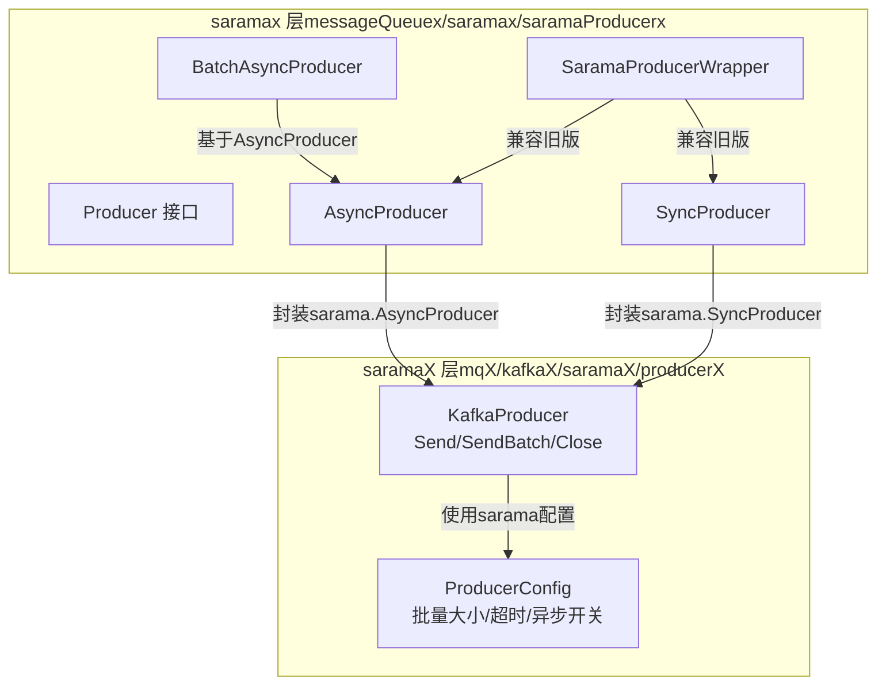
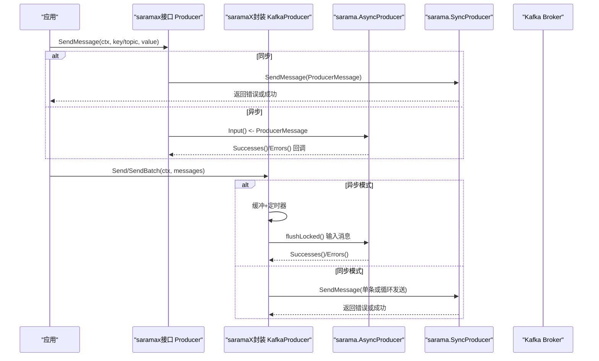
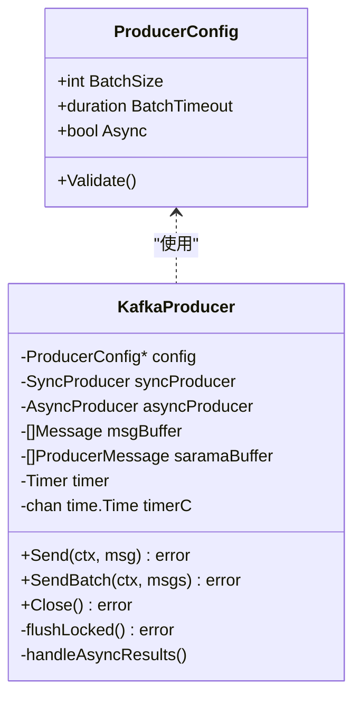
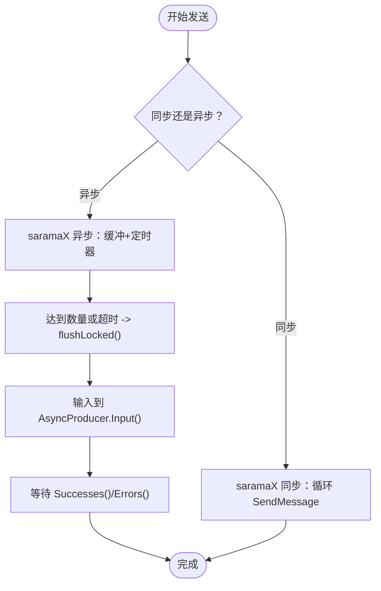
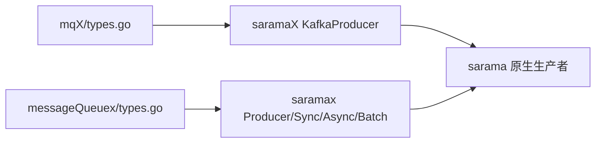

# Kafka生产者

<cite>
**本文引用的文件**
- [producer.go](file://channelx/messageQueuex/saramax/saramaProducerx/producer.go)
- [producer_test.go](file://channelx/messageQueuex/saramax/saramaProducerx/producer_test.go)
- [testType.go](file://channelx/messageQueuex/saramax/saramaProducerx/testType.go)
- [cfg.go](file://channelx/mqX/kafkaX/saramaX/producerX/cfg.go)
- [producer.go](file://channelx/mqX/kafkaX/saramaX/producerX/producer.go)
- [pro_test.go](file://channelx/mqX/kafkaX/saramaX/producerX/pro_test.go)
- [types.go](file://channelx/messageQueuex/types.go)
- [types.go](file://channelx/mqX/types.go)
- [README.md](file://README.md)
</cite>

## 目录
1. [简介](#简介)
2. [项目结构](#项目结构)
3. [核心组件](#核心组件)
4. [架构总览](#架构总览)
5. [详细组件分析](#详细组件分析)
6. [依赖关系分析](#依赖关系分析)
7. [性能考量](#性能考量)
8. [故障排查指南](#故障排查指南)
9. [结论](#结论)
10. [附录](#附录)

## 简介
本章节面向希望在Go生态中使用Kafka的开发者，系统讲解仓库中的两类生产者封装：
- saramaX层：对sarama原生生产者进行轻量封装，提供同步、异步与批量异步三种发送形态，便于直接控制sarama配置与行为。
- saramax层：在saramaX之上进一步抽象，提供统一的Producer接口与结果处理回调，强调易用性与一致性。

我们将深入解析同步与异步发送机制、消息序列化、分区路由、重试策略、配置参数（ack模式、压缩、超时等）对性能与可靠性的权衡，并给出使用示例与场景选择建议。

## 项目结构
围绕Kafka生产者，仓库包含两条路径：
- channelx/mqX/kafkaX/saramaX/producerX：saramaX层生产者，提供同步/异步/批量异步发送能力，内置缓冲与定时刷写。
- channelx/messageQueuex/saramax/saramaProducerx：saramax层生产者，提供统一Producer接口、异步结果回调与批量异步封装。



图表来源
- [cfg.go](file://channelx/mqX/kafkaX/saramaX/producerX/cfg.go#L1-L33)
- [producer.go](file://channelx/mqX/kafkaX/saramaX/producerX/producer.go#L1-L219)
- [producer.go](file://channelx/messageQueuex/saramax/saramaProducerx/producer.go#L1-L405)

章节来源
- [cfg.go](file://channelx/mqX/kafkaX/saramaX/producerX/cfg.go#L1-L33)
- [producer.go](file://channelx/mqX/kafkaX/saramaX/producerX/producer.go#L1-L219)
- [producer.go](file://channelx/messageQueuex/saramax/saramaProducerx/producer.go#L1-L405)

## 核心组件
- saramaX层（mqX/kafkaX/saramaX/producerX）
  - ProducerConfig：批量大小、超时、异步开关。
  - KafkaProducer：统一Send/SendBatch/Close；异步模式下具备缓冲与定时刷写。
- saramax层（messageQueuex/saramax/saramaProducerx）
  - Producer接口：统一的SendMessage/Close/Type。
  - SyncProducer/AsyncProducer/BatchAsyncProducer：分别对应同步、异步与批量异步。
  - AsyncResultHandler：异步结果回调接口，默认实现可记录日志。
  - SaramaProducerWrapper：兼容旧版接口。

章节来源
- [cfg.go](file://channelx/mqX/kafkaX/saramaX/producerX/cfg.go#L1-L33)
- [producer.go](file://channelx/mqX/kafkaX/saramaX/producerX/producer.go#L1-L219)
- [producer.go](file://channelx/messageQueuex/saramax/saramaProducerx/producer.go#L1-L405)

## 架构总览
下面以序列图展示两条路径的发送流程与关键差异。



图表来源
- [producer.go](file://channelx/messageQueuex/saramax/saramaProducerx/producer.go#L59-L112)
- [producer.go](file://channelx/messageQueuex/saramax/saramaProducerx/producer.go#L114-L235)
- [producer.go](file://channelx/mqX/kafkaX/saramaX/producerX/producer.go#L72-L196)

## 详细组件分析

### saramaX层（mqX/kafkaX/saramaX/producerX）
- ProducerConfig
  - BatchSize：达到该数量即触发批量发送。
  - BatchTimeout：从第一条消息进入缓冲起计时，超时也触发批量发送。
  - Async：true启用异步批量发送，false启用同步发送。
- KafkaProducer
  - Send：单条消息转发至SendBatch。
  - SendBatch：异步模式下将消息加入缓冲，满足“数量”或“超时”条件后flushLocked批量输入到sarama.AsyncProducer；同步模式下循环调用sarama.SyncProducer.SendMessage。
  - handleAsyncResults：消费Successes()/Errors()通道，可用于监控或告警。
  - Close：异步模式先flush并等待协程退出，再关闭AsyncProducer；同步模式直接关闭SyncProducer。



图表来源
- [cfg.go](file://channelx/mqX/kafkaX/saramaX/producerX/cfg.go#L1-L33)
- [producer.go](file://channelx/mqX/kafkaX/saramaX/producerX/producer.go#L1-L219)

章节来源
- [cfg.go](file://channelx/mqX/kafkaX/saramaX/producerX/cfg.go#L1-L33)
- [producer.go](file://channelx/mqX/kafkaX/saramaX/producerX/producer.go#L1-L219)
- [pro_test.go](file://channelx/mqX/kafkaX/saramaX/producerX/pro_test.go#L1-L84)

### saramax层（messageQueuex/saramax/saramaProducerx）
- Producer接口
  - SendMessage(ctx, keyOrTopic, value)：统一发送入口。
  - Close()：释放资源。
  - Type()：返回ProducerType（同步/异步）。
- SyncProducer
  - 基于sarama.SyncProducer，构造ProducerMessage后直接发送。
- AsyncProducer
  - 基于sarama.AsyncProducer，内部启动goroutine消费Successes()/Errors()，通过AsyncResultHandler回调处理结果。
  - SendMessage将消息入队到sarama.AsyncProducer.Input()。
- BatchAsyncProducer
  - 在AsyncProducer基础上增加本地批量队列与定时器，达到BatchSize或BatchInterval时批量投递。
- AsyncResultHandler
  - HandleSuccess(HandleError)：默认实现为空操作，可在业务中注入重试、监控等逻辑。
- SaramaProducerWrapper
  - 为兼容旧版接口提供包装器，暴露ProducerTyp/IsAsync/IsSync等方法。

```mermaid
classDiagram
class Producer {
<<interface>>
+SendMessage(ctx, keyOrTopic, value) error
+Close() error
+Type() ProducerType
}
class SyncProducer {
-SyncProducer producer
-Config* config
+SendMessage(...)
+Close()
+Type()
}
class AsyncProducer {
-AsyncProducer producer
-Config* config
-chan interface{} resultChan
-chan struct{} stopChan
-chan struct{} stoppedChan
-WaitGroup wg
-AsyncResultHandler handler
+SendMessage(...)
+Close()
+Type()
-handleResults()
}
class BatchAsyncProducer {
-AsyncProducer* AsyncProducer
-int batchSize
-duration batchInterval
-chan ProducerMessage* batchChan
-WaitGroup batchWG
+SendMessage(...)
+Close()
-batchProcessor()
-sendBatch(...)
}
class SaramaProducerWrapper {
-Producer producer
-ProducerType typ
+SendMessage(...)
+CloseProducer()
+ProducerTyp() uint
+IsAsync() bool
+IsSync() bool
}
Producer <|.. SyncProducer
Producer <|.. AsyncProducer
Producer <|.. BatchAsyncProducer
BatchAsyncProducer --|> AsyncProducer
SaramaProducerWrapper --> Producer : "包装"
```

图表来源
- [producer.go](file://channelx/messageQueuex/saramax/saramaProducerx/producer.go#L22-L112)
- [producer.go](file://channelx/messageQueuex/saramax/saramaProducerx/producer.go#L114-L235)
- [producer.go](file://channelx/messageQueuex/saramax/saramaProducerx/producer.go#L237-L365)
- [producer.go](file://channelx/messageQueuex/saramax/saramaProducerx/producer.go#L367-L405)

章节来源
- [producer.go](file://channelx/messageQueuex/saramax/saramaProducerx/producer.go#L1-L405)
- [producer_test.go](file://channelx/messageQueuex/saramax/saramaProducerx/producer_test.go#L1-L145)
- [testType.go](file://channelx/messageQueuex/saramax/saramaProducerx/testType.go#L1-L8)

### 同步与异步发送机制
- 同步发送（saramaX）
  - KafkaProducer在同步模式下循环调用sarama.SyncProducer.SendMessage，适合低延迟、强一致要求的场景。
- 异步发送（saramaX）
  - KafkaProducer在异步模式下将消息加入缓冲，满足“数量”或“超时”条件后批量flush到sarama.AsyncProducer.Input()，显著提升吞吐。
- 异步发送（saramax）
  - AsyncProducer直接将消息入队到sarama.AsyncProducer.Input()，并在独立goroutine中消费Successes()/Errors()，通过AsyncResultHandler回调处理结果。



图表来源
- [producer.go](file://channelx/mqX/kafkaX/saramaX/producerX/producer.go#L78-L178)
- [producer.go](file://channelx/messageQueuex/saramax/saramaProducerx/producer.go#L158-L212)

章节来源
- [producer.go](file://channelx/mqX/kafkaX/saramaX/producerX/producer.go#L72-L196)
- [producer.go](file://channelx/messageQueuex/saramax/saramaProducerx/producer.go#L114-L235)

### 消息序列化与分区路由
- 序列化
  - saramaX层：mqX.Message的Key/Value直接编码为sarama.ByteEncoder。
  - saramax层：messageQueuex.Tp的Key/Topic编码为sarama.StringEncoder，Value编码为sarama.StringEncoder。
- 分区路由
  - saramaX层：使用sarama的默认分区器（通常基于Key），也可在sarama.Config中自定义Partitioner。
  - saramax层：同上，由sarama决定分区策略。

章节来源
- [producer.go](file://channelx/mqX/kafkaX/saramaX/producerX/producer.go#L84-L109)
- [producer.go](file://channelx/messageQueuex/saramax/saramaProducerx/producer.go#L87-L99)
- [types.go](file://channelx/mqX/types.go#L20-L25)
- [types.go](file://channelx/messageQueuex/types.go#L6-L15)

### 重试策略
- saramaX层
  - 未内置重试逻辑，若出现错误可通过外部重试策略处理。
- saramax层
  - 未内置重试逻辑，可在AsyncResultHandler.HandleError中实现重试、降级或告警。
- 建议
  - 对于高可靠性场景，结合业务侧重试与幂等（enable.idempotence）使用。

章节来源
- [producer.go](file://channelx/mqX/kafkaX/saramaX/producerX/producer.go#L180-L194)
- [producer.go](file://channelx/messageQueuex/saramax/saramaProducerx/producer.go#L33-L51)

### 配置参数与性能/可靠性影响
- ack模式
  - saramaX层：默认使用sarama.WaitForAll，保证最高可靠性。
  - saramax层：同步生产者显式设置RequiredAcks为WaitForAll。
- 压缩
  - 未在上述文件中显式配置压缩类型，可在sarama.Config中设置Producer.Compression。
- 超时
  - saramaX层：BatchTimeout用于异步批量发送的定时刷写；Context超时用于发送调用。
  - saramaX层：未显式设置网络层超时，可在sarama.Config中设置Net.ReadTimeout/WriteTimeout。
- 批量
  - saramaX层：BatchSize与BatchTimeout共同控制批量发送节奏。
  - saramax层：Flush.Messages与Flush.Frequency控制批量异步发送节奏。

章节来源
- [producer.go](file://channelx/mqX/kafkaX/saramaX/producerX/producer.go#L40-L67)
- [producer.go](file://channelx/messageQueuex/saramax/saramaProducerx/producer.go#L60-L77)
- [producer_test.go](file://channelx/messageQueuex/saramax/saramaProducerx/producer_test.go#L77-L113)

## 依赖关系分析
- saramaX层依赖mqX通用消息结构与sarama原生生产者。
- saramax层依赖messageQueuex的抽象类型与sarama原生生产者。
- 两者均通过sarama.Config控制底层行为。



图表来源
- [producer.go](file://channelx/mqX/kafkaX/saramaX/producerX/producer.go#L1-L219)
- [producer.go](file://channelx/messageQueuex/saramax/saramaProducerx/producer.go#L1-L405)
- [types.go](file://channelx/mqX/types.go#L1-L71)
- [types.go](file://channelx/messageQueuex/types.go#L1-L31)

章节来源
- [producer.go](file://channelx/mqX/kafkaX/saramaX/producerX/producer.go#L1-L219)
- [producer.go](file://channelx/messageQueuex/saramax/saramaProducerx/producer.go#L1-L405)
- [types.go](file://channelx/mqX/types.go#L1-L71)
- [types.go](file://channelx/messageQueuex/types.go#L1-L31)

## 性能考量
- 吞吐优先：saramaX异步模式（BatchSize/BatchTimeout）与saramax批量异步（Flush.Messages/Flush.Frequency）均可显著提升吞吐。
- 延迟敏感：saramaX同步模式或saramax同步生产者适合低延迟场景。
- 资源占用：异步模式会引入缓冲与定时器，注意合理设置BatchSize与BatchTimeout避免内存峰值过高。
- 可靠性：sarama.WaitForAll可提升可靠性，但会增加端到端延迟；结合业务需求权衡。

## 故障排查指南
- 发送失败
  - saramaX：检查SyncProducer/AsyncProducer返回的错误；异步模式关注Errors()通道。
  - saramax：检查AsyncResultHandler.HandleError回调是否被正确实现。
- 资源泄漏
  - 确保在应用退出前调用Close()，等待所有goroutine退出。
- 上下文超时
  - SendMessage(ctx, ...)时传入合理的Context超时，避免阻塞。
- 结果处理
  - 异步模式下务必消费Successes()/Errors()通道，否则可能导致goroutine泄漏或背压。

章节来源
- [producer.go](file://channelx/mqX/kafkaX/saramaX/producerX/producer.go#L180-L196)
- [producer.go](file://channelx/messageQueuex/saramax/saramaProducerx/producer.go#L183-L212)

## 结论
- saramaX层提供对sarama原生生产者的轻量封装，适合需要精细控制配置与缓冲策略的场景。
- saramax层提供统一接口与回调机制，适合快速集成与业务侧统一处理。
- 选择建议
  - 需要极致可控与细粒度优化：优先saramaX。
  - 追求易用性与一致性：优先saramax。
  - 高吞吐低延迟混合场景：saramaX异步或saramax批量异步均可，结合业务超时与批量参数调优。

## 附录

### 使用示例（路径参考）
- 初始化saramaX生产者并发送消息
  - 参考：[pro_test.go](file://channelx/mqX/kafkaX/saramaX/producerX/pro_test.go#L17-L84)
- 初始化saramax生产者并发送消息
  - 参考：[producer_test.go](file://channelx/messageQueuex/saramax/saramaProducerx/producer_test.go#L19-L75)
- 初始化saramax批量异步生产者
  - 参考：[producer_test.go](file://channelx/messageQueuex/saramax/saramaProducerx/producer_test.go#L77-L145)

### 配置要点（路径参考）
- saramaX配置
  - 参考：[cfg.go](file://channelx/mqX/kafkaX/saramaX/producerX/cfg.go#L1-L33)
- saramax配置
  - 参考：[producer.go](file://channelx/messageQueuex/saramax/saramaProducerx/producer.go#L237-L273)

### 抽象层次对比
- saramaX（mqX/kafkaX/saramaX/producerX）
  - 更贴近sarama原生，便于直接设置sarama.Config各项参数。
- saramax（messageQueuex/saramax/saramaProducerx）
  - 提供统一Producer接口与回调，屏蔽sarama细节，提升易用性。

章节来源
- [producer.go](file://channelx/mqX/kafkaX/saramaX/producerX/producer.go#L1-L219)
- [producer.go](file://channelx/messageQueuex/saramax/saramaProducerx/producer.go#L1-L405)