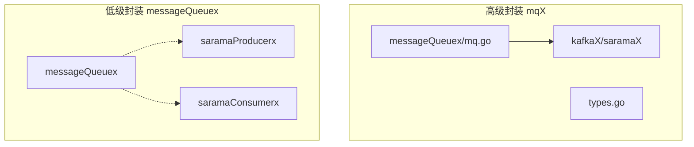
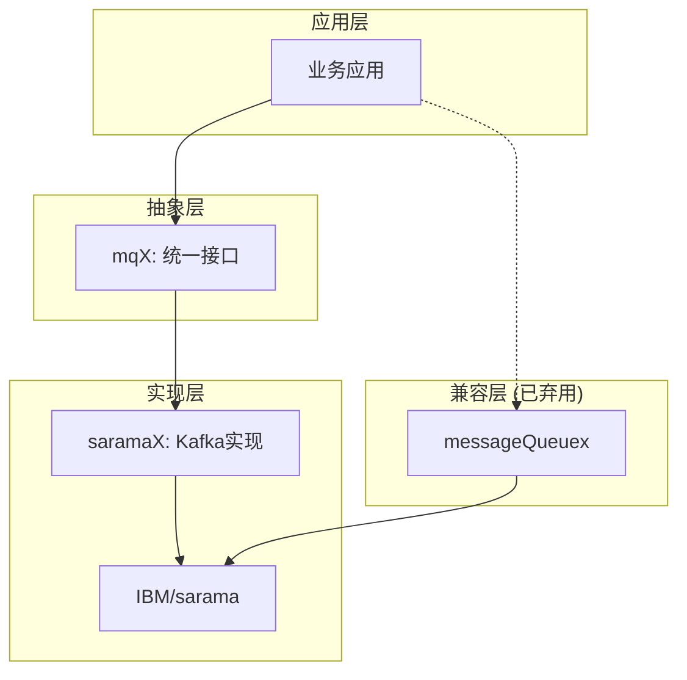
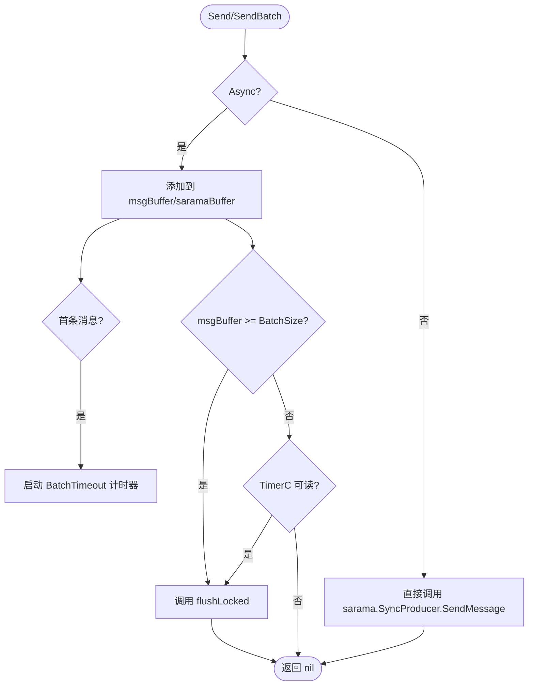
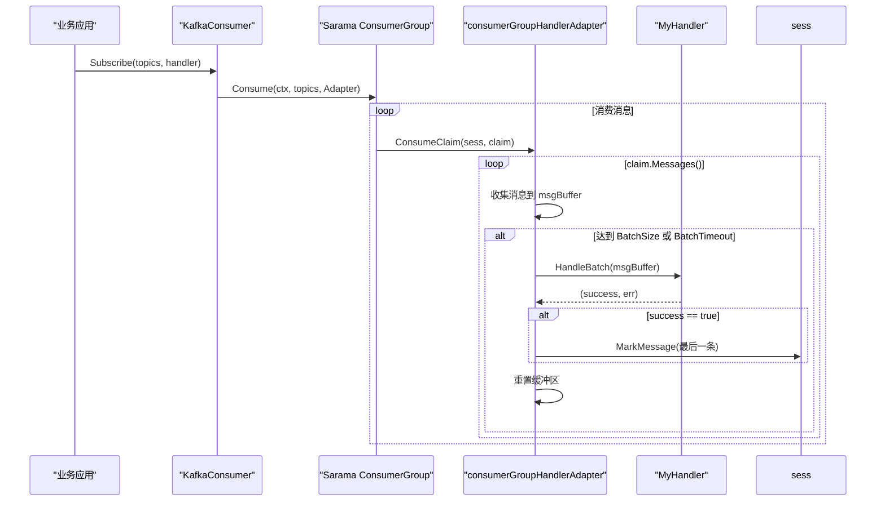
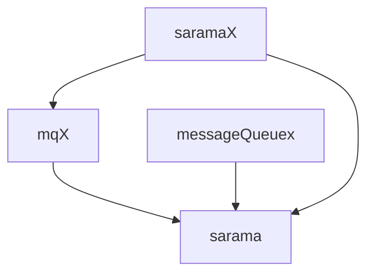

# 消息队列

<cite>
**本文档中引用的文件**  
- [types.go](file://channelx/mqX/types.go)
- [cfg.go](file://channelx/mqX/kafkaX/saramaX/producerX/cfg.go)
- [producer.go](file://channelx/mqX/kafkaX/saramaX/producerX/producer.go)
- [pro_test.go](file://channelx/mqX/kafkaX/saramaX/producerX/pro_test.go)
- [cfg.go](file://channelx/mqX/kafkaX/saramaX/consumerX/cfg.go)
- [consumer.go](file://channelx/mqX/kafkaX/saramaX/consumerX/consumer.go)
- [consumer_test.go](file://channelx/mqX/kafkaX/saramaX/consumerX/consumer_test.go)
- [offsetConsumer.go](file://channelx/mqX/kafkaX/saramaX/consumerX/offsetConsumer.go)
- [types.go](file://channelx/messageQueuex/types.go)
- [saramaProducerx/producer.go](file://channelx/messageQueuex/saramax/saramaProducerx/producer.go)
- [saramaConsumerx/consumer.go](file://channelx/messageQueuex/saramax/saramaConsumerx/consumer.go)
</cite>

## 目录
1. [简介](#简介)
2. [项目结构](#项目结构)
3. [核心组件](#核心组件)
4. [架构概述](#架构概述)
5. [详细组件分析](#详细组件分析)
6. [依赖分析](#依赖分析)
7. [性能考虑](#性能考虑)
8. [故障排除指南](#故障排除指南)
9. [结论](#结论)

## 简介
本文档深入探讨了基于Sarama库对Kafka消息队列的高级封装设计。重点介绍`mqX`包中统一的生产者与消费者API设计，详细解析Kafka生产者（`saramaX/producerX`）的配置、同步/异步消息发送及错误处理机制，以及消费者（`saramaX/consumerX`）的实现，包括消费者组、分区分配、消息处理和偏移量提交。同时，对比分析了`channelx`下两个不同层级的封装（`mqX`和`messageQueuex`）的用途与差异，并提供完整的使用示例。

## 项目结构
该项目的结构清晰地分离了不同层级的消息队列抽象。核心的高级封装位于`channelx/mqX`包中，而`channelx/messageQueuex`包则包含一个已弃用的旧版封装，主要用于向后兼容。

**图源**
- [types.go](file://channelx/mqX/types.go)
- [saramaProducerx/producer.go](file://channelx/messageQueuex/saramax/saramaProducerx/producer.go)
- [saramaConsumerx/consumer.go](file://channelx/messageQueuex/saramax/saramaConsumerx/consumer.go)

**章节源**
- [types.go](file://channelx/mqX/types.go)
- [types.go](file://channelx/messageQueuex/types.go)

## 核心组件
`mqX`包定义了消息队列的核心抽象接口，包括通用的`Message`结构、`Producer`生产者接口、`Consumer`消费者接口以及用于区分单条和批量处理的`ConsumerHandlerType`接口。这些接口为上层应用提供了与具体消息中间件解耦的统一API。

**章节源**
- [types.go](file://channelx/mqX/types.go)

## 架构概述
系统的整体架构围绕`mqX`包构建，它作为统一的门面，封装了底层`Sarama`库的复杂性。`mqX`通过`kafkaX/saramaX`子包实现了具体的Kafka逻辑。同时，为了兼容旧代码，`messageQueuex`包提供了对`Sarama`的直接封装，但已被标记为弃用。

**图源**
- [types.go](file://channelx/mqX/types.go)
- [producer.go](file://channelx/mqX/kafkaX/saramaX/producerX/producer.go)
- [consumer.go](file://channelx/mqX/kafkaX/saramaX/consumerX/consumer.go)

## 详细组件分析

### Kafka 生产者分析
`KafkaProducer`实现了`mqX.Producer`接口，支持同步和异步两种模式。其核心设计是通过`ProducerConfig`进行灵活配置，并在异步模式下实现了批量发送和超时刷新的优化机制。

#### 生产者配置与消息发送
`ProducerConfig`允许配置`BatchSize`（批量大小）、`BatchTimeout`（超时时间）和`Async`（是否异步）等关键参数。`Send`和`SendBatch`方法是主要的发送入口。在异步模式下，消息会被暂存于内部缓冲区，当达到`BatchSize`或超过`BatchTimeout`时，会触发`flushLocked`方法将消息批量推送到Sarama的`Input()`通道。

**图源**
- [cfg.go](file://channelx/mqX/kafkaX/saramaX/producerX/cfg.go)
- [producer.go](file://channelx/mqX/kafkaX/saramaX/producerX/producer.go)

**章节源**
- [cfg.go](file://channelx/mqX/kafkaX/saramaX/producerX/cfg.go)
- [producer.go](file://channelx/mqX/kafkaX/saramaX/producerX/producer.go)

### Kafka 消费者分析
`KafkaConsumer`实现了`mqX.Consumer`接口，它基于Sarama的`ConsumerGroup`，通过`consumerGroupHandlerAdapter`适配器来桥接`mqX`的`ConsumerHandlerType`接口。

#### 消费者组与消息处理
`Subscribe`方法接收一个`ConsumerHandlerType`，该接口通过`IsBatch()`方法区分处理模式。适配器`ConsumeClaim`方法根据此标志，分别执行单条或批量处理逻辑。

- **单条处理**：遍历`claim.Messages()`通道，对每条消息调用`Handle`方法，并立即调用`sess.MarkMessage`提交偏移量。
- **批量处理**：实现了一个带超时的缓冲机制。消息被收集到`msgBuffer`中，当达到`BatchSize`或`BatchTimeout`超时时，调用`HandleBatch`方法。偏移量的提交由`HandleBatch`的返回值`success`决定。

**图源**
- [consumer.go](file://channelx/mqX/kafkaX/saramaX/consumerX/consumer.go)
- [cfg.go](file://channelx/mqX/kafkaX/saramaX/consumerX/cfg.go)

**章节源**
- [consumer.go](file://channelx/mqX/kafkaX/saramaX/consumerX/consumer.go)
- [cfg.go](file://channelx/mqX/kafkaX/saramaX/consumerX/cfg.go)

### 两种封装层级对比分析
代码库中存在两个层级的封装：`mqX`和`messageQueuex`。

- **`mqX` (高级封装)**：这是推荐使用的现代封装。它定义了清晰、统一的接口（`Producer`, `Consumer`），隐藏了Sarama的实现细节，提供了更简洁的API和更好的抽象。它支持批量和超时等高级特性，并且是类型安全的。
- **`messageQueuex` (低级封装)**：这是一个已弃用的旧版封装。它直接暴露了Sarama的生产者类型（`SyncProducer`, `AsyncProducer`），并使用`Tp`结构体来传递主题和键。其API较为繁琐，且已被明确标记为`Deprecated`，建议迁移到`mqX`。

**章节源**
- [types.go](file://channelx/mqX/types.go)
- [types.go](file://channelx/messageQueuex/types.go)
- [saramaProducerx/producer.go](file://channelx/messageQueuex/saramax/saramaProducerx/producer.go)
- [saramaConsumerx/consumer.go](file://channelx/messageQueuex/saramax/saramaConsumerx/consumer.go)

## 依赖分析
`mqX`包是核心抽象，依赖于`github.com/IBM/sarama`库。`messageQueuex`包也直接依赖`sarama`，但不依赖`mqX`。`mqX`下的`kafkaX/saramaX`子包是`mqX`的具体实现，因此依赖于`mqX`的接口定义和`sarama`库。这种设计使得`mqX`可以作为独立的抽象层，未来可以轻松地为其他消息队列（如RabbitMQ）提供实现。

**图源**
- [go.mod](file://go.mod)
- [types.go](file://channelx/mqX/types.go)
- [types.go](file://channelx/messageQueuex/types.go)

**章节源**
- [go.mod](file://go.mod)

## 性能考虑
- **生产者**：异步批量发送模式能显著提高吞吐量，减少网络往返次数。合理配置`BatchSize`和`BatchTimeout`是关键，过大的批次可能导致延迟增加，过小的批次则无法发挥批量优势。
- **消费者**：批量处理模式可以减少业务逻辑的调用开销，尤其适用于需要批量写入数据库等场景。但需注意，过长的`BatchTimeout`可能导致消息处理延迟。
- **内存**：生产者和消费者的缓冲区会占用内存，应根据消息大小和速率进行评估。

## 故障排除指南
- **生产者连接失败**：检查Kafka Broker地址`addr`是否正确，网络是否通畅。
- **消息发送失败**：在异步模式下，通过`handleAsyncResults`协程监控`Errors()`通道，可以捕获并处理发送失败的消息。
- **消费者不消费**：检查`Subscribe`的`topics`是否正确，`ConsumerGroup`的`group.id`是否一致，以及Kafka Broker是否正常运行。
- **偏移量未提交**：在`consumerX`的批量模式下，确保`HandleBatch`方法返回`success=true`，否则偏移量不会被提交，导致消息重复消费。

**章节源**
- [producer.go](file://channelx/mqX/kafkaX/saramaX/producerX/producer.go)
- [consumer.go](file://channelx/mqX/kafkaX/saramaX/consumerX/consumer.go)

## 结论
该代码库提供了一个对Kafka的优秀高级封装。`mqX`包的设计理念先进，通过统一的接口和灵活的配置，极大地简化了Kafka的使用。其对同步/异步生产者和单条/批量消费者的封装，满足了多样化的业务需求。尽管存在一个已弃用的`messageQueuex`包，但明确的弃用标记和`mqX`的优越性，为代码的演进指明了方向。建议新项目直接使用`mqX`包，并将旧代码逐步迁移。