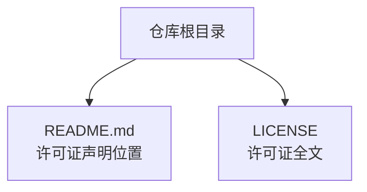
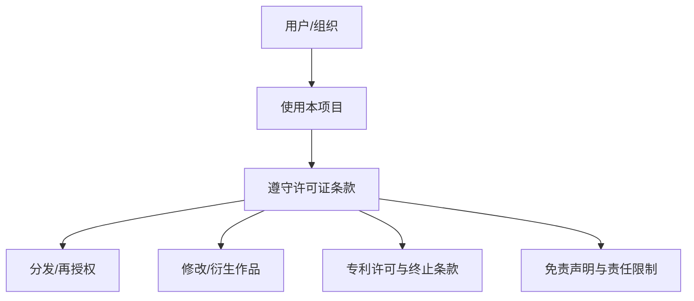
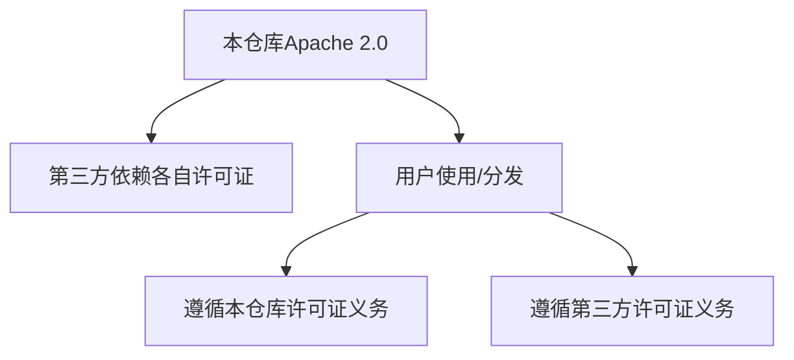

# 许可证

<cite>
**本文引用的文件**
- [README.md](file://README.md)
- [LICENSE](file://LICENSE)
</cite>

## 目录
1. [简介](#简介)
2. [项目结构](#项目结构)
3. [核心组件](#核心组件)
4. [架构总览](#架构总览)
5. [详细组件分析](#详细组件分析)
6. [依赖关系分析](#依赖关系分析)
7. [性能考虑](#性能考虑)
8. [故障排查指南](#故障排查指南)
9. [结论](#结论)
10. [附录](#附录)

## 简介
本文件旨在明确说明本项目的许可证信息，并结合仓库中的实际文件进行核对与解释。根据仓库根目录的 LICENSE 文件内容，该项目采用的是 Apache License 2.0（而非 README.md 中所标注的“MIT 许可证”）。因此，本文将围绕 Apache License 2.0 的核心条款展开说明，并指出 README.md 中关于许可证的表述与实际文件不一致的问题。

## 项目结构
与许可证相关的关键文件位于仓库根目录：
- README.md：项目说明与许可证声明位置
- LICENSE：许可证全文

图表来源
- [README.md](file://README.md#L124-L126)
- [LICENSE](file://LICENSE#L1-L202)

章节来源
- [README.md](file://README.md#L124-L126)
- [LICENSE](file://LICENSE#L1-L202)

## 核心组件
- 许可证声明文件：LICENSE
- 许可证声明位置：README.md 的“许可证”章节

章节来源
- [README.md](file://README.md#L124-L126)
- [LICENSE](file://LICENSE#L1-L202)

## 架构总览
从许可证角度，项目整体遵循 Apache License 2.0 的要求，用户在满足其条款的前提下可自由使用、复制、修改、分发、再授权等。同时，README.md 中关于“MIT 许可证”的表述与实际文件不符，需以 LICENSE 文件为准。

图表来源
- [LICENSE](file://LICENSE#L66-L176)

## 详细组件分析

### 组件一：许可证声明与实际文件一致性
- README.md 在“许可证”章节中声明“该项目使用 MIT 许可证”，并链接到根目录 LICENSE 文件。
- 实际 LICENSE 文件内容为 Apache License 2.0，包含完整的 Apache 2.0 条款与附注。

结论：
- 若 README.md 仍坚持“MIT 许可证”，则与实际文件不一致；应以 LICENSE 文件为准。
- 建议修正 README.md 中的许可证声明，避免误导使用者。

章节来源
- [README.md](file://README.md#L124-L126)
- [LICENSE](file://LICENSE#L1-L202)

### 组件二：Apache License 2.0 核心要点（摘自 LICENSE）
- 允许使用、复制、修改、分发、再授权等行为，但需满足若干前置条件与附加义务。
- 关键义务包括：
  - 必须随副本提供许可证文本；
  - 修改文件需显著标注变更；
  - 分发时必须保留原作品的版权、专利、商标与归属声明（若存在）；
  - 若作品包含 NOTICE 文件，则衍生作品也需包含该 NOTICE 的可读副本。
- 贡献默认适用相同许可证，且不得以额外条款限制贡献者的权利。
- 不授予商标权；禁止使用许可人名称进行背书或推广（合理使用除外）。
- 明确免责声明与责任限制。

章节来源
- [LICENSE](file://LICENSE#L66-L176)

### 组件三：MIT 许可证常见理解误区
- README.md 将本项目描述为“MIT 许可证”，但实际文件为 Apache 2.0。
- MIT 许可证通常更为宽松，仅要求保留版权与许可声明；而 Apache 2.0 引入了专利许可、商标限制、NOTICE 要求等更多约束与保护。
- 因此，若 README.md 仍标注为 MIT，将导致用户对权利义务的理解偏差。

章节来源
- [README.md](file://README.md#L124-L126)
- [LICENSE](file://LICENSE#L1-L202)

## 依赖关系分析
- 本项目通过 go.mod 声明了大量第三方依赖，这些依赖各自具有独立的许可证。本仓库的许可证声明与第三方许可证无直接耦合关系，但用户在使用本项目时，仍需关注第三方依赖各自的许可证要求。
- 由于本仓库的许可证文件为 Apache 2.0，用户在分发或再授权时应遵循该许可证的义务。

图表来源
- [go.mod](file://go.mod#L1-L42)
- [LICENSE](file://LICENSE#L66-L176)

章节来源
- [go.mod](file://go.mod#L1-L42)
- [LICENSE](file://LICENSE#L66-L176)

## 性能考虑
- 许可证本身不影响代码性能，但许可证合规会带来维护成本与风险控制成本。建议：
  - 在发布版本中标注准确的许可证信息；
  - 对第三方依赖进行许可证扫描与归档；
  - 在分发前进行合规审查清单核对。

## 故障排查指南
- 现象：README.md 声明为 MIT，但 LICENSE 文件为 Apache 2.0。
  - 处理：以 LICENSE 文件为准；修正 README.md 的许可证声明。
- 现象：分发时遗漏许可证文本或 NOTICE。
  - 处理：确保分发物包含 LICENSE 文本与 NOTICE（如适用），并在修改文件上标注变更。
- 现象：误用许可人名称进行推广。
  - 处理：严格遵守商标与名称使用的限制条款。

章节来源
- [README.md](file://README.md#L124-L126)
- [LICENSE](file://LICENSE#L94-L121)

## 结论
- 本项目的实际许可证为 Apache License 2.0，README.md 中的“MIT 许可证”表述与实际文件不一致，应尽快修正。
- Apache 2.0 在保障自由使用的同时，引入了专利许可、商标限制、NOTICE 要求等条款，用户在使用、修改、分发与再授权时应严格遵循。
- 建议在后续版本中统一许可证声明与实际文件，避免混淆。

## 附录
- Apache License 2.0 的核心义务与免责条款详见 LICENSE 文件对应章节。

章节来源
- [LICENSE](file://LICENSE#L66-L176)