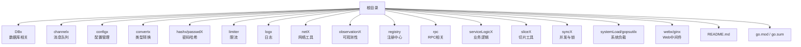
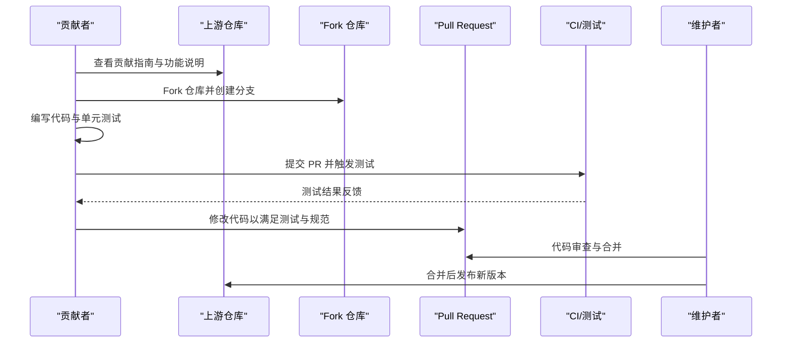
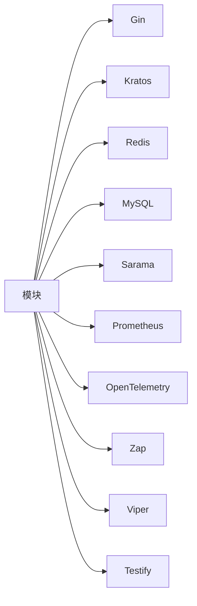

# 贡献指南

<cite>
**本文引用的文件**
- [README.md](file://README.md)
- [go.mod](file://go.mod)
- [go.sum](file://go.sum)
- [DBx/localCahceX/cacheLocalRistrettox/ristretto_test.go](file://DBx/localCahceX/cacheLocalRistrettox/ristretto_test.go)
- [DBx/mysqlX/gormx/dbMovex/myMovex/test/myMove_test.go](file://DBx/mysqlX/gormx/dbMovex/myMovex/test/myMove_test.go)
- [webx/ginx/middleware/jwtX2/jwt_test.go](file://webx/ginx/middleware/jwtX2/jwt_test.go)
- [configx/viperX/viper_test.go](file://configx/viperX/viper_test.go)
- [configx/viperX/viper.go](file://configx/viperX/viper.go)
</cite>

## 目录
1. [简介](#简介)
2. [项目结构](#项目结构)
3. [核心组件](#核心组件)
4. [架构总览](#架构总览)
5. [详细组件分析](#详细组件分析)
6. [依赖分析](#依赖分析)
7. [性能注意事项](#性能注意事项)
8. [故障排查指南](#故障排查指南)
9. [结论](#结论)
10. [附录](#附录)

## 简介
本指南面向希望为本项目贡献代码的开发者，基于仓库现有信息，系统说明贡献流程（提交 Issue、创建 Pull Request）、代码风格与测试要求、开发环境搭建、运行测试与代码格式化的步骤，并鼓励社区参与。同时，README 中明确指出需先阅读“贡献指南”，请在贡献前参考该文件以获取更详细的规范。

## 项目结构
项目采用多模块分层组织，涵盖 Web 中间件、RPC 中间件、榜单模型、定时任务、数据库迁移、限流与锁、消息队列、配置管理、类型转换、日志与监控等能力。各模块位于独立子目录，便于维护与扩展。

图示来源
- [README.md](file://README.md#L1-L126)
- [go.mod](file://go.mod#L1-L42)

章节来源
- [README.md](file://README.md#L1-L126)
- [go.mod](file://go.mod#L1-L42)

## 核心组件
- Web 中间件：提供 Gin 框架的 JWT 认证、限流、日志记录等中间件能力。
- RPC 中间件：包含多种限流算法（滑动窗口、计数器、令牌桶等）、负载均衡、熔断拦截器、可观测性集成。
- 榜单模型：提供高性能榜单服务模型计算封装。
- 定时任务：二次封装定时任务调度机制，支持节点负载控制与候选策略。
- 数据库迁移：支持双写池、迁移调度器、数据校验。
- 限流与锁：实现滑动窗口限流与 Redis 分布式锁。
- 消息队列：提供 Kafka 生产者与消费者封装。
- 配置管理：基于 Viper 的配置读取与监听。
- 类型转换：提供多种类型转换工具函数。
- 日志与监控：支持多种日志框架与 Prometheus 监控。
- 观测性：OpenTelemetry 与 Prometheus 集成。

章节来源
- [README.md](file://README.md#L5-L17)

## 架构总览
下图展示典型贡献工作流：从 Fork 仓库、创建分支、编写代码与测试，到提交 PR；以及 PR 合并后发布版本的流程。

说明
- 贡献前请先阅读“贡献指南”文件，了解规范与流程。
- 提交 PR 前务必保证所有测试通过，遵循代码风格与文档更新要求。

章节来源
- [README.md](file://README.md#L120-L126)

## 详细组件分析

### 贡献流程与规范
- 提交问题（Issue）
  - 在提交 Issue 前，请先阅读“贡献指南”，确认是否已有相关讨论或修复计划。
  - 描述问题时请包含：复现步骤、期望行为、实际行为、环境信息（Go 版本、操作系统、依赖版本）。
- 创建拉取请求（PR）
  - 基于 Fork 的最新分支创建 PR，确保 PR 描述清晰，包含改动动机、影响范围、测试覆盖情况。
  - 遵循代码风格与测试要求，确保 CI 通过后再请求合并。
- 文档更新
  - 新增或修改功能需同步更新 README 或对应模块文档，保持文档与代码一致。

章节来源
- [README.md](file://README.md#L120-L126)

### 开发环境搭建
- 环境要求
  - Go 版本：项目模块声明使用较新的 Go 版本，请根据 go.mod 中的 go 语句确认具体版本要求。
- 依赖管理
  - 使用 go mod 管理依赖，首次克隆后可直接 go mod tidy 下载依赖。
- 外部服务
  - 部分测试涉及 Redis、MySQL、Kafka 等外部服务，可在本地或容器中启动相应服务以运行端到端测试。

章节来源
- [go.mod](file://go.mod#L1-L10)
- [go.sum](file://go.sum#L1-L40)

### 运行测试（go test）
- 单元测试
  - 项目广泛使用 testify 断言与测试套件（suite），测试文件通常以 _test.go 结尾。
  - 示例：缓存、数据库迁移、JWT 中间件、配置管理等模块均包含测试文件。
- 运行方式
  - 在项目根目录执行 go test ./... 可一次性运行所有包的测试。
  - 如需仅运行特定包或文件，可使用 go test ./<path> 或 go test -run <TestName>。
- 测试覆盖率
  - 建议在提交 PR 前补充或完善测试用例，确保关键路径被覆盖，避免降低整体覆盖率。

章节来源
- [DBx/localCahceX/cacheLocalRistrettox/ristretto_test.go](file://DBx/localCahceX/cacheLocalRistrettox/ristretto_test.go#L1-L101)
- [DBx/mysqlX/gormx/dbMovex/myMovex/test/myMove_test.go](file://DBx/mysqlX/gormx/dbMovex/myMovex/test/myMove_test.go#L1-L120)
- [webx/ginx/middleware/jwtX2/jwt_test.go](file://webx/ginx/middleware/jwtX2/jwt_test.go#L1-L25)
- [configx/viperX/viper_test.go](file://configx/viperX/viper_test.go#L1-L40)

### 代码风格与格式化（gofmt）
- 代码风格
  - 项目使用 testify 进行断言与测试套件，建议在新增或修改代码时保持一致的风格与命名约定。
- 格式化
  - 使用 gofmt 对代码进行格式化，确保统一的缩进、空格与换行风格。
  - 建议在提交前执行 gofmt -w . 或 gofmt -d . 检查差异并修正。
- 依赖与工具
  - go.mod 显示项目使用了 testify 等常用库，建议在本地安装相应工具链以提升开发效率。

章节来源
- [go.mod](file://go.mod#L1-L42)
- [go.sum](file://go.sum#L1-L40)

### 贡献前必读文件
- README 中明确指出“请先阅读贡献指南”，请在贡献前查阅该文件以获取更详细的规范与流程说明。

章节来源
- [README.md](file://README.md#L120-L126)

## 依赖分析
项目使用 go mod 管理依赖，常见第三方库包括 Gin、Kratos、Redis、MySQL、Sarama、Prometheus、OpenTelemetry、Zap、Viper、Testify 等。这些依赖贯穿 Web 中间件、RPC、消息队列、监控与配置管理等多个模块。

图示来源
- [go.mod](file://go.mod#L5-L42)

章节来源
- [go.mod](file://go.mod#L5-L42)
- [go.sum](file://go.sum#L1-L40)

## 性能注意事项
- 测试阶段建议关注：
  - 数据库迁移与双写池的并发与一致性，避免在测试中引入不必要的延迟。
  - 消息队列生产者与消费者的吞吐与延迟，确保测试环境具备稳定的消息代理。
  - 缓存与限流策略的配置，避免在测试中过度占用资源。
- 代码层面：
  - 使用合适的成本与 TTL 配置，减少内存与 CPU 开销。
  - 在测试中尽量使用最小化数据集与简化的配置，提高测试执行效率。

[本节为通用建议，无需特定文件来源]

## 故障排查指南
- 测试失败
  - 使用 go test -v ./... 查看详细输出，定位失败用例与断言点。
  - 若涉及外部服务（Redis、MySQL、Kafka），请确认服务可用且配置正确。
- 配置问题
  - 使用 Viper 读取配置时，注意配置文件路径与默认值设置，必要时启用监听以观察变更。
- 日志与监控
  - 使用 Zap 或 ZeroLog 输出日志，结合 Prometheus 指标辅助定位问题。

章节来源
- [configx/viperX/viper.go](file://configx/viperX/viper.go#L119-L141)
- [configx/viperX/viper_test.go](file://configx/viperX/viper_test.go#L1-L40)

## 结论
为确保高质量贡献，建议在提交 Issue 与 PR 前先阅读“贡献指南”，严格遵守代码风格与测试要求，完善测试覆盖并及时更新文档。通过 go test 与 gofmt 等工具保障代码质量，配合外部服务与监控手段提升问题定位效率。感谢社区的参与与贡献！

[本节为总结性内容，无需特定文件来源]

## 附录
- 快速操作清单
  - 克隆仓库并安装依赖：go mod tidy
  - 运行全部测试：go test ./...
  - 格式化代码：gofmt -w .
  - 提交 PR 前再次核对：测试通过、文档更新、风格统一

[本节为通用建议，无需特定文件来源]