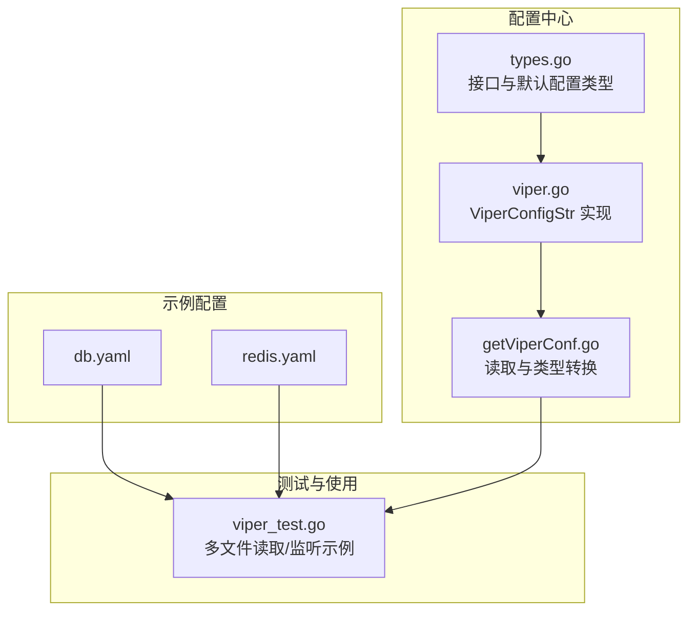
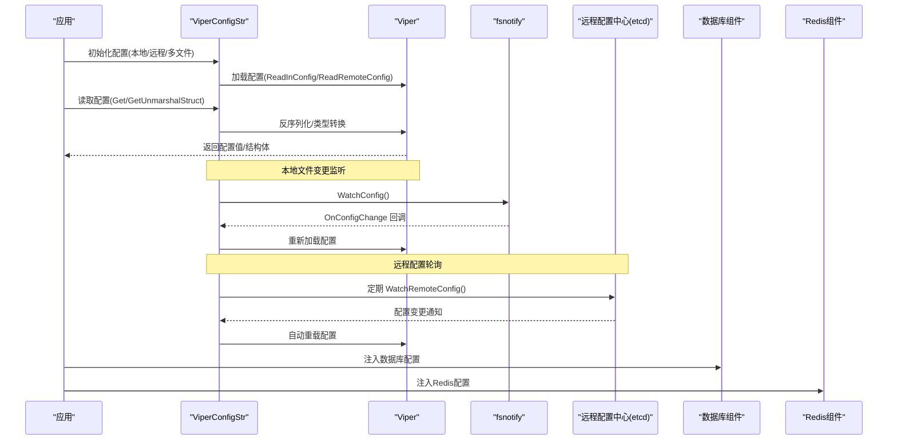
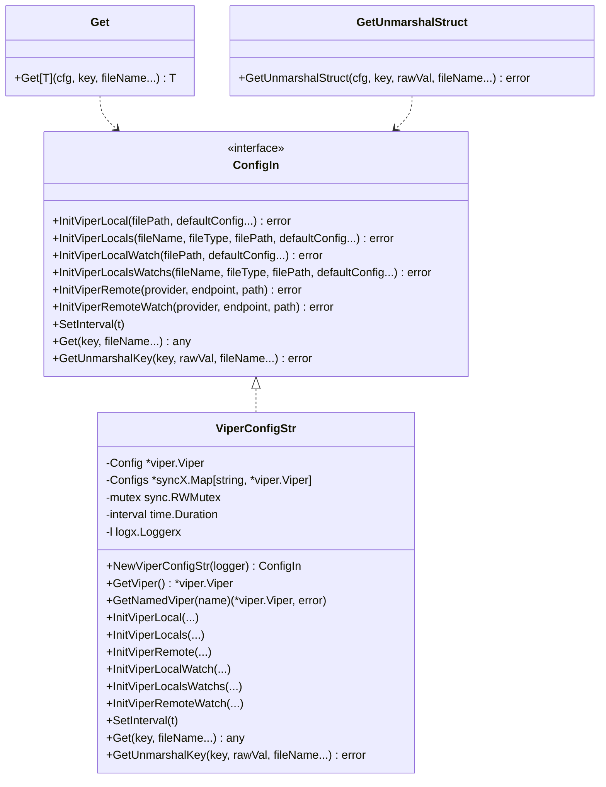
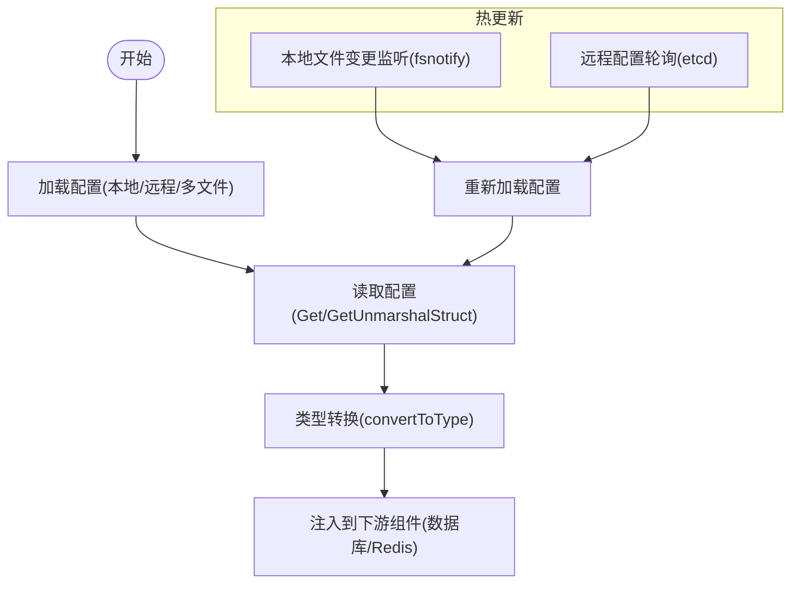
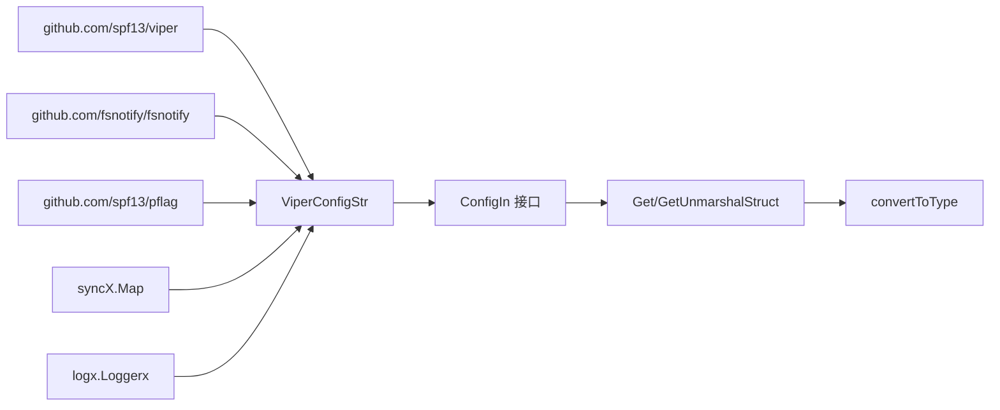

# 配置管理

<cite>
**本文引用的文件列表**
- [viper.go](file://configx/viperX/viper.go)
- [getViperConf.go](file://configx/viperX/getViperConf.go)
- [types.go](file://configx/types.go)
- [db.yaml](file://configx/viperX/db.yaml)
- [redis.yaml](file://configx/viperX/redis.yaml)
- [viper_test.go](file://configx/viperX/viper_test.go)
</cite>

## 目录
1. [简介](#简介)
2. [项目结构](#项目结构)
3. [核心组件](#核心组件)
4. [架构总览](#架构总览)
5. [组件详解](#组件详解)
6. [依赖关系分析](#依赖关系分析)
7. [性能与可靠性](#性能与可靠性)
8. [故障排查指南](#故障排查指南)
9. [结论](#结论)
10. [附录](#附录)

## 简介
本文件围绕基于 Viper 的配置管理组件进行系统化说明，重点阐述 NewViperConfigStr 等 API 如何简化配置加载、解析与热更新；覆盖支持的配置源（本地文件、远程配置中心）、格式（YAML 等）；通过 db.yaml 与 redis.yaml 示例展示结构化配置的定义与读取；并给出初始化配置服务、监听配置变更、将配置注入到数据库与 Redis 客户端的完整流程与最佳实践。该组件作为系统配置中心，统一承载配置来源、解析与分发，提升配置集中化与可观测性。

## 项目结构
配置管理相关代码集中在 configx/viperX 目录，包含：
- 接口定义与默认配置类型：types.go
- Viper 封装实现：viper.go
- 配置读取与类型转换工具：getViperConf.go
- 示例配置文件：db.yaml、redis.yaml
- 使用示例与测试：viper_test.go

图表来源
- [types.go](file://configx/types.go#L1-L101)
- [viper.go](file://configx/viperX/viper.go#L1-L254)
- [getViperConf.go](file://configx/viperX/getViperConf.go#L1-L452)
- [db.yaml](file://configx/viperX/db.yaml#L1-L6)
- [redis.yaml](file://configx/viperX/redis.yaml#L1-L2)
- [viper_test.go](file://configx/viperX/viper_test.go#L1-L91)

章节来源
- [types.go](file://configx/types.go#L1-L101)
- [viper.go](file://configx/viperX/viper.go#L1-L254)
- [getViperConf.go](file://configx/viperX/getViperConf.go#L1-L452)
- [db.yaml](file://configx/viperX/db.yaml#L1-L6)
- [redis.yaml](file://configx/viperX/redis.yaml#L1-L2)
- [viper_test.go](file://configx/viperX/viper_test.go#L1-L91)

## 核心组件
- 接口层（ConfigIn）：抽象配置服务能力，统一初始化、读取与远程监听接口。
- 实现层（ViperConfigStr）：基于 Viper 的具体实现，支持本地/远程配置、多文件管理、热更新监听与默认配置注入。
- 工具层（Get/GetUnmarshalStruct/convertToType）：提供类型安全的配置读取与结构化反序列化，内置丰富类型兼容转换。

章节来源
- [types.go](file://configx/types.go#L1-L101)
- [viper.go](file://configx/viperX/viper.go#L1-L254)
- [getViperConf.go](file://configx/viperX/getViperConf.go#L1-L452)

## 架构总览
配置中心整体工作流如下：
- 初始化阶段：选择本地/远程配置源，加载配置文件或远程配置。
- 运行阶段：提供 Get/GetUnmarshalStruct 读取配置；本地文件通过 fsnotify 监听变更；远程配置按周期轮询并自动重载。
- 注入阶段：将读取到的配置注入到数据库、Redis 等下游组件。

图表来源
- [viper.go](file://configx/viperX/viper.go#L1-L254)
- [getViperConf.go](file://configx/viperX/getViperConf.go#L1-L452)

## 组件详解

### ViperConfigStr 类与 API
- NewViperConfigStr：创建配置服务实例，内部持有 Viper 实例、命名配置映射、日志与远程轮询间隔。
- 初始化 API：
  - InitViperLocal：加载单个本地配置文件（支持命令行参数与默认配置）。
  - InitViperLocals：加载多个本地配置文件（按文件名+类型注册），便于多模块拆分。
  - InitViperRemote：加载远程配置（如 etcd），适合集中式配置中心。
  - InitViperLocalWatch/InitViperLocalsWatchs：在初始化后开启本地文件变更监听，回调中记录变更事件。
  - InitViperRemoteWatch：启动远程配置轮询，按间隔自动重载。
- 读取 API：
  - Get/GetUnmarshalKey：支持按文件名区分多配置场景；GetUnmarshalStruct 为便捷包装。
- 辅助 API：
  - SetInterval：设置远程配置轮询间隔。
  - GetViper/GetNamedViper：获取底层 Viper 实例或按名称获取已注册的 Viper 实例。

图表来源
- [types.go](file://configx/types.go#L1-L101)
- [viper.go](file://configx/viperX/viper.go#L1-L254)
- [getViperConf.go](file://configx/viperX/getViperConf.go#L1-L452)

章节来源
- [viper.go](file://configx/viperX/viper.go#L1-L254)
- [types.go](file://configx/types.go#L1-L101)

### 配置源与格式支持
- 本地文件：支持 YAML、JSON 等格式，可通过 AddConfigPath 与 SetConfigType 指定；支持多文件注册与按文件名读取。
- 远程配置中心：通过 AddRemoteProvider 与 ReadRemoteConfig 加载远程配置（示例使用 etcd）。
- 命令行参数：InitViperLocal/InitViperLocalWatch 支持通过 pflag 指定配置文件路径，便于不同环境切换。
- 默认配置：通过 DefaultConfig 注入默认值，增强容错能力。

章节来源
- [viper.go](file://configx/viperX/viper.go#L54-L117)
- [viper.go](file://configx/viperX/viper.go#L119-L181)
- [viper.go](file://configx/viperX/viper.go#L183-L215)
- [types.go](file://configx/types.go#L70-L74)

### 结构化配置示例：db.yaml 与 redis.yaml
- db.yaml 定义 mysql.dsn 与 testKey.val 等键，可用于数据库连接与测试键值。
- redis.yaml 定义 redis.addr 等键，可用于 Redis 连接地址。

章节来源
- [db.yaml](file://configx/viperX/db.yaml#L1-L6)
- [redis.yaml](file://configx/viperX/redis.yaml#L1-L2)

### 类型安全读取与热更新流程
- 类型安全读取：Get 提供泛型约束，convertToType 内置多种基础类型、切片、映射、时间与时长的兼容转换。
- 热更新：
  - 本地文件：WatchConfig + OnConfigChange 记录变更并触发重新加载。
  - 远程配置：InitViperRemoteWatch 后，后台 goroutine 按 SetInterval 调用 WatchRemoteConfig 并自动重载。

图表来源
- [getViperConf.go](file://configx/viperX/getViperConf.go#L1-L452)
- [viper.go](file://configx/viperX/viper.go#L119-L215)

章节来源
- [getViperConf.go](file://configx/viperX/getViperConf.go#L1-L452)
- [viper.go](file://configx/viperX/viper.go#L119-L215)

### 初始化配置服务、监听与注入（完整流程）
- 初始化：
  - 单文件：InitViperLocal 或 InitViperLocalWatch。
  - 多文件：InitViperLocals 或 InitViperLocalsWatchs，分别注册 db.yaml 与 redis.yaml。
  - 远程：InitViperRemote 或 InitViperRemoteWatch。
- 监听：
  - 本地：InitViperLocalWatch/InitViperLocalsWatchs 后，OnConfigChange 记录变更事件。
  - 远程：InitViperRemoteWatch 后，后台 goroutine 定期轮询并自动重载。
- 注入：
  - 数据库：通过 GetUnmarshalStruct 读取 mysql 配置段，注入到数据库客户端。
  - Redis：通过 GetUnmarshalStruct 读取 redis 配置段，注入到 Redis 客户端。

章节来源
- [viper_test.go](file://configx/viperX/viper_test.go#L18-L58)
- [viper_test.go](file://configx/viperX/viper_test.go#L60-L79)
- [getViperConf.go](file://configx/viperX/getViperConf.go#L28-L34)

## 依赖关系分析
- ViperConfigStr 依赖：
  - viper：配置读取、远程配置、文件监听。
  - fsnotify：本地文件变更监听。
  - pflag：命令行参数解析。
  - syncX.Map：并发安全的多配置映射。
  - logx：日志输出。
- 工具函数依赖：
  - Get/GetUnmarshalStruct 依赖 ConfigIn 接口，实现与 ViperConfigStr 解耦。
  - convertToType 内置类型转换逻辑，减少上层重复处理。

图表来源
- [viper.go](file://configx/viperX/viper.go#L1-L254)
- [getViperConf.go](file://configx/viperX/getViperConf.go#L1-L452)
- [types.go](file://configx/types.go#L1-L101)

章节来源
- [viper.go](file://configx/viperX/viper.go#L1-L254)
- [getViperConf.go](file://configx/viperX/getViperConf.go#L1-L452)
- [types.go](file://configx/types.go#L1-L101)

## 性能与可靠性
- 并发安全：多配置映射使用 syncX.Map，避免锁竞争；Get/GetUnmarshalKey 在多配置场景下按文件名快速定位。
- 热更新策略：
  - 本地文件：fsnotify 事件驱动，低延迟感知变更。
  - 远程配置：可调间隔 SetInterval 控制轮询频率，平衡实时性与资源消耗。
- 类型转换：convertToType 内置广泛兼容转换，降低上层类型适配成本。
- 默认配置：DefaultConfig 注入默认值，提升配置缺失时的健壮性。

章节来源
- [viper.go](file://configx/viperX/viper.go#L1-L254)
- [getViperConf.go](file://configx/viperX/getViperConf.go#L1-L452)

## 故障排查指南
- 配置文件未找到：
  - 检查 InitViperLocal/InitViperLocals 的文件路径与扩展名是否正确。
  - 确认 AddConfigPath 与 SetConfigName/Type 是否匹配。
- 远程配置加载失败：
  - 检查 AddRemoteProvider 的 provider、endpoint、path 是否正确。
  - 确认网络连通与 etcd 权限。
- 热更新无效：
  - 本地：确认 WatchConfig 已调用且 OnConfigChange 回调被注册。
  - 远程：确认 InitViperRemoteWatch 已调用且后台 goroutine 正常运行。
- 类型转换异常：
  - 使用 GetUnmarshalStruct 将配置段反序列化为结构体，避免手动转换错误。
  - 若仍失败，检查配置值格式与目标类型兼容性。

章节来源
- [viper.go](file://configx/viperX/viper.go#L54-L117)
- [viper.go](file://configx/viperX/viper.go#L119-L215)
- [getViperConf.go](file://configx/viperX/getViperConf.go#L28-L34)

## 结论
该配置管理组件以 Viper 为核心，通过 ConfigIn 抽象与 ViperConfigStr 实现，提供了统一、类型安全、可热更新的配置加载与分发能力。结合多文件注册、远程配置中心与丰富的类型转换，能够有效支撑数据库、Redis 等组件的集中化配置管理，提升系统的可维护性与可观测性。

## 附录
- 示例配置文件位置与键名：
  - db.yaml：mysql.dsn、testKey.val
  - redis.yaml：redis.addr
- 使用建议：
  - 将不同模块配置拆分为独立文件并通过 InitViperLocals 注册，便于按需读取。
  - 对关键配置启用热更新监听，确保运行时动态调整。
  - 使用 GetUnmarshalStruct 将配置段直接反序列化为结构体，减少重复解析与类型转换。

章节来源
- [db.yaml](file://configx/viperX/db.yaml#L1-L6)
- [redis.yaml](file://configx/viperX/redis.yaml#L1-L2)
- [viper_test.go](file://configx/viperX/viper_test.go#L18-L58)
- [viper_test.go](file://configx/viperX/viper_test.go#L60-L79)