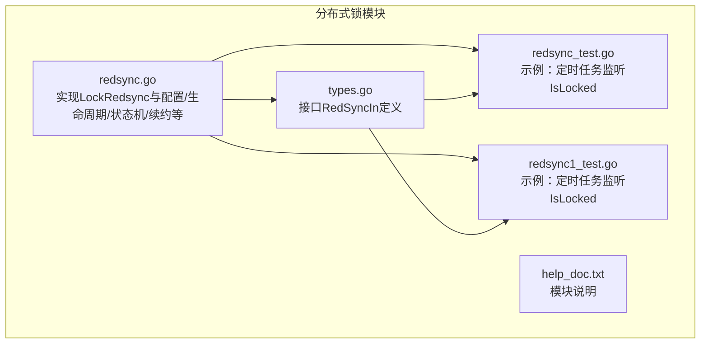
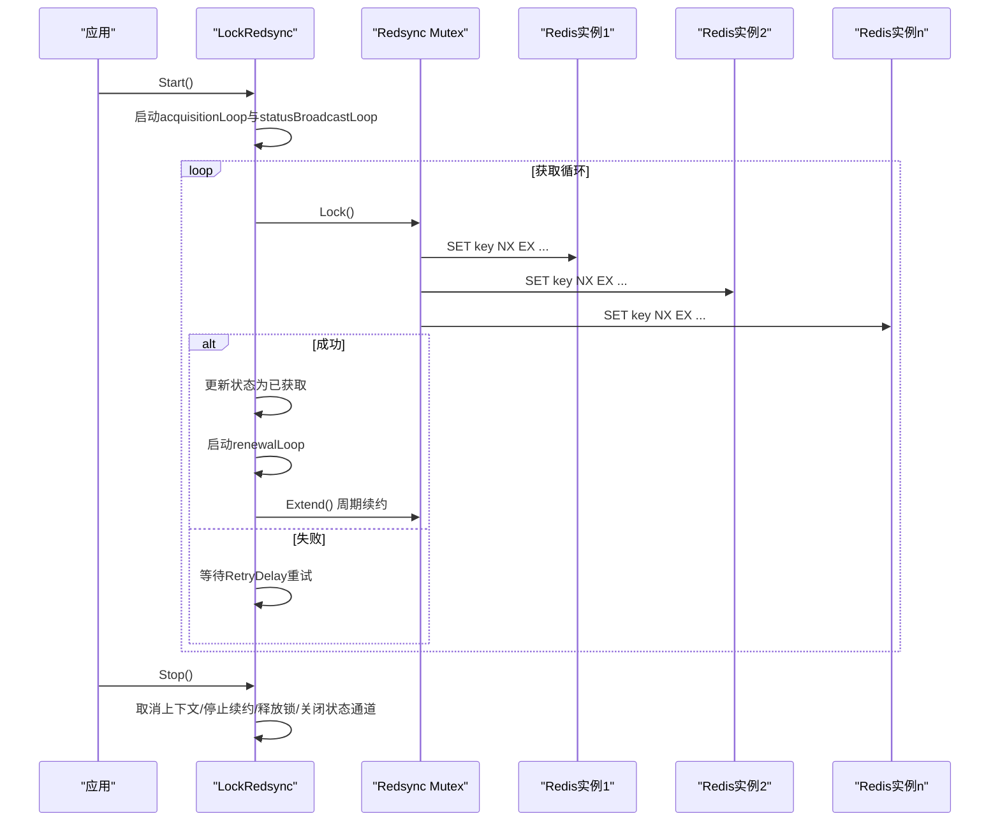
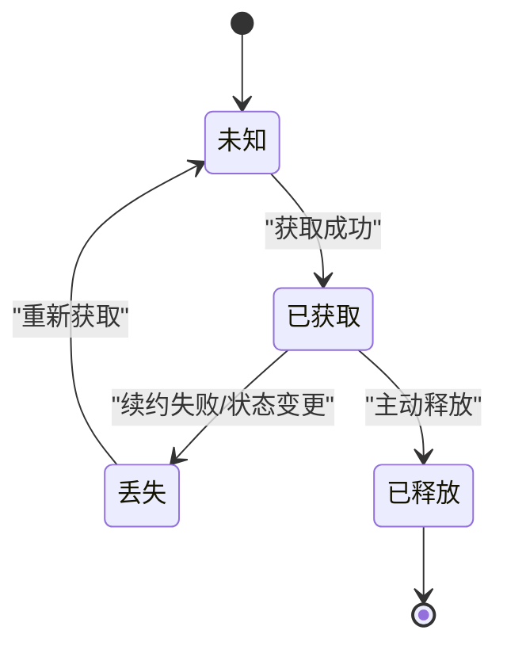
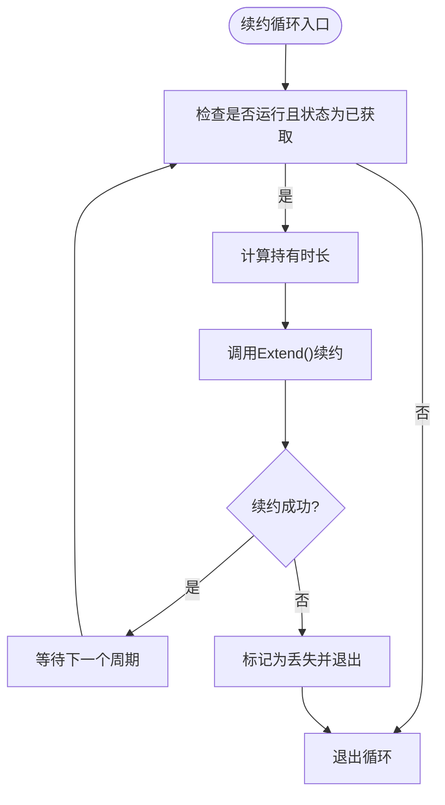
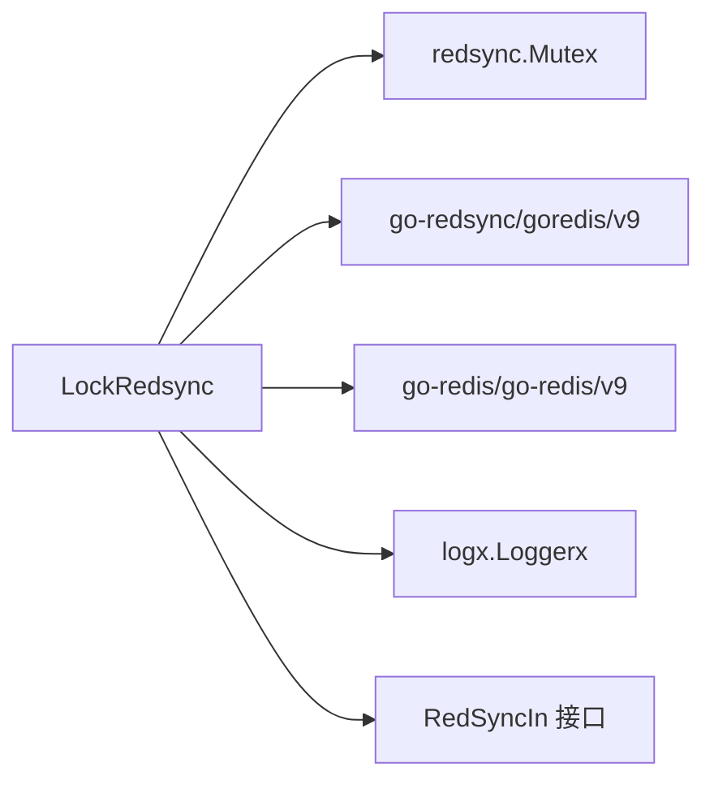

# 分布式锁

<cite>
**本文引用的文件**
- [redsync.go](file://syncX/lock/redisLock/redsyncx/redsync.go)
- [types.go](file://syncX/lock/redisLock/redsyncx/types.go)
- [redsync_test.go](file://syncX/lock/redisLock/redsyncx/redsync_test.go)
- [redsync1_test.go](file://syncX/lock/redisLock/redsyncx/redsync1_test.go)
- [help_doc.txt](file://syncX/lock/redisLock/redsyncx/help_doc.txt)
</cite>

## 目录
1. [简介](#简介)
2. [项目结构](#项目结构)
3. [核心组件](#核心组件)
4. [架构总览](#架构总览)
5. [详细组件分析](#详细组件分析)
6. [依赖分析](#依赖分析)
7. [性能考量](#性能考量)
8. [故障排查指南](#故障排查指南)
9. [结论](#结论)
10. [附录：使用示例与最佳实践](#附录使用示例与最佳实践)

## 简介
本文件围绕基于 Redsync 的 Redis 分布式锁实现进行系统化文档化，重点阐述 LockRedsync 结构体的设计原理、配置合并与默认值处理、生命周期管理（Start/Stop）、以及获取锁、续约与释放锁的完整流程。文档还解释了状态机与状态通知机制，以及如何通过 GetLockInfo 监控运行时信息，并给出在定时任务与关键业务中的使用建议及极端网络分区场景的风险与应对策略。

## 项目结构
该实现位于仓库的同步与并发子模块下，采用“按功能域分层”的组织方式：
- 核心实现：redsync.go
- 接口定义：types.go
- 使用示例与测试：redsync_test.go、redsync1_test.go
- 文档说明：help_doc.txt

图表来源
- [redsync.go](file://syncX/lock/redisLock/redsyncx/redsync.go#L1-L519)
- [types.go](file://syncX/lock/redisLock/redsyncx/types.go#L1-L8)
- [redsync_test.go](file://syncX/lock/redisLock/redsyncx/redsync_test.go#L1-L128)
- [redsync1_test.go](file://syncX/lock/redisLock/redsyncx/redsync1_test.go#L1-L126)
- [help_doc.txt](file://syncX/lock/redisLock/redsyncx/help_doc.txt#L1-L3)

章节来源
- [redsync.go](file://syncX/lock/redisLock/redsyncx/redsync.go#L1-L519)
- [types.go](file://syncX/lock/redisLock/redsyncx/types.go#L1-L8)
- [redsync_test.go](file://syncX/lock/redisLock/redsyncx/redsync_test.go#L1-L128)
- [redsync1_test.go](file://syncX/lock/redisLock/redsyncx/redsync1_test.go#L1-L126)
- [help_doc.txt](file://syncX/lock/redisLock/redsyncx/help_doc.txt#L1-L3)

## 核心组件
- LockRedsync：分布式锁主体，封装 Redsync Mutex、状态、上下文、协程与状态通道。
- Config：锁配置项，包含锁名、过期时间、重试间隔、最大重试次数、续约间隔、状态通道缓冲等。
- LockStatus/LockResult：状态枚举与状态变更结果载体。
- RedSyncIn：对外暴露的接口，包含 Start/Stop/IsLocked。

章节来源
- [redsync.go](file://syncX/lock/redisLock/redsyncx/redsync.go#L24-L81)
- [redsync.go](file://syncX/lock/redisLock/redsyncx/redsync.go#L44-L66)
- [types.go](file://syncX/lock/redisLock/redsyncx/types.go#L1-L8)

## 架构总览
整体采用“单锁实例 + 多 Redis 实例 + 两协程（获取+续约）+ 状态广播”的模式：
- 多 Redis 客户端被包装为 Redsync Pool，Redsync 基于多数派达成共识以保证高可用。
- acquisitionLoop 负责尝试获取锁；成功后启动 renewalLoop 周期性续约。
- statusChan 作为非阻塞通知通道，statusBroadcastLoop 异步消费并记录日志。
- Stop 会取消上下文、停止续约、必要时释放锁并等待所有协程退出。

图表来源
- [redsync.go](file://syncX/lock/redisLock/redsyncx/redsync.go#L149-L209)
- [redsync.go](file://syncX/lock/redisLock/redsyncx/redsync.go#L223-L276)
- [redsync.go](file://syncX/lock/redisLock/redsyncx/redsync.go#L325-L388)
- [redsync.go](file://syncX/lock/redisLock/redsyncx/redsync.go#L306-L323)

## 详细组件分析

### LockRedsync 结构体设计
- 字段职责
  - rsMutex：底层 Redsync Mutex，负责与多 Redis 实例交互。
  - logger：日志接口，便于可观测性。
  - lockName/config：锁标识与配置。
  - 状态字段：status/isRunning/acquiredTime，保护状态的互斥读写。
  - 控制字段：ctx/cancel/wg，用于协程生命周期管理。
  - 通知通道：statusChan，非阻塞发送状态变更。
  - 续约控制：renewalTicker。
- 设计要点
  - 通过多 Redis 客户端构建 Redsync Pool，利用 Redsync 的多数派算法提升可用性。
  - 通过 WaitGroup 与 context 协调协程退出，避免资源泄漏。
  - 通过非阻塞通道与广播协程解耦状态通知与业务主逻辑。

章节来源
- [redsync.go](file://syncX/lock/redisLock/redsyncx/redsync.go#L44-L66)

### 配置合并与默认值处理（NewLockRedsync）
- 默认配置 DefaultConfig 提供基础默认值。
- NewLockRedsync 对传入配置进行合并：
  - 锁名、过期时间、重试间隔、最大重试次数、状态通道缓冲为空时使用默认值。
  - 若续约间隔为 0，则自动设置为 Expiry/3，且最小不低于 1 秒。
  - 将 []*redis.Client 包装为 []redRedis.Pool，交由 Redsync 构造 Mutex。
  - 设置初始状态为 LockStatusUnknown，初始化状态通道。
- 影响
  - 自动续约间隔确保在业务逻辑耗时较长时仍能维持锁有效。
  - 默认缓冲避免高频状态变更导致阻塞。

章节来源
- [redsync.go](file://syncX/lock/redisLock/redsyncx/redsync.go#L83-L119)
- [redsync.go](file://syncX/lock/redisLock/redsyncx/redsync.go#L120-L139)

### 生命周期管理（Start/Stop）
- Start
  - 标记 isRunning，启动 acquisitionLoop 与 statusBroadcastLoop 两个协程。
  - 返回状态通道，供外部订阅状态变更。
- Stop
  - 取消上下文，触发所有协程退出。
  - 停止续约 ticker，若处于已获取状态则尝试释放锁。
  - 等待所有协程结束，关闭状态通道。
- 并发安全
  - 使用互斥锁保护状态字段，WaitGroup 确保优雅退出。

章节来源
- [redsync.go](file://syncX/lock/redisLock/redsyncx/redsync.go#L149-L172)
- [redsync.go](file://syncX/lock/redisLock/redsyncx/redsync.go#L174-L209)

### 状态机与状态通知（LockStatus/LockResult/statusChan）
- 状态机
  - LockStatusUnknown → LockStatusAcquired → LockStatusLost → LockStatusReleased
  - 仅当状态真正变化时才发送通知，避免冗余事件。
- 状态通道
  - 非阻塞发送，若缓冲已满则记录警告。
  - statusBroadcastLoop 异步消费并记录日志，避免阻塞主逻辑。
- 监控
  - GetLockInfo 提供运行时信息（锁名、状态、是否运行、是否持有、获取时间、持有时长）。

图表来源
- [redsync.go](file://syncX/lock/redisLock/redsyncx/redsync.go#L24-L43)
- [redsync.go](file://syncX/lock/redisLock/redsyncx/redsync.go#L446-L463)
- [redsync.go](file://syncX/lock/redisLock/redsyncx/redsync.go#L500-L518)

章节来源
- [redsync.go](file://syncX/lock/redisLock/redsyncx/redsync.go#L24-L43)
- [redsync.go](file://syncX/lock/redisLock/redsyncx/redsync.go#L446-L463)
- [redsync.go](file://syncX/lock/redisLock/redsyncx/redsync.go#L500-L518)

### 获取锁（tryAcquireLock）
- 流程
  - 检查 isRunning，防止在停止状态下继续尝试。
  - 调用 rsMutex.Lock()，若失败更新状态为 Lost 并返回错误。
  - 成功后更新状态为 Acquired，记录 acquiredTime，并通过 updateStatus 通知。
- 复杂度
  - 获取锁涉及与多个 Redis 实例通信，复杂度取决于实例数量与网络状况。

章节来源
- [redsync.go](file://syncX/lock/redisLock/redsyncx/redsync.go#L278-L304)

### 续约（doRenewal）与续约循环（renewalLoop）
- doRenewal
  - 检查 isRunning 与当前状态必须为 Acquired。
  - 计算持有时长，调用 rsMutex.Extend() 执行续约。
  - 若续约失败，根据错误类型决定是否标记为 Lost。
- renewalLoop
  - 周期性触发续约，捕获 panic 并记录日志，确保协程健壮性。
  - 收到 ctx.Done 或续约失败时退出。
- 重要性
  - 在业务逻辑耗时较长时，续约可避免锁过期导致的竞态。

图表来源
- [redsync.go](file://syncX/lock/redisLock/redsyncx/redsync.go#L390-L420)
- [redsync.go](file://syncX/lock/redisLock/redsyncx/redsync.go#L355-L388)

章节来源
- [redsync.go](file://syncX/lock/redisLock/redsyncx/redsync.go#L325-L388)
- [redsync.go](file://syncX/lock/redisLock/redsyncx/redsync.go#L390-L420)

### 释放锁（releaseLock）
- 条件
  - 仅在状态为 Acquired 时允许释放。
- 流程
  - 调用 rsMutex.Unlock()，若失败记录错误并标记为 Lost。
  - 成功则标记为 Released。
- 注意
  - Stop 中若处于已获取状态会自动尝试释放，避免遗留锁。

章节来源
- [redsync.go](file://syncX/lock/redisLock/redsyncx/redsync.go#L306-L323)
- [redsync.go](file://syncX/lock/redisLock/redsyncx/redsync.go#L174-L209)

### 获取锁流程（acquisitionLoop）
- 初始延迟避免立即重试。
- 循环内尝试获取锁，失败则按 RetryDelay 等待后重试。
- 成功后启动续约，等待状态变为非已获取或收到停止信号，随后停止续约。
- 通过 waitForLockLossOrStop 以较小开销轮询状态变化。

章节来源
- [redsync.go](file://syncX/lock/redisLock/redsyncx/redsync.go#L223-L276)
- [redsync.go](file://syncX/lock/redisLock/redsyncx/redsync.go#L422-L444)

### 接口与实现关系（RedSyncIn）
- RedSyncIn 定义对外接口：Start/Stop/IsLocked。
- LockRedsync 实现该接口，支持以接口形式注入与替换。

章节来源
- [types.go](file://syncX/lock/redisLock/redsyncx/types.go#L1-L8)
- [redsync.go](file://syncX/lock/redisLock/redsyncx/redsync.go#L149-L209)

## 依赖分析
- 外部依赖
  - go-redsync/redsync：分布式锁核心算法与多数派实现。
  - go-redsync/redis/goredis/v9：将 go-redis v9 客户端适配为 Redsync Pool。
  - go-redis/go-redis/v9：Redis 客户端。
  - 日志：logx.Loggerx 接口，示例使用 zerologx。
- 内部依赖
  - types.RedSyncIn 与 LockRedsync 的组合关系。
  - 测试文件依赖 cron/v3 与 go-redis/v9。

图表来源
- [redsync.go](file://syncX/lock/redisLock/redsyncx/redsync.go#L1-L23)
- [types.go](file://syncX/lock/redisLock/redsyncx/types.go#L1-L8)

章节来源
- [redsync.go](file://syncX/lock/redisLock/redsyncx/redsync.go#L1-L23)
- [redsync_test.go](file://syncX/lock/redisLock/redsyncx/redsync_test.go#L1-L128)
- [redsync1_test.go](file://syncX/lock/redisLock/redsyncx/redsync1_test.go#L1-L126)

## 性能考量
- 续约频率
  - 默认续约间隔为 Expiry 的 1/3，且不低于 1 秒，平衡锁有效性和续约开销。
- 状态通道缓冲
  - 通过 StatusChanBuffer 降低高频状态变更对主逻辑的影响。
- 并发与退出
  - WaitGroup 与 context 协同确保协程优雅退出，避免资源泄露。
- 网络抖动
  - acquisitionLoop 的 RetryDelay 与 MaxRetries 可调，有助于在网络波动时稳定获取锁。

章节来源
- [redsync.go](file://syncX/lock/redisLock/redsyncx/redsync.go#L83-L119)
- [redsync.go](file://syncX/lock/redisLock/redsyncx/redsync.go#L149-L172)
- [redsync.go](file://syncX/lock/redisLock/redsyncx/redsync.go#L223-L276)

## 故障排查指南
- 常见问题
  - 锁未获取：检查 Redis 连通性、锁名冲突、过期时间与续约间隔设置是否合理。
  - 锁丢失：续约失败或业务逻辑耗时超过 Expiry 导致丢失，需缩短业务耗时或增大 Expiry。
  - 状态通道阻塞：增大 StatusChanBuffer 或优化状态消费速率。
  - 停止后仍有锁：确认 Stop 是否被调用，以及是否在已获取状态下自动释放。
- 排查手段
  - 使用 GetLockInfo 获取当前状态与持有时长。
  - 通过状态广播日志观察状态变化轨迹。
  - 在 Stop 前后打印状态通道消费情况，定位阻塞点。

章节来源
- [redsync.go](file://syncX/lock/redisLock/redsyncx/redsync.go#L500-L518)
- [redsync.go](file://syncX/lock/redisLock/redsyncx/redsync.go#L465-L498)
- [redsync.go](file://syncX/lock/redisLock/redsyncx/redsync.go#L174-L209)

## 结论
该实现以 Redsync 为核心，结合多 Redis 实例与多数派算法，提供了高可用的分布式锁能力。通过清晰的状态机、非阻塞状态通道与优雅的生命周期管理，能够在复杂网络环境下保持稳定性。合理的续约策略与配置合并逻辑，使得在不同业务场景下都能获得可靠的锁行为。

## 附录：使用示例与最佳实践

### 使用示例（定时任务/关键业务）
- 示例思路
  - 创建多个 Redis 客户端并传入 NewLockRedsync。
  - 调用 Start 启动锁获取与续约协程。
  - 使用 cron/v3 或 time.Ticker 触发任务，仅在 IsLocked() 为真时执行关键逻辑。
  - 在业务结束后调用 Stop 释放资源。
- 参考路径
  - [redsync_test.go](file://syncX/lock/redisLock/redsyncx/redsync_test.go#L52-L94)
  - [redsync1_test.go](file://syncX/lock/redisLock/redsyncx/redsync1_test.go#L64-L98)

章节来源
- [redsync_test.go](file://syncX/lock/redisLock/redsyncx/redsync_test.go#L52-L94)
- [redsync1_test.go](file://syncX/lock/redisLock/redsyncx/redsync1_test.go#L64-L98)

### 高可用性设计要点
- 多 Redis 实例
  - 通过 Redsync Pool 连接多个 Redis 实例，多数派达成共识，降低单点故障影响。
- 续约保障
  - 自动续约与状态检查循环，减少锁过期带来的竞态风险。
- 监控与可观测
  - 通过 GetLockInfo 与状态广播日志，实时掌握锁状态。

章节来源
- [redsync.go](file://syncX/lock/redisLock/redsyncx/redsync.go#L120-L139)
- [redsync.go](file://syncX/lock/redisLock/redsyncx/redsync.go#L325-L388)
- [redsync.go](file://syncX/lock/redisLock/redsyncx/redsync.go#L500-L518)

### 极端网络分区风险与应对
- 风险
  - 部分 Redis 实例不可达可能导致多数派不足，锁获取失败或续约失败。
  - 长时间网络分区可能导致锁过期，业务逻辑并发执行。
- 应对策略
  - 增加 Redis 实例数量以满足多数派要求。
  - 合理设置 Expiry 与 RenewalInterval，缩短续约周期但避免过度续约。
  - 在业务侧增加幂等性与补偿机制，降低重复执行的影响。
  - 使用 GetLockInfo 与日志持续监控锁状态，及时发现异常。

章节来源
- [redsync.go](file://syncX/lock/redisLock/redsyncx/redsync.go#L83-L119)
- [redsync.go](file://syncX/lock/redisLock/redsyncx/redsync.go#L325-L388)
- [redsync.go](file://syncX/lock/redisLock/redsyncx/redsync.go#L500-L518)