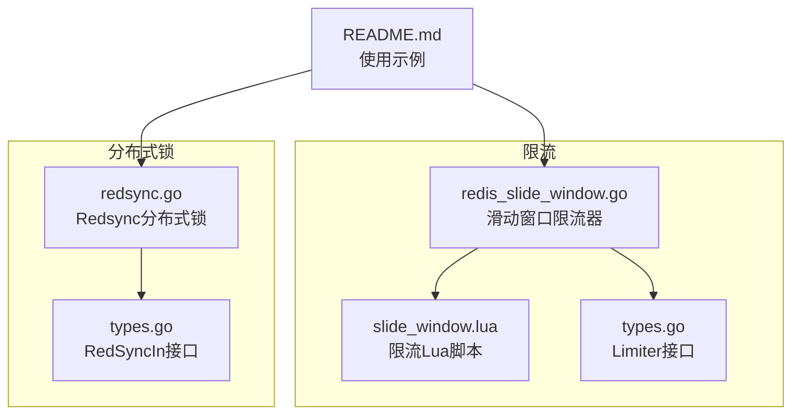
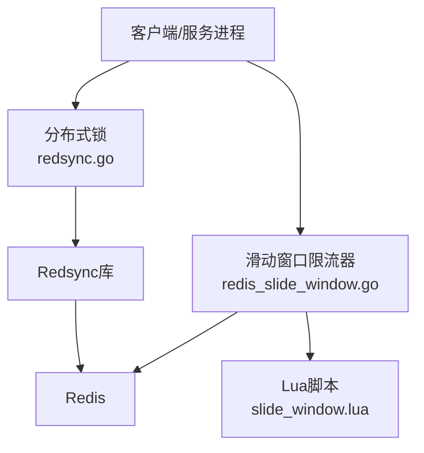
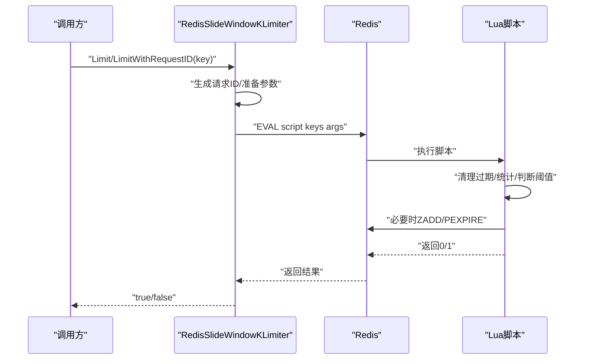
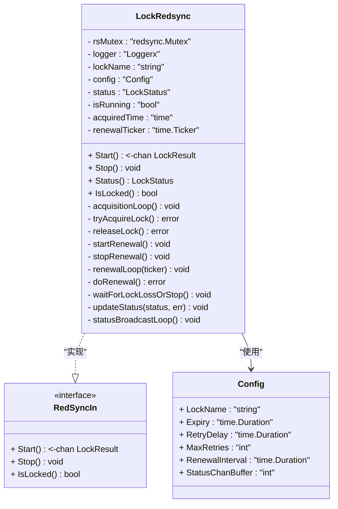
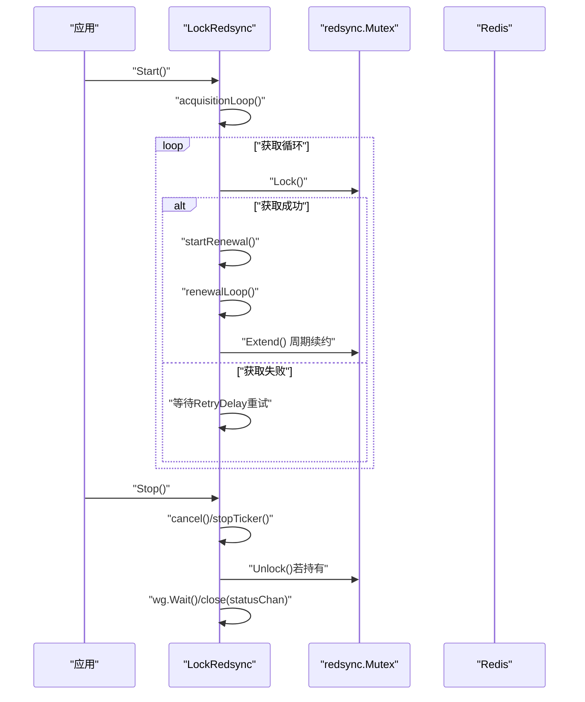
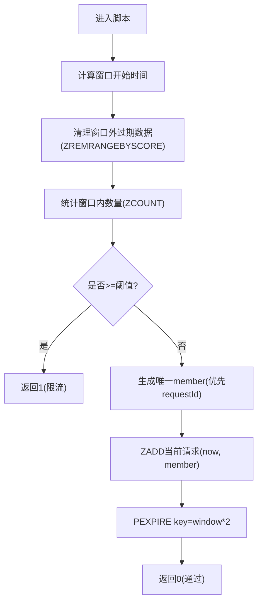
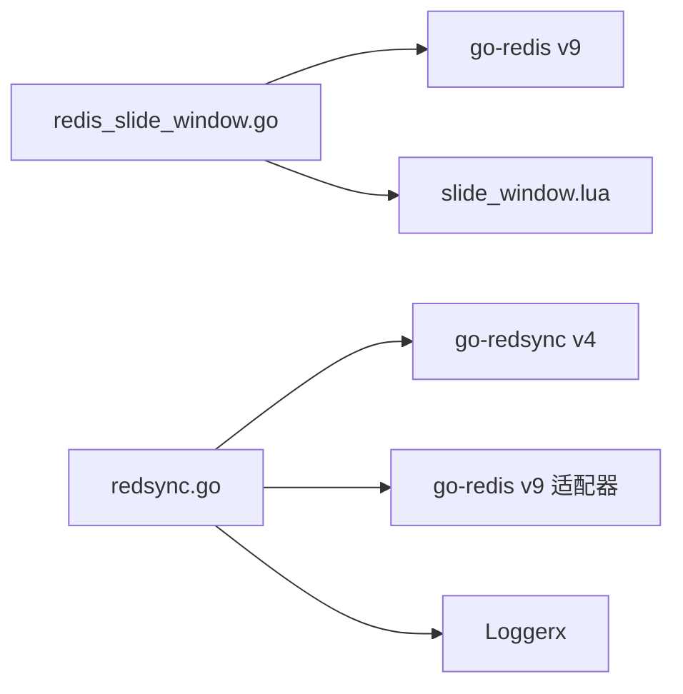

# 限流与锁

<cite>
**本文引用的文件列表**
- [limiter/redis_slide_window.go](file://limiter/redis_slide_window.go)
- [limiter/slide_window.lua](file://limiter/slide_window.lua)
- [limiter/types.go](file://limiter/types.go)
- [syncX/lock/redisLock/redsyncx/redsync.go](file://syncX/lock/redisLock/redsyncx/redsync.go)
- [syncX/lock/redisLock/redsyncx/types.go](file://syncX/lock/redisLock/redsyncx/types.go)
- [README.md](file://README.md)
</cite>

## 目录
1. [引言](#引言)
2. [项目结构](#项目结构)
3. [核心组件](#核心组件)
4. [架构总览](#架构总览)
5. [组件详解](#组件详解)
6. [依赖关系分析](#依赖关系分析)
7. [性能考量](#性能考量)
8. [故障排查指南](#故障排查指南)
9. [结论](#结论)
10. [附录](#附录)

## 引言
本文件围绕仓库中的“限流与分布式锁”两大主题展开，重点分析：
- 基于 Redis Lua 脚本的滑动窗口限流器（redis_slide_window.go），解释其原子性与高性能优势，并给出使用要点。
- 基于 Redsync 库的 Redis 分布式锁（redsync.go），涵盖获取、释放、续期与容错处理，以及高并发下的注意事项与最佳实践。
同时，说明这两个组件如何以 Redis 作为共享存储，分别在防止资源滥用与保证数据一致性方面发挥关键作用。

## 项目结构
与“限流与锁”直接相关的文件组织如下：
- 限流器
  - Go 实现：limiter/redis_slide_window.go
  - Lua 脚本：limiter/slide_window.lua
  - 接口定义：limiter/types.go
- 分布式锁
  - Redsync 实现：syncX/lock/redisLock/redsyncx/redsync.go
  - 接口定义：syncX/lock/redisLock/redsyncx/types.go
- 使用示例与说明：README.md

图表来源
- [limiter/redis_slide_window.go](file://limiter/redis_slide_window.go#L1-L193)
- [limiter/slide_window.lua](file://limiter/slide_window.lua#L1-L57)
- [limiter/types.go](file://limiter/types.go#L1-L10)
- [syncX/lock/redisLock/redsyncx/redsync.go](file://syncX/lock/redisLock/redsyncx/redsync.go#L1-L519)
- [syncX/lock/redisLock/redsyncx/types.go](file://syncX/lock/redisLock/redsyncx/types.go#L1-L8)
- [README.md](file://README.md#L84-L103)

章节来源
- [limiter/redis_slide_window.go](file://limiter/redis_slide_window.go#L1-L193)
- [limiter/slide_window.lua](file://limiter/slide_window.lua#L1-L57)
- [limiter/types.go](file://limiter/types.go#L1-L10)
- [syncX/lock/redisLock/redsyncx/redsync.go](file://syncX/lock/redisLock/redsyncx/redsync.go#L1-L519)
- [syncX/lock/redisLock/redsyncx/types.go](file://syncX/lock/redisLock/redsyncx/types.go#L1-L8)
- [README.md](file://README.md#L84-L103)

## 核心组件
- 滑动窗口限流器（Redis + Lua）
  - 通过单条 EVAL 命令原子性地清理过期数据、统计窗口内请求数、决定是否放行，并在必要时写入新的请求记录与设置过期时间。
  - 支持自定义前缀、自定义完整 key、请求 ID 注入，便于幂等与审计。
- 分布式锁（Redsync）
  - 基于多 Redis 客户端的 Redsync 库，提供自动获取、续约、丢失检测与状态广播，具备优雅停止与容错能力。
  - 提供状态通道，便于上层业务按锁状态驱动任务执行。

章节来源
- [limiter/redis_slide_window.go](file://limiter/redis_slide_window.go#L31-L193)
- [limiter/slide_window.lua](file://limiter/slide_window.lua#L1-L57)
- [syncX/lock/redisLock/redsyncx/redsync.go](file://syncX/lock/redisLock/redsyncx/redsync.go#L149-L519)

## 架构总览
整体架构围绕 Redis 作为共享存储，限流器与分布式锁分别承担“访问控制”和“互斥保障”的职责。

图表来源
- [limiter/redis_slide_window.go](file://limiter/redis_slide_window.go#L80-L145)
- [limiter/slide_window.lua](file://limiter/slide_window.lua#L1-L57)
- [syncX/lock/redisLock/redsyncx/redsync.go](file://syncX/lock/redisLock/redsyncx/redsync.go#L120-L147)

## 组件详解

### 滑动窗口限流器（基于 Redis Lua）
- 设计要点
  - 单键维护有序集合（zset），score 为时间戳，member 为唯一请求标识（可选）。
  - Lua 脚本原子性完成：
    - 清理窗口外过期数据（ZREMRANGEBYSCORE）
    - 统计窗口内数量（ZCOUNT）
    - 若未超阈值则 ZADD 新成员并设置过期（PEXPIRE）
    - 返回 0/1 表示通过/限流
  - 请求 ID 生成策略：UUID + 时间戳 + 自增计数，确保唯一性。
  - 支持两种调用入口：
    - 自动注入请求 ID 的 Limit
    - 指定请求 ID 的 LimitWithRequestID
    - 自定义完整 key 的 LimitWithCustomKey/AndRequestID
- 性能与原子性
  - 仅一次网络往返（EVAL），Lua 内部原子执行，避免竞态。
  - 使用 ZSET 的排序与范围查询，复杂度 O(log N) 插入/删除，统计 O(log N)。
- 使用建议
  - 合理设置窗口大小与阈值，避免过小导致频繁限流或过大导致抗压不足。
  - 对热点 key 建议加业务维度前缀，降低竞争。
  - 如需跨实例严格一致，建议使用相同 Redis 集群或分片策略。

图表来源
- [limiter/redis_slide_window.go](file://limiter/redis_slide_window.go#L80-L145)
- [limiter/slide_window.lua](file://limiter/slide_window.lua#L1-L57)

章节来源
- [limiter/redis_slide_window.go](file://limiter/redis_slide_window.go#L31-L193)
- [limiter/slide_window.lua](file://limiter/slide_window.lua#L1-L57)
- [limiter/types.go](file://limiter/types.go#L1-L10)

### 分布式锁（基于 Redsync）
- 设计要点
  - 多 Redis 客户端池化，Redsync 通过多数派共识保证锁的可用性。
  - 生命周期管理：
    - Start：启动获取循环与状态广播协程
    - Stop：取消上下文、停止续约、释放锁、等待协程退出
  - 获取与释放：
    - tryAcquireLock：调用底层 Mutex.Lock，更新状态并记录获取时间
    - releaseLock：调用 Unlock，更新状态
  - 续约机制：
    - startRenewal：按 RenewalInterval 启动续约 ticker
    - renewalLoop：周期性调用 Extend，失败则标记丢失
    - waitForLockLossOrStop：轮询检查状态变化
  - 状态通道：
    - updateStatus：非阻塞发送状态变更，避免阻塞主流程
    - statusBroadcastLoop：异步消费状态通道并记录日志
- 容错与健壮性
  - 错误常量：ErrLockStopped、ErrLockNotAcquired
  - panic 恢复：续约循环内部捕获并记录
  - 停止流程：关闭状态通道、停止 ticker、释放锁、等待 goroutine
- 使用建议
  - Expiry 与 RenewalInterval 的比例要合理，避免频繁续约或锁过期丢失。
  - MaxRetries 与 RetryDelay 需结合网络抖动与业务 RT 调整。
  - 使用状态通道驱动业务逻辑，避免阻塞锁获取循环。

图表来源
- [syncX/lock/redisLock/redsyncx/redsync.go](file://syncX/lock/redisLock/redsyncx/redsync.go#L44-L147)
- [syncX/lock/redisLock/redsyncx/types.go](file://syncX/lock/redisLock/redsyncx/types.go#L1-L8)

图表来源
- [syncX/lock/redisLock/redsyncx/redsync.go](file://syncX/lock/redisLock/redsyncx/redsync.go#L149-L519)

章节来源
- [syncX/lock/redisLock/redsyncx/redsync.go](file://syncX/lock/redisLock/redsyncx/redsync.go#L1-L519)
- [syncX/lock/redisLock/redsyncx/types.go](file://syncX/lock/redisLock/redsyncx/types.go#L1-L8)

### 复杂逻辑流程图：滑动窗口限流脚本

图表来源
- [limiter/slide_window.lua](file://limiter/slide_window.lua#L1-L57)

## 依赖关系分析
- 限流器
  - 依赖 go-redis v9 的 Cmdable 接口，通过 Eval 执行 Lua 脚本。
  - 通过 go:embed 内嵌脚本，减少外部依赖与部署复杂度。
- 分布式锁
  - 依赖 go-redsync/redsync v4 及其 go-redis v9 适配器。
  - 依赖日志接口 Loggerx，便于统一日志输出。
  - 通过多 Redis 客户端池化，提升可用性与容错能力。

图表来源
- [limiter/redis_slide_window.go](file://limiter/redis_slide_window.go#L1-L20)
- [limiter/slide_window.lua](file://limiter/slide_window.lua#L1-L10)
- [syncX/lock/redisLock/redsyncx/redsync.go](file://syncX/lock/redisLock/redsyncx/redsync.go#L1-L20)

章节来源
- [limiter/redis_slide_window.go](file://limiter/redis_slide_window.go#L1-L20)
- [syncX/lock/redisLock/redsyncx/redsync.go](file://syncX/lock/redisLock/redsyncx/redsync.go#L1-L20)

## 性能考量
- 滑动窗口限流器
  - 原子性与低延迟：单次 EVAL，避免多次往返与锁竞争。
  - 数据结构：ZSET 的插入/删除/范围统计均为 O(log N)，适合高并发场景。
  - 内存与过期：PEXPIRE 设置为窗口两倍，避免无限增长。
- 分布式锁
  - 续约频率：RenewalInterval 建议为 Expiry 的 1/3 或以上，避免锁过期。
  - 并发安全：状态更新与日志广播分离，避免阻塞获取循环。
  - 容错：异常 panic 捕获与状态通道缓冲，提升稳定性。

[本节为通用性能建议，不直接分析具体文件]

## 故障排查指南
- 滑动窗口限流器
  - 常见问题
    - 返回类型解析失败：确认 Redis 客户端版本与返回类型兼容。
    - key 为空：调用前校验 key 非空。
    - Lua 执行错误：检查脚本路径与权限，确认 Redis 可加载内嵌脚本。
  - 排查步骤
    - 在调用前后打印 key 与参数，验证前缀与自定义 key。
    - 检查 Redis 集群/哨兵配置，确保 EVAL 可用。
- 分布式锁
  - 常见问题
    - 锁丢失：续约失败或业务执行时间超过 Expiry。
    - 无法停止：确认 Stop 是否被调用且上下文已取消。
    - 状态通道阻塞：增大缓冲区或优化消费速度。
  - 排查步骤
    - 查看状态通道日志，定位状态变更时间点。
    - 检查 Redis 集群健康与网络延迟。
    - 调整 RenewalInterval 与 Expiry，确保续约及时。

章节来源
- [limiter/redis_slide_window.go](file://limiter/redis_slide_window.go#L101-L174)
- [syncX/lock/redisLock/redsyncx/redsync.go](file://syncX/lock/redisLock/redsyncx/redsync.go#L325-L420)

## 结论
- 滑动窗口限流器通过 Redis + Lua 实现高性能、强一致的限流控制，适合高并发与跨实例场景。
- 分布式锁基于 Redsync 提供可靠的互斥保障与续期机制，配合状态通道实现灵活的业务驱动。
- 两者均以 Redis 为共享存储，分别从“访问速率”和“互斥执行”两个维度保障系统稳定与数据一致性。

[本节为总结性内容，不直接分析具体文件]

## 附录
- 使用示例（参考 README）
  - 限流：创建 Redis 客户端后初始化滑动窗口限流器。
  - 分布式锁：传入多个 Redis 客户端、日志器与配置，启动后通过状态通道感知锁状态。

章节来源
- [README.md](file://README.md#L84-L103)