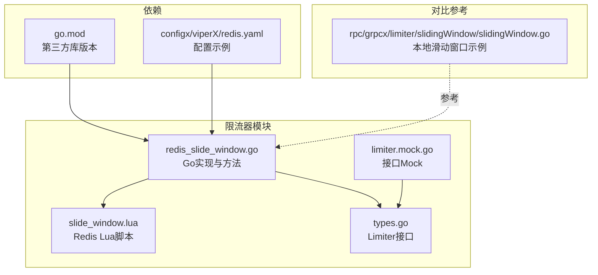
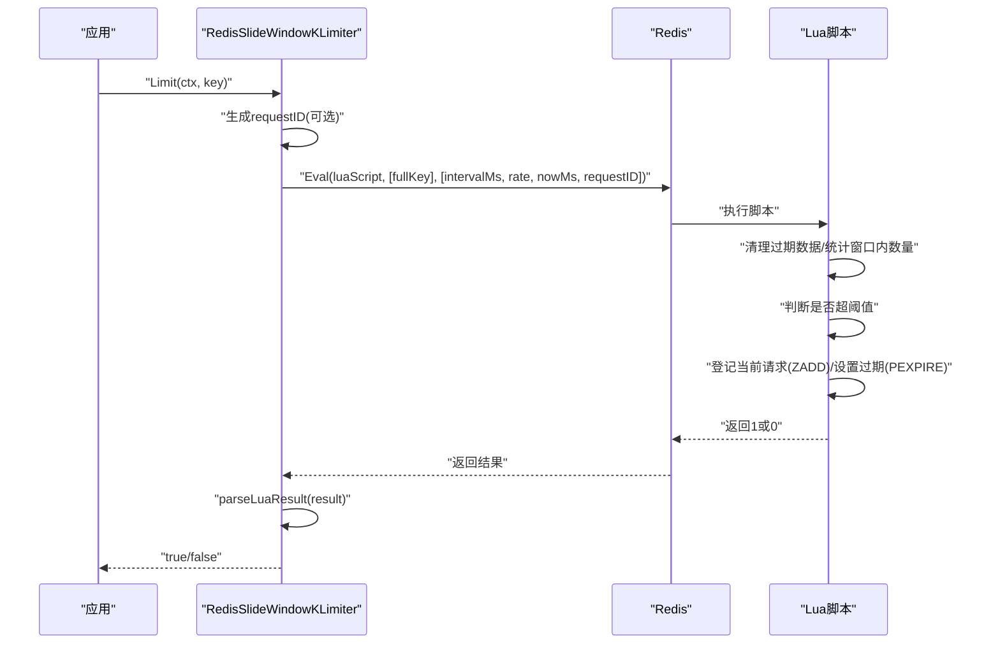
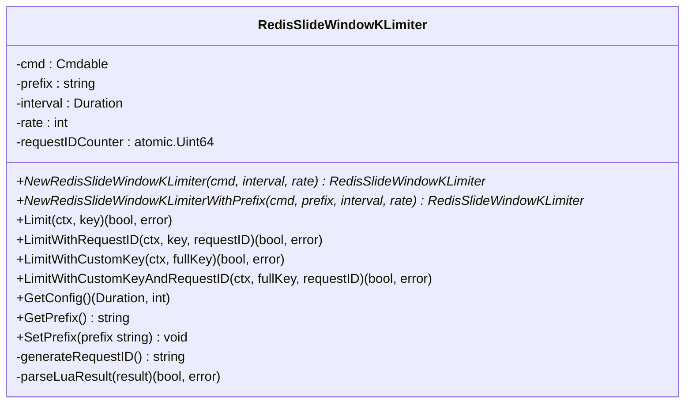
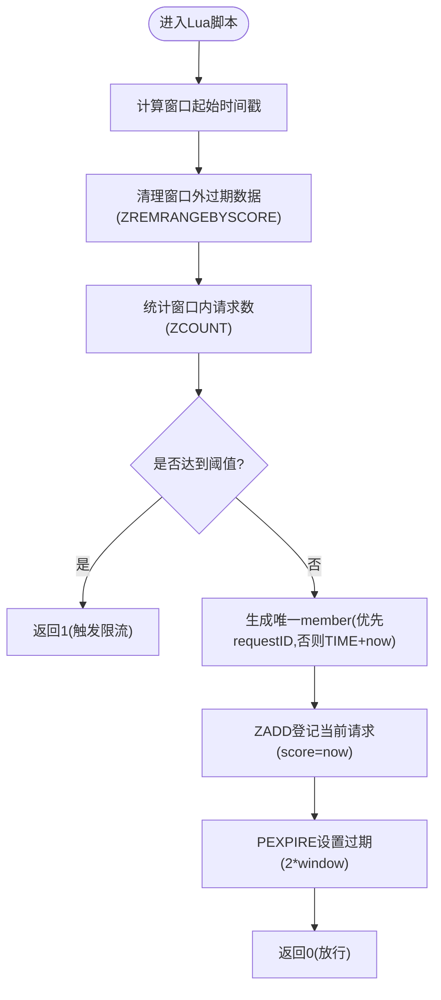
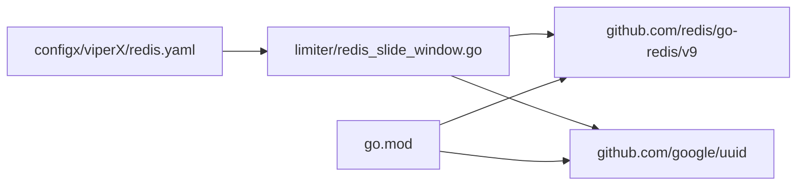

# 限流器

<cite>
**本文引用的文件**
- [limiter/redis_slide_window.go](file://limiter/redis_slide_window.go)
- [limiter/slide_window.lua](file://limiter/slide_window.lua)
- [limiter/types.go](file://limiter/types.go)
- [limiter/mocks/limiter.mock.go](file://limiter/mocks/limiter.mock.go)
- [go.mod](file://go.mod)
- [configx/viperX/redis.yaml](file://configx/viperX/redis.yaml)
- [rpc/grpcx/limiter/slidingWindow/slidingWindow.go](file://rpc/grpcx/limiter/slidingWindow/slidingWindow.go)
</cite>

## 目录
1. [简介](#简介)
2. [项目结构](#项目结构)
3. [核心组件](#核心组件)
4. [架构总览](#架构总览)
5. [详细组件分析](#详细组件分析)
6. [依赖关系分析](#依赖关系分析)
7. [性能考量](#性能考量)
8. [故障排查指南](#故障排查指南)
9. [结论](#结论)
10. [附录](#附录)

## 简介
本文件围绕基于 Redis 的滑动窗口限流器进行系统化技术文档整理，重点解析 RedisSlideWindowKLimiter 的实现机制，阐明其如何通过 Lua 脚本保证限流操作的原子性，并在高并发场景下获得稳定性能。文档还详细说明构造函数 NewRedisSlideWindowKLimiter 与 NewRedisSlideWindowKLimiterWithPrefix 的使用方式与参数含义，解释 Limit、LimitWithRequestID 等核心方法的工作流程，包括请求 ID 的生成策略与 Lua 脚本参数传递。最后给出在实际项目中按用户 ID 或 IP 地址进行限流的集成思路，对比滑动窗口与固定窗口算法的优势，提供配置 interval 与 rate 的最佳实践，以及性能调优建议与常见错误排查。

## 项目结构
- 限流器核心位于 limiter 包，包含 Go 实现与配套 Lua 脚本。
- 类型接口定义位于 limiter/types.go，便于上层抽象与测试替身。
- 构造函数与方法实现集中在 limiter/redis_slide_window.go。
- Lua 脚本位于 limiter/slide_window.lua，负责原子化的窗口清理、计数与成员登记。
- 单元测试与模拟对象位于 limiter/mocks。
- 依赖管理与外部库版本信息见 go.mod。
- 配置样例位于 configx/viperX/redis.yaml。
- 另有本地单机版滑动窗口示例（非 Redis）位于 rpc/grpcx/limiter/slidingWindow/slidingWindow.go，便于理解算法思想。

图表来源
- [limiter/redis_slide_window.go](file://limiter/redis_slide_window.go#L1-L193)
- [limiter/slide_window.lua](file://limiter/slide_window.lua#L1-L57)
- [limiter/types.go](file://limiter/types.go#L1-L10)
- [limiter/mocks/limiter.mock.go](file://limiter/mocks/limiter.mock.go#L1-L57)
- [go.mod](file://go.mod#L1-L175)
- [configx/viperX/redis.yaml](file://configx/viperX/redis.yaml#L1-L2)
- [rpc/grpcx/limiter/slidingWindow/slidingWindow.go](file://rpc/grpcx/limiter/slidingWindow/slidingWindow.go#L1-L105)

章节来源
- [limiter/redis_slide_window.go](file://limiter/redis_slide_window.go#L1-L193)
- [limiter/slide_window.lua](file://limiter/slide_window.lua#L1-L57)
- [limiter/types.go](file://limiter/types.go#L1-L10)
- [limiter/mocks/limiter.mock.go](file://limiter/mocks/limiter.mock.go#L1-L57)
- [go.mod](file://go.mod#L1-L175)
- [configx/viperX/redis.yaml](file://configx/viperX/redis.yaml#L1-L2)
- [rpc/grpcx/limiter/slidingWindow/slidingWindow.go](file://rpc/grpcx/limiter/slidingWindow/slidingWindow.go#L1-L105)

## 核心组件
- RedisSlideWindowKLimiter：基于 Redis 的滑动窗口限流器，封装了 Redis 命令接口、窗口大小、阈值、键前缀与请求 ID 生成器。
- Redis Lua 脚本：在 Redis 侧完成窗口清理、计数、成员登记与过期设置，保证原子性。
- Limiter 接口：统一的限流入口，便于替换实现与测试。
- 构造函数：
  - NewRedisSlideWindowKLimiter(cmd, interval, rate)：默认前缀，适用于通用场景。
  - NewRedisSlideWindowKLimiterWithPrefix(cmd, prefix, interval, rate)：自定义前缀，便于多业务隔离。
- 核心方法：
  - Limit(ctx, key)：基于业务 key 进行限流，内部自动生成请求 ID。
  - LimitWithRequestID(ctx, key, requestID)：显式传入请求 ID，便于幂等或追踪。
  - LimitWithCustomKey(ctx, fullKey) / LimitWithCustomKeyAndRequestID(ctx, fullKey, requestID)：直接使用完整 key，不附加前缀。
  - parseLuaResult(result)：解析 Lua 返回值，兼容多种 Redis 客户端返回类型。
  - GetConfig()/GetPrefix()/SetPrefix()：读取与修改配置与前缀。

章节来源
- [limiter/redis_slide_window.go](file://limiter/redis_slide_window.go#L19-L193)
- [limiter/types.go](file://limiter/types.go#L1-L10)

## 架构总览
Redis 滑动窗口限流的整体流程如下：
- 应用侧调用 Limit/LimitWithRequestID 等方法。
- Go 层准备 Lua 参数（窗口毫秒、阈值、当前时间戳、请求 ID），并通过 Eval 在 Redis 侧执行 Lua 脚本。
- Lua 脚本原子地清理过期数据、统计窗口内请求数、决定是否触发限流、登记当前请求并设置过期时间。
- Go 层解析返回值，返回是否触发限流。

图表来源
- [limiter/redis_slide_window.go](file://limiter/redis_slide_window.go#L65-L145)
- [limiter/slide_window.lua](file://limiter/slide_window.lua#L1-L57)

## 详细组件分析

### RedisSlideWindowKLimiter 类与方法
- 字段与职责
  - cmd：Redis 命令接口，支持 redis.Client/Cluster 等。
  - prefix：Redis key 前缀，用于业务隔离。
  - interval：滑动窗口大小（纳秒转毫秒传入 Lua）。
  - rate：窗口内最大请求数阈值。
  - requestIDCounter：线程安全的请求 ID 计数器，配合 UUID 与时间戳生成唯一 ID。
- 构造函数
  - NewRedisSlideWindowKLimiter：设置默认前缀与参数。
  - NewRedisSlideWindowKLimiterWithPrefix：允许自定义前缀，空则回退默认值。
- 方法族
  - Limit/LimitWithRequestID：校验 key 非空，拼接 fullKey，准备参数，执行 Eval，解析结果。
  - LimitWithCustomKey/LimitWithCustomKeyAndRequestID：直接使用完整 key，不拼接前缀。
  - parseLuaResult：兼容 int64/string/bool 多种返回类型。
  - GetConfig/GetPrefix/SetPrefix：读取/设置配置与前缀。

图表来源
- [limiter/redis_slide_window.go](file://limiter/redis_slide_window.go#L19-L193)

章节来源
- [limiter/redis_slide_window.go](file://limiter/redis_slide_window.go#L19-L193)

### Lua 脚本工作流
- 参数与键空间
  - KEYS[1]：fullKey（由 Go 层拼接 prefix + key）。
  - ARGV[1]：窗口大小（毫秒）。
  - ARGV[2]：阈值。
  - ARGV[3]：当前时间戳（毫秒）。
  - ARGV[4]：唯一请求 ID（可选）。
- 步骤
  1) 计算窗口起始时间戳，清理过期数据（ZREMRANGEBYSCORE）。
  2) 统计窗口内请求数（ZCOUNT）。
  3) 若达到阈值，返回 1 表示触发限流；否则继续。
  4) 生成唯一 member：
     - 若提供 requestID，则直接使用；
     - 否则使用 TIME 命令获取秒与微秒，结合当前时间戳生成相对唯一标识。
  5) ZADD 将当前请求登记到有序集合，score 为当前时间戳。
  6) PEXPIRE 设置 key 过期时间为窗口大小的两倍，避免内存泄漏。
  7) 返回 0 表示放行。

图表来源
- [limiter/slide_window.lua](file://limiter/slide_window.lua#L1-L57)

章节来源
- [limiter/slide_window.lua](file://limiter/slide_window.lua#L1-L57)

### 请求 ID 生成策略
- 生成规则
  - 使用 UUID 作为基础标识。
  - 搭配纳秒级时间戳与单调递增计数器，确保在高并发下仍具备唯一性。
- 作用
  - 作为 Lua 脚本的 member，避免重复请求被误判为相同请求。
  - 支持 LimitWithRequestID 显式传入，便于幂等与链路追踪。

章节来源
- [limiter/redis_slide_window.go](file://limiter/redis_slide_window.go#L57-L63)

### 核心方法工作流程详解
- Limit(ctx, key)
  - 自动生成 requestID 并委托 LimitWithRequestID。
- LimitWithRequestID(ctx, key, requestID)
  - 校验 key 非空。
  - 拼接 fullKey = prefix + key。
  - 准备参数数组：[intervalMs, rate, nowMs, requestID]。
  - 执行 Eval，解析结果。
- LimitWithCustomKey/LimitWithCustomKeyAndRequestID
  - 直接使用完整 key，不拼接前缀。
- parseLuaResult(result)
  - 兼容 int64/string/bool 等类型，若无法解析则返回错误。

章节来源
- [limiter/redis_slide_window.go](file://limiter/redis_slide_window.go#L65-L145)

### 接口与模拟
- Limiter 接口
  - 定义统一的 Limit(ctx, key) 方法，便于替换实现与注入测试。
- 接口 Mock
  - 使用 MockGen 生成的 MockLimiter，便于单元测试。

章节来源
- [limiter/types.go](file://limiter/types.go#L1-L10)
- [limiter/mocks/limiter.mock.go](file://limiter/mocks/limiter.mock.go#L1-L57)

## 依赖关系分析
- 第三方依赖
  - github.com/redis/go-redis/v9：Redis 客户端，提供 Cmdable/Eval 等能力。
  - github.com/google/uuid：生成唯一请求 ID。
- 版本与兼容性
  - go.mod 中声明了 go 版本与依赖版本，确保与 Redis 客户端 API 兼容。
- 配置
  - redis.yaml 提供了基本的地址配置示例，实际项目中应结合 Viper 加载完整连接参数（如密码、DB、连接池等）。

图表来源
- [limiter/redis_slide_window.go](file://limiter/redis_slide_window.go#L1-L42)
- [go.mod](file://go.mod#L1-L175)
- [configx/viperX/redis.yaml](file://configx/viperX/redis.yaml#L1-L2)

章节来源
- [limiter/redis_slide_window.go](file://limiter/redis_slide_window.go#L1-L42)
- [go.mod](file://go.mod#L1-L175)
- [configx/viperX/redis.yaml](file://configx/viperX/redis.yaml#L1-L2)

## 性能考量
- 原子性与低延迟
  - Lua 脚本在 Redis 侧执行，避免网络往返与竞态，显著降低延迟与抖动。
- 数据结构选择
  - 使用有序集合（ZSET）存储请求时间戳，score 为时间戳，天然有序，便于清理与计数。
- 内存与过期
  - PEXPIRE 设置为 2×window，既保证窗口期内数据可用，又避免长期占用内存。
- Lua 参数传递
  - 将 interval、rate、now、requestID 作为 ARGV 传入，减少序列化成本。
- Redis 连接池与客户端
  - 建议使用 go-redis 官方连接池配置（如最小/最大连接数、空闲超时、连接生命周期等），并结合业务 QPS 与延迟目标进行压测调优。
- 监控与可观测性
  - 结合 Prometheus Hook 监控 Redis 命令耗时与成功率，定位热点 key 与异常延迟。
- 对比参考
  - 本地单机滑动窗口示例展示了基于最小堆与锁的实现，便于理解算法思想，但不具备分布式一致性与原子性保障。

章节来源
- [limiter/slide_window.lua](file://limiter/slide_window.lua#L1-L57)
- [rpc/grpcx/limiter/slidingWindow/slidingWindow.go](file://rpc/grpcx/limiter/slidingWindow/slidingWindow.go#L1-L105)

## 故障排查指南
- 常见错误与定位
  - Redis 错误：当 Eval 返回错误时，需检查 Redis 连接状态、权限与网络。
  - Lua 脚本返回 nil：Go 层会包装错误，需确认脚本执行路径与返回值。
  - 返回类型不匹配：parseLuaResult 对多种返回类型做了兼容，若仍报错，检查 Redis 客户端版本差异。
  - key 为空：Limit/LimitWithRequestID/LimitWithCustomKey 等方法对空 key 会直接返回错误。
- 建议排查步骤
  - 确认 Redis 客户端连接正常（Ping 成功）。
  - 检查 Lua 脚本是否正确加载与执行。
  - 校验 interval 与 rate 是否合理，避免过小导致频繁限流或过大导致窗口“平滑”不足。
  - 关注过期时间设置，确保不会过早清理仍在窗口内的数据。
- 常见使用错误与解决方案
  - 忘记设置前缀或前缀冲突：使用 NewRedisSlideWindowKLimiterWithPrefix 明确区分业务域。
  - 未传入 requestID 导致幂等性问题：在需要幂等的场景使用 LimitWithRequestID 显式传入。
  - key 设计不合理：建议按用户 ID/IP/令牌等维度设计 key，避免热点集中。

章节来源
- [limiter/redis_slide_window.go](file://limiter/redis_slide_window.go#L65-L145)
- [limiter/redis_slide_window.go](file://limiter/redis_slide_window.go#L147-L174)

## 结论
Redis 滑动窗口限流器通过 Lua 脚本在 Redis 侧完成原子化操作，有效避免了竞态与网络往返带来的延迟与抖动，适合高并发、强一致性的限流需求。构造函数提供了灵活的前缀与参数配置，核心方法覆盖了从自动生成请求 ID 到自定义完整 key 的多种使用场景。结合合理的 interval 与 rate 配置、连接池与监控优化，可在生产环境中获得稳定的吞吐与低延迟表现。

## 附录

### 构造函数与参数说明
- NewRedisSlideWindowKLimiter(cmd, interval, rate)
  - cmd：Redis 命令接口（如 redis.Client/Cluster）。
  - interval：滑动窗口大小（如 1 秒）。
  - rate：窗口内最大请求数阈值。
- NewRedisSlideWindowKLimiterWithPrefix(cmd, prefix, interval, rate)
  - prefix：Redis key 前缀，空则回退默认值。

章节来源
- [limiter/redis_slide_window.go](file://limiter/redis_slide_window.go#L31-L55)

### 核心方法与参数说明
- Limit(ctx, key)
  - key：业务维度的限流键。
- LimitWithRequestID(ctx, key, requestID)
  - requestID：唯一请求标识，用于 Lua 脚本 member 生成。
- LimitWithCustomKey(ctx, fullKey)
  - fullKey：完整 Redis key，不拼接前缀。
- LimitWithCustomKeyAndRequestID(ctx, fullKey, requestID)

章节来源
- [limiter/redis_slide_window.go](file://limiter/redis_slide_window.go#L65-L145)

### 实际项目集成示例思路
- 基于用户 ID 限流
  - key = "user:" + userID
  - 调用 Limit(ctx, key)，根据返回值决定放行或拒绝。
- 基于 IP 限流
  - key = "ip:" + clientIP
  - 调用 Limit(ctx, key)。
- 基于令牌/路由限流
  - key = "route:" + routePath
  - 调用 Limit(ctx, key)。
- 幂等与追踪
  - 使用 LimitWithRequestID(ctx, key, requestID)，requestID 可来自请求上下文或网关层。

章节来源
- [limiter/redis_slide_window.go](file://limiter/redis_slide_window.go#L65-L145)

### 滑动窗口 vs 固定窗口
- 滑动窗口
  - 更平滑的速率控制，避免边界突变带来的突发流量。
  - 原子化清理与计数，适合高并发。
- 固定窗口
  - 实现简单，但在窗口边界处存在“边界效应”，易出现瞬时峰值。
- 选择建议
  - 对平滑性要求高的场景优先选择滑动窗口。

章节来源
- [rpc/grpcx/limiter/slidingWindow/slidingWindow.go](file://rpc/grpcx/limiter/slidingWindow/slidingWindow.go#L1-L105)

### 配置 interval 与 rate 的最佳实践
- interval
  - 根据业务 SLA 与 QPS 目标确定窗口大小，通常 1 秒至 60 秒之间。
- rate
  - 基于峰值 QPS 与窗口大小计算，留出一定余量以应对突发。
- 前缀与 key 设计
  - 使用 WithPrefix 区分业务域；key 采用“维度:标识”的命名规范，避免冲突。
- 过期策略
  - Lua 已设置 2×window 过期，确保窗口期内数据可用且不会无限增长。

章节来源
- [limiter/slide_window.lua](file://limiter/slide_window.lua#L1-L57)
- [limiter/redis_slide_window.go](file://limiter/redis_slide_window.go#L31-L55)

### 性能调优建议
- Redis 连接池
  - 最小/最大连接数、空闲超时、连接生命周期等参数需结合压测结果调整。
- Lua 脚本优化
  - 保持脚本简洁，避免额外的网络往返与复杂计算。
- 监控与告警
  - 使用 Prometheus Hook 监控命令耗时与错误率，及时发现异常。
- 分片与热点
  - 对热点 key 可考虑增加维度（如按时间片分桶）或引入多实例。

章节来源
- [limiter/slide_window.lua](file://limiter/slide_window.lua#L1-L57)
- [rpc/grpcx/limiter/slidingWindow/slidingWindow.go](file://rpc/grpcx/limiter/slidingWindow/slidingWindow.go#L1-L105)