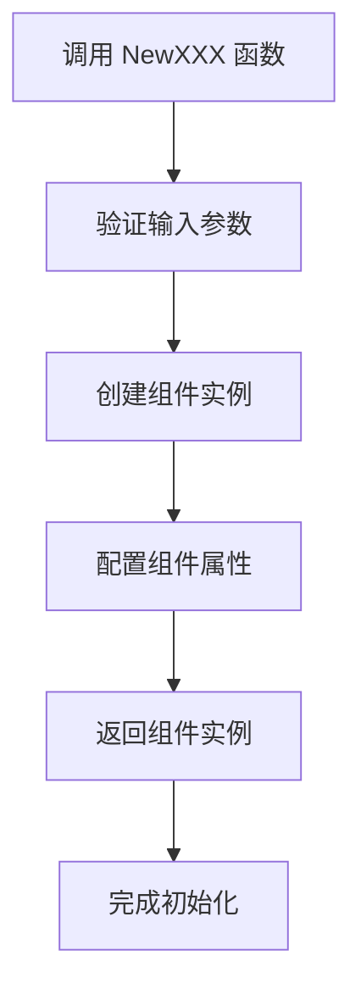
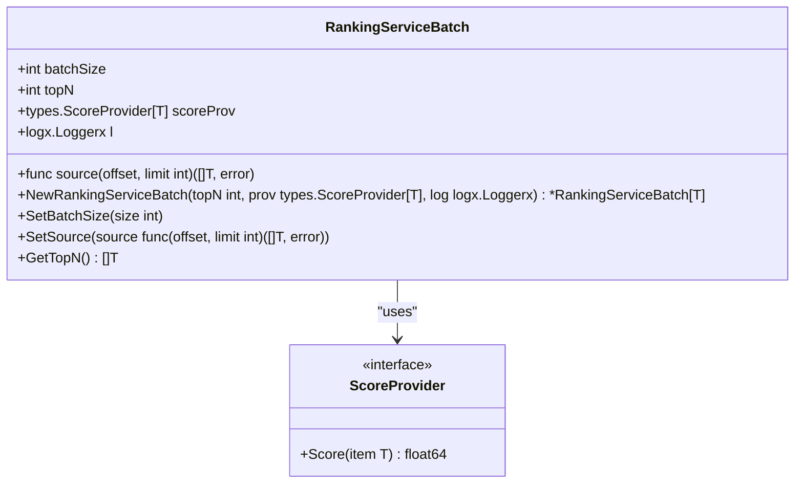

# 项目概述

<cite>
**本文档引用的文件**  
- [README.md](file://README.md)
- [go.mod](file://go.mod)
- [convertx/convertx.go](file://convertx/convertx.go)
- [convertx/toanyx/toany.go](file://convertx/toanyx/toany.go)
- [sliceX/slicex.go](file://sliceX/slicex.go)
- [limiter/types.go](file://limiter/types.go)
- [limiter/redis_slide_window.go](file://limiter/redis_slide_window.go)
- [logx/types.go](file://logx/types.go)
- [logx/zaplogx/zapLogger.go](file://logx/zaplogx/zapLogger.go)
- [webx/ginx/middleware/jwtX2/jwt.go](file://webx/ginx/middleware/jwtX2/jwt.go)
- [channelx/messageQueuex/saramax/saramaProducerx/producer.go](file://channelx/messageQueuex/saramax/saramaProducerx/producer.go)
- [DBx/mysqlX/gormx/dbMovex/myMovex/migrator.go](file://DBx/mysqlX/gormx/dbMovex/myMovex/migrator.go)
- [configx/viperX/viper.go](file://configx/viperX/viper.go)
- [rpc/grpcx/observationX/builder.go](file://rpc/grpcx/observationX/builder.go)
- [serviceLogicX/rankingListX/rankingServiceX/rankingService.go](file://serviceLogicX/rankingListX/rankingServiceX/rankingService.go)
</cite>

## 目录
1. [项目简介](#项目简介)
2. [核心设计目标](#核心设计目标)
3. [主要功能模块](#主要功能模块)
4. [组件协同与开发工具链](#组件协同与开发工具链)
5. [简洁的API设计](#简洁的api设计)
6. [初学者引导](#初学者引导)
7. [高级用户技术全景](#高级用户技术全景)
8. [生产环境价值与应用场景](#生产环境价值与应用场景)

## 项目简介

pkg_tool 是一个功能丰富的Go语言后端工具包项目，旨在为微服务架构和高并发系统提供可复用的基础设施组件。该项目通过模块化设计，集成了Web中间件、RPC治理、数据库迁移、消息队列封装、配置管理、限流与锁、日志监控等多种工具模块，为开发者提供了一站式的开发解决方案。项目采用Go语言的泛型特性，增强了代码的复用性和类型安全性，同时通过简洁的API设计降低了开发复杂度。

**本文档引用的文件**  
- [README.md](file://README.md)
- [go.mod](file://go.mod)

## 核心设计目标

pkg_tool 的核心设计目标是为微服务架构和高并发系统提供稳定、高效、可复用的基础设施组件。通过将常见的开发需求抽象为独立的模块，项目旨在减少重复代码，提高开发效率，并确保在高并发场景下的性能和可靠性。项目的设计充分考虑了微服务架构的特点，支持服务发现、负载均衡、熔断降级等关键功能，同时通过限流、分布式锁等机制保障系统的稳定性。

**本文档引用的文件**  
- [README.md](file://README.md)

## 主要功能模块

### Web中间件
pkg_tool 提供了基于Gin框架的Web中间件支持，包括JWT认证、限流、日志记录等功能。通过 `jwtx.NewJwtxMiddlewareGinx` 等函数，开发者可以轻松实现用户认证和会话管理，支持Access Token和Refresh Token的双Token机制，确保系统的安全性。

### RPC治理
在RPC治理方面，pkg_tool 提供了多种限流算法（如滑动窗口、计数器、令牌桶等）、负载均衡算法、熔断拦截器和可观测性平台。这些组件帮助开发者构建健壮的微服务通信，有效应对高并发场景下的性能挑战。

### 数据库迁移
数据库迁移工具支持双写池、迁移调度器和数据校验等功能。通过 `dbMovex.NewDoubleWritePool` 等函数，开发者可以安全地进行数据库迁移，确保数据的一致性和完整性。

### 消息队列封装
消息队列模块提供了顶级接口封装，支持Kafka的生产者和消费者实现。通过 `saramaProducerx.NewSaramaProducerStr` 等函数，开发者可以方便地集成消息队列，实现异步通信和解耦。

### 配置管理
配置管理模块基于Viper库，提供了灵活的配置加载和监听机制。通过 `viperx.NewViperConfigStr` 等函数，开发者可以轻松管理本地和远程配置，支持配置文件的动态更新。

### 限流与锁
限流与锁模块实现了滑动窗口限流和Redis分布式锁。通过 `redis_slide_window.NewRedisSlideWindowKLimiter` 等函数，开发者可以有效控制系统的请求速率，防止过载。

### 日志与监控
日志与监控模块支持多种日志框架（如Zap、ZeroLog）和Prometheus监控。通过 `zaplogx.NewZapLogger` 等函数，开发者可以实现高性能的日志记录和系统监控。

**本文档引用的文件**  
- [README.md](file://README.md)
- [limiter/types.go](file://limiter/types.go)
- [limiter/redis_slide_window.go](file://limiter/redis_slide_window.go)
- [logx/types.go](file://logx/types.go)
- [logx/zaplogx/zapLogger.go](file://logx/zaplogx/zapLogger.go)
- [webx/ginx/middleware/jwtX2/jwt.go](file://webx/ginx/middleware/jwtX2/jwt.go)
- [channelx/messageQueuex/saramax/saramaProducerx/producer.go](file://channelx/messageQueuex/saramax/saramaProducerx/producer.go)
- [DBx/mysqlX/gormx/dbMovex/myMovex/migrator.go](file://DBx/mysqlX/gormx/dbMovex/myMovex/migrator.go)
- [configx/viperX/viper.go](file://configx/viperX/viper.go)

## 组件协同与开发工具链

pkg_tool 的各个组件通过统一的接口和设计模式协同工作，形成一个完整的开发工具链。例如，Web中间件可以与配置管理模块结合，动态加载认证配置；RPC治理组件可以与日志监控模块集成，实现调用链的追踪和分析。这种模块化的设计使得开发者可以根据具体需求灵活组合组件，构建高效、稳定的后端服务。

**本文档引用的文件**  
- [README.md](file://README.md)

## 简洁的API设计

pkg_tool 通过简洁的API设计降低了开发复杂度。每个模块都提供了 `NewXXX` 函数，用于创建和初始化组件。例如，`toanyx.ToAny` 函数支持安全的类型转换，`sliceX.Max` 函数提供切片最大值计算。这些API设计遵循Go语言的最佳实践，确保代码的可读性和可维护性。

**图示来源**  
- [convertx/toanyx/toany.go](file://convertx/toanyx/toany.go)
- [sliceX/slicex.go](file://sliceX/slicex.go)

**本文档引用的文件**  
- [convertx/convertx.go](file://convertx/convertx.go)
- [convertx/toanyx/toany.go](file://convertx/toanyx/toany.go)
- [sliceX/slicex.go](file://sliceX/slicex.go)

## 初学者引导

对于初学者，pkg_tool 提供了清晰的使用示例和文档。通过阅读README.md中的示例代码，开发者可以快速上手各个模块。建议从配置管理、日志记录等基础模块开始，逐步了解项目的整体架构和设计思路。项目中的泛型使用和接口抽象是学习的重点，有助于理解Go语言的高级特性。

**本文档引用的文件**  
- [README.md](file://README.md)

## 高级用户技术全景

对于高级用户，pkg_tool 提供了深入的技术全景。通过分析 `rpc/grpcx/observationX/builder.go` 等文件，可以了解RPC调用的可观测性实现；通过研究 `serviceLogicX/rankingListX/rankingServiceX/rankingService.go`，可以掌握高性能榜单服务的设计。这些组件展示了项目在复杂场景下的应用，为高级用户提供了解决实际问题的参考。

**图示来源**  
- [serviceLogicX/rankingListX/rankingServiceX/rankingService.go](file://serviceLogicX/rankingListX/rankingServiceX/rankingService.go)

**本文档引用的文件**  
- [rpc/grpcx/observationX/builder.go](file://rpc/grpcx/observationX/builder.go)
- [serviceLogicX/rankingListX/rankingServiceX/rankingService.go](file://serviceLogicX/rankingListX/rankingServiceX/rankingService.go)

## 生产环境价值与应用场景

pkg_tool 在生产环境中具有重要的价值。其稳定的组件和高效的性能使其适用于高并发的微服务架构。典型应用场景包括用户认证系统、实时数据处理、分布式任务调度等。通过集成限流、熔断等机制，项目能够有效应对流量高峰，保障系统的可用性。此外，丰富的监控和日志功能有助于快速定位和解决问题，提升运维效率。

**本文档引用的文件**  
- [README.md](file://README.md)